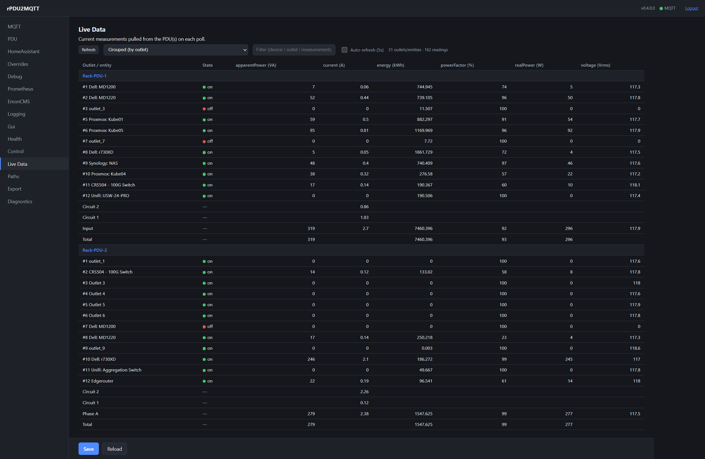
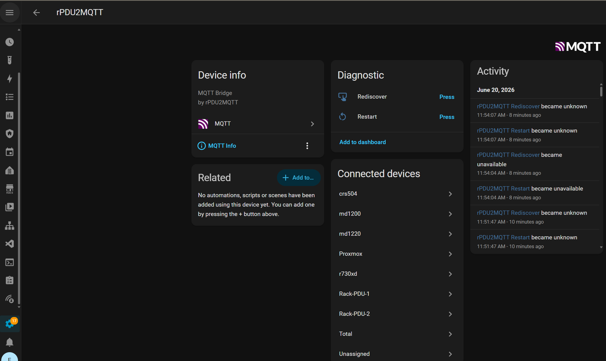
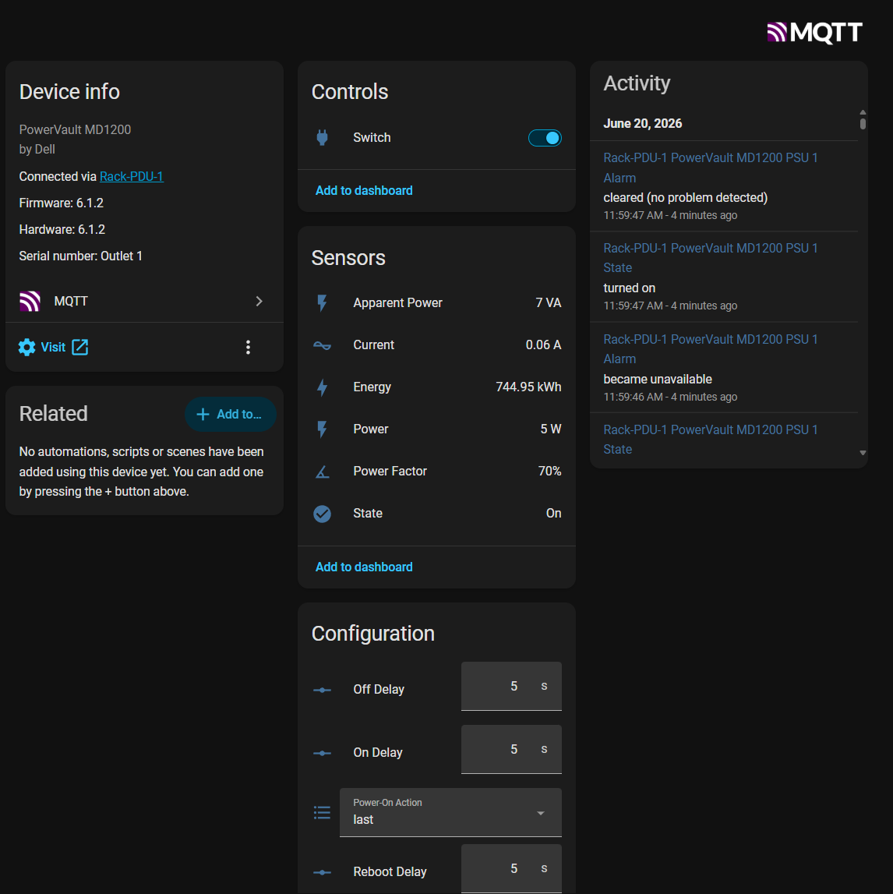
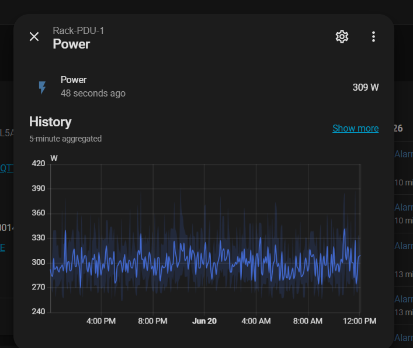
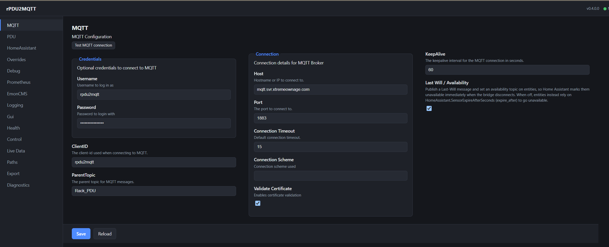
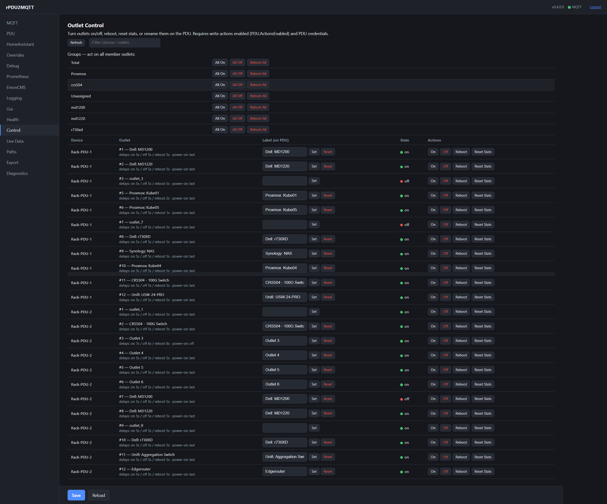
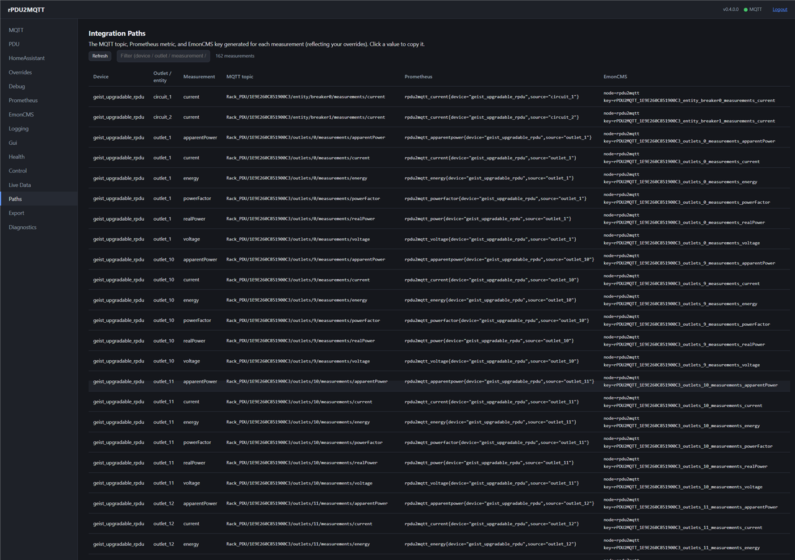
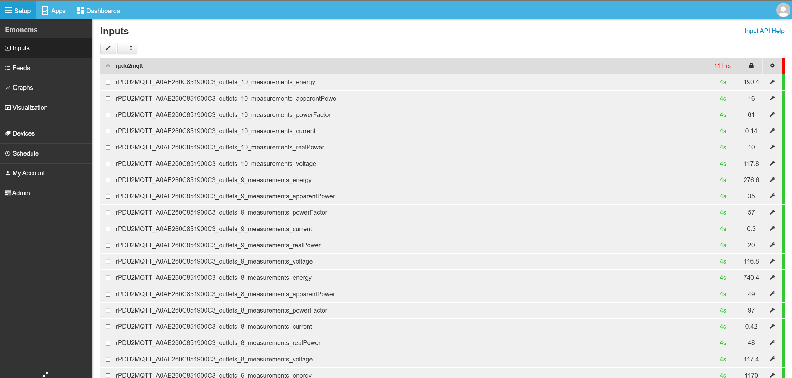

# rPDU2MQTT

**Yes**, This is partially coded by AI. You can stop scrolling if that is what you came here looking for. You- can either accept that claude has been handling PRs, or- you can wait another 5 years for me to find time to do them myself. If you prefer the latter, then please feel free to use the [0.3.5 release.](https://github.com/XtremeOwnage/rPDU2MQTT/releases/tag/v0.3.5)


**Bridge your Vertiv / Geist rack PDU to MQTT — with first-class Home Assistant, Prometheus, EmonCMS, and Kubernetes support, and a built-in configuration & control GUI.**

rPDU2MQTT is a small, container-friendly .NET service. It polls a Vertiv/Geist rPDU's HTTP API, publishes every measurement to MQTT, and (optionally) auto-creates the matching **Home Assistant** devices & entities via MQTT discovery — including **controllable outlets** when you enable write actions. It also pushes metrics to **Prometheus** and **EmonCMS**, understands **OneView** PDU clusters, and ships a **Helm chart + CRD** for Kubernetes.

> New to these PDUs? See this [blog post on metered/switched PDUs](https://static.xtremeownage.com/blog/2024/metered-switch-pdu/) for background on the units and their capabilities.



---

## ✨ Features

- **MQTT publishing** — every outlet/device/entity measurement (power, energy, current, voltage, power factor, …) published on each poll.
- **Home Assistant auto-discovery** — devices, sensors, and `problem` alarm binary-sensors created automatically; proper device hierarchy (`via_device`), MAC/IP connection info, and availability/`expire_after`.
- **Outlet control** (opt-in) — on/off **switches**, **reboot** buttons, configurable **on/off/reboot delays** (`number`), **power-on action** (`select`), and a **reset-statistics** button.
- **OneView clusters** — aggregates multiple PDUs; per-group **Sum/Avg/Min/Max** rollup sensors, plus **group actions** (All On / All Off / Reboot All) fanned out to member outlets, and the member switches mirrored onto the group device.
- **Configuration & control GUI** — a built-in web UI to view/edit/test the config, control outlets, rename PDU labels, browse live data, and see the generated MQTT/Prometheus/EmonCMS paths.
- **GUI authentication** — HTTP Basic, **OpenID Connect (SSO)** against any OIDC provider (Keycloak, Authentik, Authelia, Entra ID, Google, …), or none.
- **Prometheus** — scrape (`/metrics`) and/or Pushgateway, with a **customizable metric-name template**.
- **EmonCMS** — pushes inputs on each poll.
- **Kubernetes-native** — Helm chart, optional **`RpduConfig` CRD** as a writable config source, Argo CD example, health probes, NetworkPolicy, and Gateway API `HTTPRoute`.
- **Secrets-friendly** — credentials via `RPDU2MQTT_*` env vars / `*_FILE` Docker secrets, never required in the config file (see [environment variables & precedence](./Examples/Configuration/environment-variables.md)).

---

## 📸 Screenshots

### Home Assistant

The **bridge** device — every PDU, outlet, and OneView group as connected devices, plus Rediscover/Restart:



An **outlet** as its own device — switch, sensors, configurable delays, and power-on action:



A **OneView group** device — Sum/Avg/Min/Max rollup sensors, the member outlet switches, and All On / All Off / Reboot All:


Standard Home Assistant history, dashboards, and automations come for free:



### Configuration & control GUI

The structured **configuration** form (every option, generated from the model):



The **Control** tab — per-outlet On/Off/Reboot/Reset + editable label, plus group actions:



The **Paths** tab — the generated MQTT topic / Prometheus metric / EmonCMS key for every measurement:



### Metrics (Prometheus / EmonCMS)

Beyond MQTT, every measurement can be scraped by Prometheus and/or pushed to EmonCMS:



---

## 🚀 Quick start (Docker Compose)

```yaml
services:
  rpdu2mqtt:
    image: ghcr.io/xtremeownage/rpdu2mqtt:stable
    restart: unless-stopped
    ports:
      - "8080:8080"   # optional GUI
    volumes:
      - ./config.yaml:/config/config.yaml:ro
    environment:
      RPDU2MQTT_MQTT_PASSWORD: "your-mqtt-password"
      RPDU2MQTT_PDU_PASSWORD: "your-pdu-password"   # only needed for outlet control
```

A minimal `config.yaml`:

```yaml
Mqtt:
  Connection: { Host: mqtt.example.com, Port: 1883 }
  ParentTopic: rPDU2MQTT
Pdu:
  Connection: { Host: pdu.example.com, Port: 80 }
  PollInterval: 5
HomeAssistant:
  DiscoveryEnabled: true
  DiscoveryTopic: homeassistant
Gui:
  Enabled: true
  Password: "change-me"
```

Then browse to `http://<host>:8080` for the GUI. See the full guides below.

---

## 📚 Documentation

| Guide | What's inside |
| --- | --- |
| [Configuration](./docs/Configuration.md) | Every config option — MQTT, PDU, overrides, control, Prometheus, EmonCMS, the GUI (incl. OIDC) and health checks. |
| [Environment variables & precedence](./Examples/Configuration/environment-variables.md) | All `RPDU2MQTT_*` vars and what overrides what (env vs config file vs CRD). |
| [Deployment](./docs/Deployment.md) | Docker, Docker Compose, Helm, Argo CD, the CRD config source, secrets, and verification. |
| [Aggregation (OneView)](./docs/Aggregation.md) | Multi-PDU clusters: rollup sensors and group actions. |
| [Kubernetes CRD](./docs/KubernetesCRD.md) | Using an `RpduConfig` custom resource as a writable config source. |

---

## ❓ Help

- Ask in [my Discord](https://static.xtremeownage.com/discord) (tag **@XtremeOwnage**) — preferred.
- Or open a [new issue](https://github.com/XtremeOwnage/rPDU2MQTT/issues/new/choose).

## 🤝 Contributing

This is a small project without heavy process. If you want to work on an issue or feature, comment on the issue so others know, then open a [pull request](https://github.com/XtremeOwnage/rPDU2MQTT/compare) — we'll polish it together.

## 🧭 Q&A

**Why not a native Home Assistant integration?**
It's written in .NET (what I work in daily), it doesn't *require* Home Assistant at all, and beyond HA it also feeds Prometheus and EmonCMS and works standalone.
