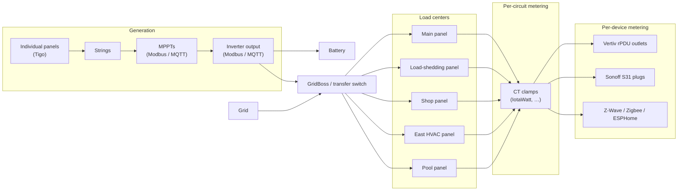
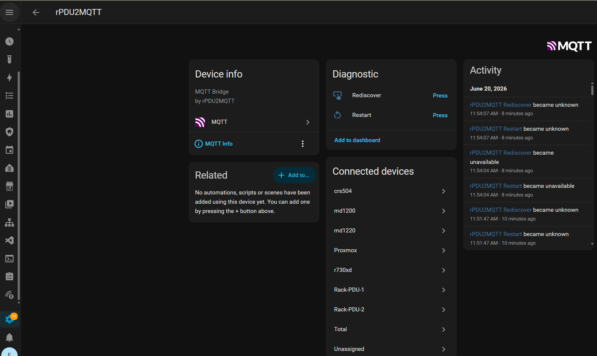
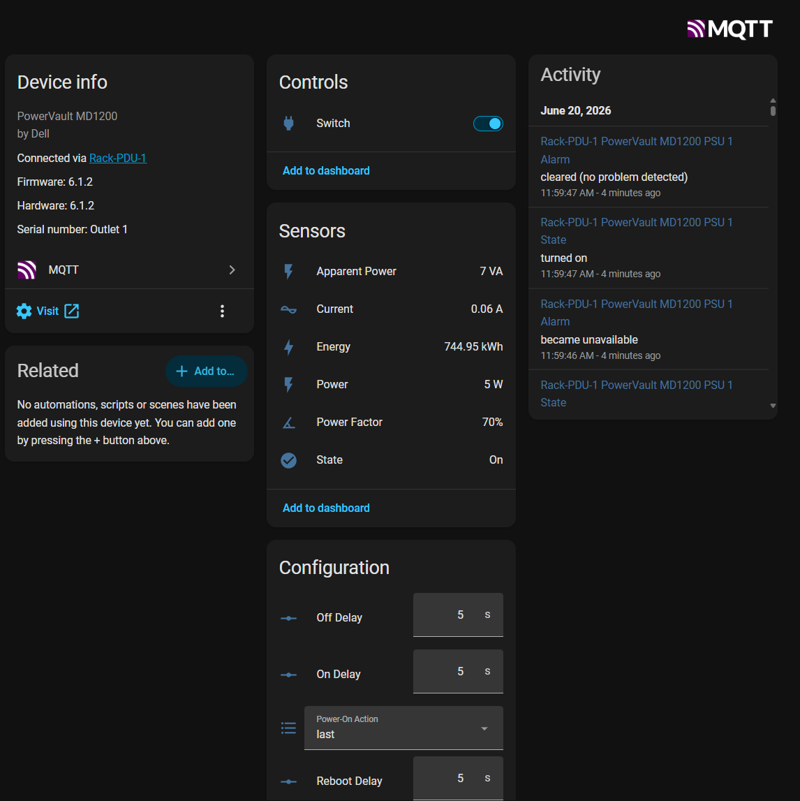
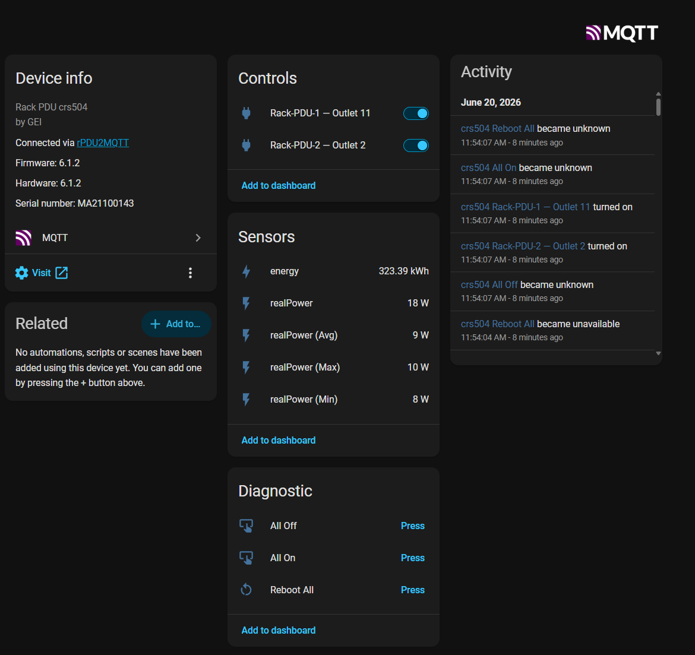
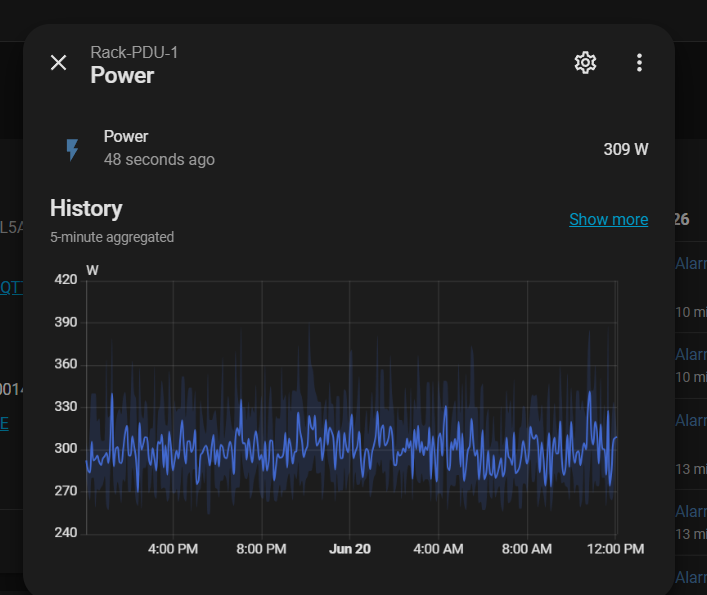
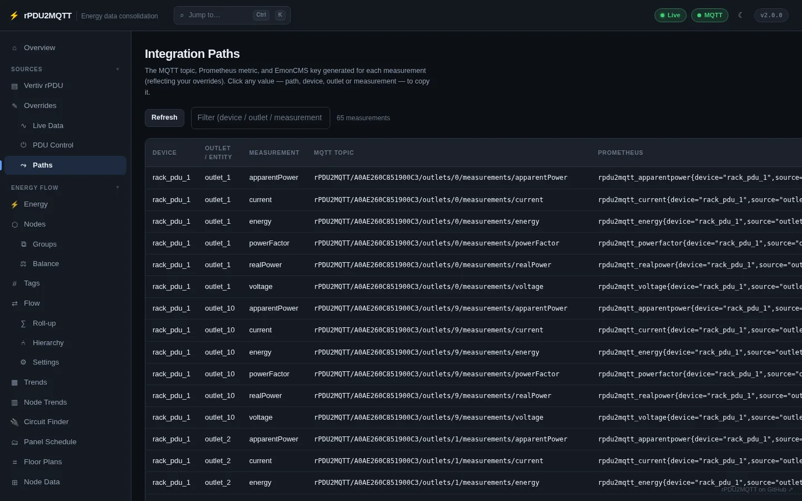
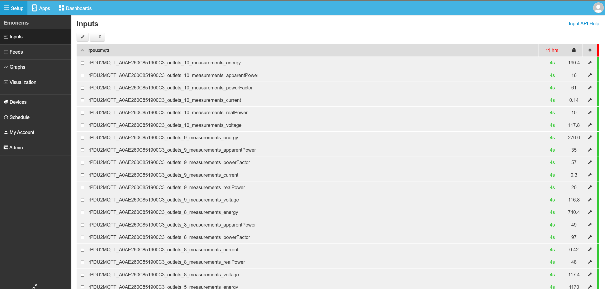

# rPDU2MQTT

**Yes**, This is partially coded by AI. You can stop scrolling if that is what you came here looking for. You- can either accept that claude has been handling PRs, or- you can wait another 5 years for me to find time to do them myself. If you prefer the latter, then please feel free to use the [0.3.5 release.](https://github.com/XtremeOwnage/rPDU2MQTT/releases/tag/v0.3.5)


**Map the energy flow of an entire house, end to end — from individual solar panels to individual appliances — and publish it to MQTT, Home Assistant, Prometheus and EmonCMS.**

📖 **Documentation: [xtremeownage.github.io/rPDU2MQTT](https://xtremeownage.github.io/rPDU2MQTT/)**

rPDU2MQTT is a small, container-friendly .NET service. It started as a bridge for Vertiv/Geist rack PDUs (it still is one, and a good one), but that turned out to be a single tier of a much bigger picture. The job now is the whole chain: every producer, every panel, every circuit and every device, measured wherever it can be measured, joined into one hierarchy, and rolled up so each tier's number is the sum of what's beneath it.

Data comes in over **MQTT**, **Modbus TCP**, **EmonCMS feeds**, **Home Assistant entities** and the PDUs' own HTTP API; it goes out to **MQTT**, **Home Assistant** (auto-discovery, including the Energy Dashboard), **Prometheus** and **EmonCMS**. There's a built-in GUI for wiring it all up, and a **Helm chart + CRD** for Kubernetes.

> New to these PDUs? See this [blog post on metered/switched PDUs](https://static.xtremeownage.com/blog/2024/metered-switch-pdu/) for background on the units and their capabilities.


---

## ⚡ The energy flow

This is the shape of the problem the project exists to solve — one house, measured from the panels on the roof to the plug behind the TV:


```mermaid
flowchart LR
  subgraph GEN["Generation"]
    P["Individual panels<br/>(Tigo)"] --> S["Strings"]
    S --> M["MPPTs<br/>(Modbus / MQTT)"]
    M --> INV["Inverter output<br/>(Modbus / MQTT)"]
  end

  INV --> BAT["Battery"]
  INV --> GB["GridBoss / transfer switch"]
  GRID["Grid"] --> GB

  subgraph PANELS["Load centers"]
    MAIN["Main panel"]
    SHED["Load-shedding panel"]
    SHOP["Shop panel"]
    HVAC["East HVAC panel"]
    POOL["Pool panel"]
  end

  GB --> MAIN & SHED & SHOP & HVAC & POOL

  subgraph CIRCUITS["Per-circuit metering"]
    CT["CT clamps<br/>(IotaWatt, …)"]
  end

  MAIN & SHED & SHOP & HVAC & POOL --> CT

  subgraph DEVICES["Per-device metering"]
    PDU["Vertiv rPDU outlets"]
    S31["Sonoff S31 plugs"]
    ZW["Z-Wave / Zigbee / ESPHome"]
  end

  CT --> PDU & S31 & ZW
```

Every tier is a node you define in the GUI; a node's value is whatever measures it (an MQTT topic, a Modbus register, a PDU outlet, a fixed figure), or the sum of its children when nothing measures it directly. Untracked consumption — the part of a panel its metered circuits don't account for — is a node type of its own, so the numbers add up honestly rather than silently.

Some of the hardware behind those tiers, if you're curious: [Sonoff S31 energy monitoring](https://static.xtremeownage.com/blog/2023/sonoff-s31---low-cost-energy-monitoring/), [metered/switched PDUs](https://static.xtremeownage.com/blog/2024/metered-switch-pdu/), and [an earlier version of this flow diagram](https://static.xtremeownage.com/blog/2023/home-assistant---energy-flow-diagram/) from a smaller house.

### Why not just do this in Home Assistant?

Because of the history. I keep a lot of energy data — six years of per-circuit measurements from my old house, at a 15-second interval, collected via IotaWatt. I may never use it. I like having it in case I do.

More than once, an update to Home Assistant or one of its plugins has renamed entities and broken things for me. This project owns the naming and the topology itself, and pushes it *out* to Home Assistant, EmonCMS, Prometheus and MQTT — so what those systems see is derived from one definition I control, rather than the other way round. It creates and updates the HA entities, maintains the Energy Dashboard, provisions the EmonCMS feeds, and exports Prometheus metrics for Grafana.

Should you use it? That's up to you. I built it for me, but made it public and tried to make sure it was at least half-way documented.

---

## ✨ Features

### The energy flow

- **Whole-house hierarchy** — define the tiers (panels → strings → MPPTs → inverter → transfer switch → load centers → circuits → devices) and how they feed each other; every tier rolls up the ones beneath it, per metric.
- **Any source per node** — bind a node's power/energy/current/… to an **MQTT topic** (Solar Assistant, ESPHome, Tasmota, anything already on your broker), a **Modbus TCP register** (inverters, meters, PLCs), an **EmonCMS feed** (IotaWatt, emonTx — anything already posting there), a **Home Assistant entity**, a PDU outlet, or a fixed value.
- **Browse instead of guess** — autocomplete over the topics actually on your broker (with the metric and unit inferred from the payload), a Modbus explorer that reads a block of registers and shows each decoding, and a feed picker that lists what EmonCMS actually holds with its latest reading.
- **Untracked consumption** — a residual node reports what a measured parent's metered children don't account for, the way Home Assistant's energy dashboard does.
- **Flow views** — Sankey, sunburst and treemap, with per-tier MQTT export and Home Assistant Energy Dashboard sync.
- **Breaker panels** — panel schedule with slots, breakers, wire labels, gauge, rating and live load per circuit; circuit finder.
- **Floor plans** — rooms, outlets, lights and appliances, with the cable runs from the panel to each one.
- **Trends and history** — built-in history store, per-node trends, daily totals and cost charts.
- **Device templates** — ready-made node/register sets for known hardware (EG4 inverters, meters, …) to import and adjust.

### The PDU bridge

- **MQTT publishing** — every outlet/device/entity measurement (power, energy, current, voltage, power factor, …) published on each poll.
- **Home Assistant auto-discovery** — devices, sensors, and `problem` alarm binary-sensors created automatically; proper device hierarchy (`via_device`), MAC/IP connection info, and availability/`expire_after`.
- **Outlet control** (opt-in) — on/off **switches**, **reboot** buttons, configurable **on/off/reboot delays** (`number`), **power-on action** (`select`), and a **reset-statistics** button.
- **OneView clusters** — aggregates multiple PDUs; per-group **Sum/Avg/Min/Max** rollup sensors, plus **group actions** (All On / All Off / Reboot All) fanned out to member outlets, and the member switches mirrored onto the group device.
- **Plugins** — every integration (sources, destinations, history backends, devices) implements one set of contracts, and an external plugin is an ordinary .NET class library dropped into `plugins/`. It gets a generated settings page, API actions, health and a nav entry without shipping any UI. See [Examples/Plugins](Examples/Plugins).
- **Configuration & control GUI** — a built-in web UI to view/edit/test the config, control outlets, rename PDU labels, browse live data, and see the generated MQTT/Prometheus/EmonCMS paths.
- **GUI authentication** — HTTP Basic, **OpenID Connect (SSO)** against any OIDC provider (Keycloak, Authentik, Authelia, Entra ID, Google, …), or none.
- **Prometheus** — scrape (`/metrics`) and/or Pushgateway, with a **customizable metric-name template**.
- **EmonCMS** — pushes inputs on each poll.
- **Kubernetes-native** — Helm chart, optional **`RpduConfig` CRD** as a writable config source, Argo CD example, health probes, NetworkPolicy, and Gateway API `HTTPRoute`.
- **Secrets-friendly** — credentials via `RPDU2MQTT_*` env vars / `*_FILE` Docker secrets, never required in the config file (see [environment variables](https://xtremeownage.github.io/rPDU2MQTT/system/environment-variables/)).

---

## 📸 Screenshots

More in the [documentation](https://xtremeownage.github.io/rPDU2MQTT/).

### Energy flow


### Breaker panel


### Floor plan and circuit mapping


### Trends


### Home Assistant

The **bridge** device — every PDU, outlet, and OneView group as connected devices, plus Rediscover/Restart:



An **outlet** as its own device — switch, sensors, configurable delays, and power-on action:



A **OneView group** device — Sum/Avg/Min/Max rollup sensors, the member outlet switches, and All On / All Off / Reboot All:



Standard Home Assistant history, dashboards, and automations come for free:



### Configuration & control GUI

Every setting has a page, e.g. **MQTT**:


**PDU Control** — per-outlet On/Off/Reboot/Reset + editable label, plus group actions:


**Paths** — the generated MQTT topic / Prometheus metric / EmonCMS key for every measurement:



### Metrics (Prometheus / EmonCMS)

Beyond MQTT, every measurement can be scraped by Prometheus and/or pushed to EmonCMS:



---

## 🚀 Quick start (Docker Compose)

```yaml
services:
  rpdu2mqtt:
    image: ghcr.io/xtremeownage/rpdu2mqtt:stable
    restart: unless-stopped
    ports:
      - "8080:8080"   # optional GUI
    volumes:
      - ./config.yaml:/config/config.yaml   # writable, so the GUI can save
    environment:
      RPDU2MQTT_MQTT_PASSWORD: "your-mqtt-password"
      RPDU2MQTT_PDU_PASSWORD: "your-pdu-password"   # only needed for outlet control
```

A minimal `config.yaml`:

```yaml
Mqtt:
  Connection: { Host: mqtt.example.com, Port: 1883 }
  ParentTopic: rPDU2MQTT
Pdus:
  default:
    Connection: { Host: pdu.example.com, Port: 80 }
    PollInterval: 5
HomeAssistant:
  DiscoveryEnabled: true
  DiscoveryTopic: homeassistant
Gui:
  Enabled: true
  Username: admin
  Password: "change-me"
```

Then browse to `http://<host>:8080` and configure the rest in the GUI. See the [quick start](https://xtremeownage.github.io/rPDU2MQTT/getting-started/quickstart/).

---

## 📚 Documentation

Full documentation: **[xtremeownage.github.io/rPDU2MQTT](https://xtremeownage.github.io/rPDU2MQTT/)**

| Guide | What's inside |
| --- | --- |
| [Getting started](https://xtremeownage.github.io/rPDU2MQTT/getting-started/) | Installation, quick start, configuration, upgrading to 2.0. |
| [Vertiv rPDU](https://xtremeownage.github.io/rPDU2MQTT/vertiv/) | PDUs, overrides, OneView, outlet control. |
| [Energy flow](https://xtremeownage.github.io/rPDU2MQTT/energy-flow/) | Nodes, flow views, panels, floor plans, trends, totals. |
| [Integrations](https://xtremeownage.github.io/rPDU2MQTT/integrations/mqtt/) | MQTT, MQTT import, Modbus TCP. |
| [Destinations](https://xtremeownage.github.io/rPDU2MQTT/destinations/home-assistant/) | Home Assistant, Prometheus, EmonCMS. |
| [Deployment](https://xtremeownage.github.io/rPDU2MQTT/deployment/) | Docker, Docker Compose, Helm, Argo CD, Kubernetes CRD. |
| [Settings reference](https://xtremeownage.github.io/rPDU2MQTT/reference/settings/) | Every setting, generated from the code. |
| [Changelog](https://xtremeownage.github.io/rPDU2MQTT/changelog/) | What changed in 1.0 and 2.0. |

---

## ❓ Help

- Ask in [my Discord](https://static.xtremeownage.com/discord) (tag **@XtremeOwnage**) — preferred.
- Or open a [new issue](https://github.com/XtremeOwnage/rPDU2MQTT/issues/new/choose).

## 🤝 Contributing

This is a small project without heavy process. If you want to work on an issue or feature, comment on the issue so others know, then open a [pull request](https://github.com/XtremeOwnage/rPDU2MQTT/compare) — we'll polish it together.

PR titles and labels follow [CONTRIBUTING.md](CONTRIBUTING.md).

## 🧭 Q&A

**Why not a native Home Assistant integration?**
It's written in .NET (what I work in daily), it doesn't *require* Home Assistant at all, and beyond HA it also feeds Prometheus and EmonCMS and works standalone. It also owns the naming and the topology, which is the point — see [why not just do this in Home Assistant](#why-not-just-do-this-in-home-assistant) above.

**Isn't this just a PDU bridge?**
It was. The PDUs are now one tier of the map — the per-outlet one. Everything else (solar, battery, transfer switch, panels, CT-clamped circuits, smart plugs) joins the same hierarchy through MQTT or Modbus.
