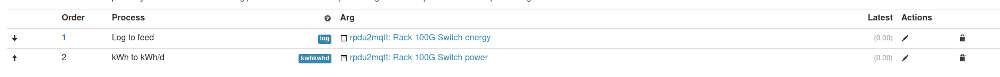
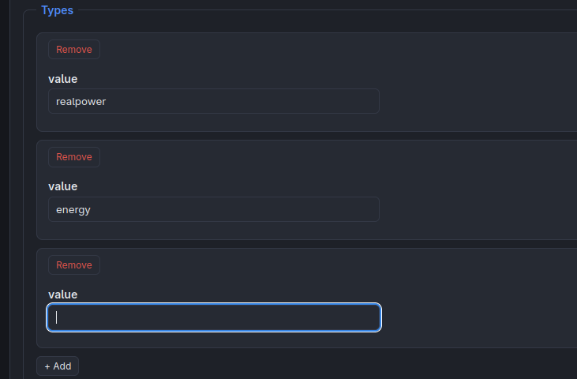
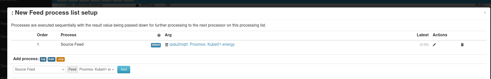

# rPDU2MQTT — Improvements & Known Issues

## ✅ Done

### Correctness
- [x] **Retained-message cleanup** — stale `homeassistant/device/<id>/config` topics are cleared
  when a device disappears between discovery runs (component removals are handled by republishing).
- [x] **`JsonAttributes` flatten landmine** — removed the broken flatten converter and the unused
  `JsonAttributes`/`JsonAttributeSettings` types.
- [x] **No-override naming NRE** — falls back to the identifier instead of throwing.
- [x] **Nullable derefs in `PDU.cs`** — explicit null guards added.
- [x] **`Debugger.Break()` fallbacks** — replaced with warning logs.

### Robustness / quality
- [x] **Graceful shutdown** — `StopAsync` cancels the loop and drains it.
- [x] **Sync-over-async** — timer loop runs without `Task.Run(...).Wait()`.
- [x] **Build warnings** — all eliminated (0); CS8618 scoped via `.editorconfig`.
- [x] **Credentials out of config** — env vars `RPDU2MQTT_*` / `*_FILE` (Docker secrets).
- [x] **Tests** — xUnit project with helper/converter tests.

### Features
- [x] **Contextual default device names** — outlet names prefixed with their PDU.
- [x] **Device hierarchy** — verified PDU→outlet ownership via `via_device`.
- [x] **Outlet on/off control** — opt-in via `ActionsEnabled` (`switch` entities + command
  subscriber + PDU control). NOTE: PDU control endpoint is from the Geist/Vertiv spec and is
  **unverified against live hardware**.
- [x] **Alarm integration** — device + outlet `problem` binary_sensors from the PDU alarm state.
- [x] **`expire_after` / QoS tuning** — `expire_after` derived from `PollInterval`; state at QoS 1.
- [x] **Configuration GUI (#69)** — optional embedded web GUI (`Gui.Enabled`): password-protected,
  structured form generated from the config model, MQTT/PDU connection tests, and saves back to
  `config.yaml` (with a `.bak`). Restart applies changes.

### Ops
- [x] **GHCR publishing** — workflow fixed (built-in BuildKit, no Docker Hub dependency) with
  tagging: `main`→`:stable`, other branches→`:dev`, release tags→`:<version>`. (Already publishes
  to GHCR, not Docker Hub.)
- [x] **Simpler config format** — evaluated; see [ConfigFormatEvaluation.md](ConfigFormatEvaluation.md)
  (recommendation: incremental YAML improvements, not a format switch).

## 📌 Open

- [x] **Outlet control — verified on live hardware** (both PDUs incl. OneView cluster via the
  master's proxy port; auth, control, optimistic + latched state all confirmed working).
- [ ] **Push / release** — this session's commits live on local `working-branch`. Push it (builds
  `:dev`) and tag `v0.4.0` to publish a release image.
- [ ] **Outlet control docs** — document setup: `ActionsEnabled`, a PDU user with **Control** on
  every cluster node, proxy-port behavior, and the PDU apply-delay.
- [ ] **Release workflow** — consider a dedicated GitHub Release workflow (changelog/artifacts)
  beyond the container build.
- [ ] **README & documentation** — make the README more thorough and less AI-generated in tone.
- [x] **Helm chart** — [`charts/rpdu2mqtt`](charts/rpdu2mqtt): config ConfigMap, credentials Secret,
  Deployment, optional GUI Service/Ingress, and a Prometheus Operator `ServiceMonitor`.
- [ ] **Kubernetes CRD config source** — optional `RpduConfig` CRD as a writable config source
  (makes GUI Save work in k8s), with status subresource. Design proposal:
  [KubernetesCRD.md](docs/KubernetesCRD.md).

Configuration GUI needs explanation of various settings. Help text, etc... 
- Ex- what is "ActionsEnabled"? What is "RemapMake and Remap Model???" GUI should display meaning....
- Kubernetes CRDs should contain descriptiosn too.

GUI
  - Would be nice to be able to see the ACTUAL generated paths and metric types for home assistant, prometheus, home assistant... etc.... and how overrides affects it.

Home Assistant  - Groups
  - For Oneview groups- I should be able to see the switches for contained group members, to allow me to toggle individual outlets in a group.
  - Should be a master "switch" allowing the entire group to be toggled off as well.
  - I would like to see some rollup sensors potentially populated for groups, if possible.

Alarms-
  There is nothing in the GUI, or MQTT to allow configuring any of the alarms or actions.
  Seems like that could be useful functionality.

Documentation
  - Configuration guide will need to be updated to include details to configure either via GUI, or via CRDs.
  - Will need to capture a bunch of screenshots and images too.
  - The main readme, needs to have screenshots showing this in use, in home assistant, emoncms, and prometheus.

Actions Enabled-
  - If actions are not enabled, switches should not be discovered in home assistant. Or any other write actions.
  - Should also prob rename this, to Enable Write Actions, or something.

Unit Testing-
  - Pretty lax. Need to expand unit testing.
  - Unit testing k8s CRDs too?
  - Helm chart unit tests?

Make / Model
  - As home assistant can display the Manufacturer and Model for individual switches, it would be pretty slick to be able to override the values for individual outlets, so instead of showing GEI / MNU3E1R1-12S203-3TL5A0E10-S-115, I could for example, show Dell / PowerEdge r730XD.

Home Assistant / Device Info
  - 
  - Should show the IP and MAC Address of the connected PDU.

Home Assistant / Outlet Info
  - 
  - Should ideally display the actual outlet number in the device info.

MQTT / Home Assistant
  - Add option/configuration to toggle last-will messages
  - When disabled, then option to configure the amount of time before device/outlets/etc shows unavailable.

Reset Statistics (Write Action)

More Outlet Options / Metrics / Values
  - Expose more PDU configuration options to home assistant
  - 
  - Configurable On / Off / Reboot Delays.
  - Reboot Button
  - Dropdown for Power-On Action
  - 
  - Add option to enable a diagnostics button in home assistant to reset the statistics for a outlet/device.
    - This is exposed as a operation. Reboot is too.
    - 

GUI / Live View Enhancements:
  - Can improve the live view, to display data simlier to this:
  - 