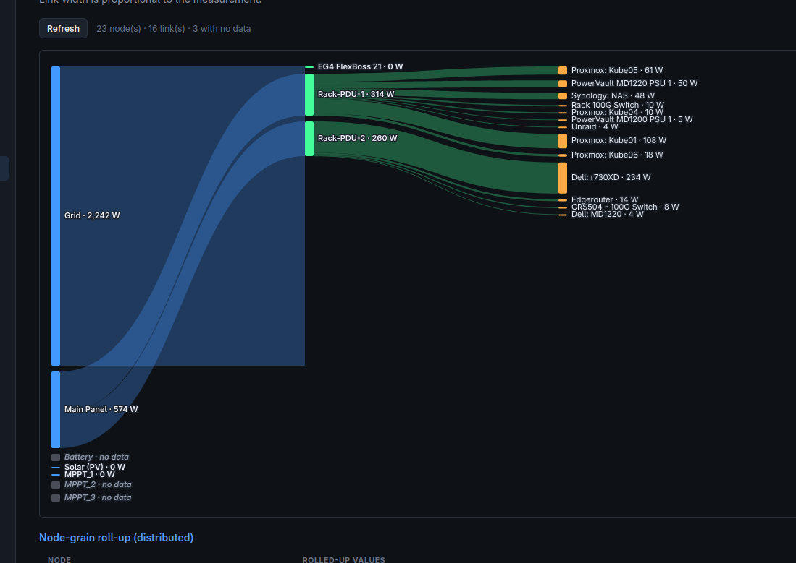
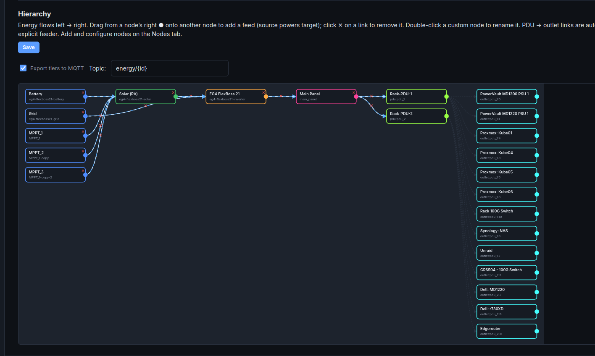

Branch feat/v3-pipeline-abstractions.

1. Node editor — 05b1406
    [x] New nodes default to Mode "none"; nothing is inferred/sized until you ask for it.
    [x] "Current" column explains itself (header + empty cells): the value lands on the source's
        next message/poll, and an unsaved binding isn't read at all. No page reload involved.
    [x] "Invert" checkbox on power/current bindings — it's the sign of Scale.
    [x] "Copy" per node (kind/mode/value/bindings; wiring not copied — rename then wire).
    [x] Feeds / Fed by pickers have a search box; Enter takes the single match.

2. Multi-PDU — 2c1a0e5, a9a6eec, 8ea0864
    [x] Outlet + group writes reach the PDU that owns them, never the primary. Writes go up the
        tree: the child holds the instance its parent stamped and asks that parent (whose grain
        key IS the instance id) to make the device call. No grain resolves a PDU for itself.
    [x] Parent hands the whole document down: PduGrain -> RawDevice -> PduDeviceGrain ->
        RawOutlet -> OutletGrain. Each child extracts what it needs (the outlet does its own
        unit conversion and feeds its own flow node) and keeps the document it came from.
    [x] Each OneView group is bound to its PDU on every poll; PduChildren lists groups too.

3. Same anti-pattern, found while sweeping for it — 8ea0864
    [x] OperatorGrain fished KubernetesConfigSource out of IServiceProvider; now an optional
        constructor dependency.
    [x] PduGrain wrote poll success to the process-local HealthState, so every process that
        didn't host the activation failed its readiness probe forever. PduSyncService records it
        per-process now, only on a genuinely newer snapshot.

4. Group-key collision — 6685ca6
    [x] No topic change was needed after all: the ambiguity was in the identity. A group grain is
        keyed instanceId|groupKey, so "Rack 1" on two PDUs is two groups; a flat group command is
        resolved by asking each PDU which groups it has, and actions every PDU that has that name.
        <parent>/Groups/<key>/control is unchanged — existing automations keep working.

5. Autocomplete / Picker — 2835481
    [x] MQTT topic autocomplete while typing, plus a Browse picker showing each topic's last value.
    [x] Choosing a topic infers metric / unit / value from the payload (a unit beats the topic's
        wording), and never overwrites a choice you already made.
    [x] JSON payloads offer their numeric field paths as autocomplete for the JSON field box; a
        field's leaf name decides its metric (ENERGY.Voltage is a voltage, not an energy).
    [x] Modbus explorer: "Browse…" reads a block of registers and shows each decoded as
        uint16/int16/uint32/float32 — click the one that matches to bind it. One read per click.
    [x] No background indexer. TopicIndexGrain leases itself to whoever is browsing; the broker
        subscription exists only during a lease, the grain drops everything and deactivates when it
        lapses, and it caps at 2000 topics while alive.

6. Logging — f39f754
    [x] Startup summary: version, roles, config source, every PDU/Modbus source, the size of the
        energy-flow graph, and each destination that's on or off. One block, once.
    [x] Information covers anything that changes the world: every outlet/group/config write, with
        the PDU it went to, plus a PDU's shape whenever it changes.
    [x] Debug covers why nothing is happening: each poll with latency + counts, the flow graph as
        provisioned, ingest batches, and repeat failures (loud once, then counted quietly).
    [x] Verbose covers the roll-up step by step — every node's value change and who it notified.
    [x] Fixed the file sink, which was given the *console's* severity and format, so "quiet console,
        full detail on disk" could not work. docs/Configuration.md now documents all three levels.

7. Paths page — 1927d2b
    [x] Every cell copies now, not just the generated paths — device, outlet and measurement names
        are what you type into overrides and filters.
    [x] Copying reports whether it actually worked: navigator.clipboard only exists in a secure
        context, and this GUI is usually plain http on a LAN, so it falls back to the selection
        trick instead of claiming "Copied" and doing nothing.

8. Node rename — 1927d2b
    [x] Rename action rewrites the node, its links and the legacy Parents map in one go.
    [x] Warns about what it can't fix: the MQTT topic, HA entity, Prometheus series and EmonCMS feed
        are all derived from the id, so anything recording under the old name stops following it.

9. EmonCMS grains — 71a3169
    [x] EmonCmsFeedGrain is the single cluster-wide owner of the writes to EmonCMS. One activation,
        one caller at a time, so "once cluster-wide" is structural instead of a leader check — and
        the GUI's "Provision now" button can no longer race the periodic pass into duplicate feeds.
    [x] The grain owns when it runs (throttled for a timer, always for a human) and holds the last
        outcome; EmonCmsFeedSync keeps knowing the API. EmonCmsFeedProvisioner is now a thin poker.

10. README / project goals — f2a8da1
    [x] Rewritten around what this actually is: whole-house energy flow, end to end, with a mermaid
        diagram of the chain (panels -> strings -> MPPTs -> inverter -> battery/transfer switch ->
        load centers -> CT-clamped circuits -> devices).
    [x] Says why it exists rather than being done in Home Assistant: six years of 15-second
        per-circuit history is worth keeping, and HA updates have renamed entities and broken things.
    [x] Features split into the energy flow and the PDU bridge — the PDUs are one tier now, not the
        whole story.

Nothing open.

- [x] in the energy flow chart- clicking a node, which hilight its path back to the root nodes, and dim everything else

Click it again, to restore.

    Clicking a node lights everything upstream of it and dims the rest; clicking it again, or clicking the
    empty canvas, restores. Group nodes keep click for expand/collapse — that is their existing
    affordance — so open a group first, then trace inside it.

    Dimming is a class on the <svg>, never a rewrite of each element's fill-opacity: that attribute
    already means something (a hairline says the quantity is unknown), and overwriting it to dim would
    destroy the thing the chart is being read for.

- [x] Energy Flow Chart- ability to display Power.... Or Energy.  (#275 — metric toggle on the Flow tab)

- Need to aggregate energy data, using the collected power data. Will need redis broker to support
    Helm chart will need redis broker. Docker compse example, will need redis.
    For those wanting simple install, should offer a simple sqlite database or mabye an inmemory cache or something.
    Cache will be responsible for aggregating Power into Energy.

- [x] Putting a "None" node between populated nodes, causing the chart to get extremely weird.

The None nodes are removed form the chart, instead of displaying between the nodes.

    Fixed: a none node carries zero by definition, and the known-zero filter dropped its inbound link —
    leaving it with no feeders, so it laid out as a root in column 0 instead of between the pair it was
    placed between. Its links are kept when it sits mid-chain; an inert node used as a pure source still
    drops out, as two existing tests require.

- [x] Nodes without energy, explain extremely weird.

In this case- MPPTs 1-3 feeds a aggregate node named Solar/PV, which feeds the inverter.

WELL..... since its night time, they have zero output. And... fubar.

    Fixed: the barycenter weighted each feeder by its link value, so a zero-carrying link had no pull at
    all and the whole idle solar chain sorted to the bottom of its column (measured: MPPTs at y=557/580/603
    against Solar at y=29) while the inverter stayed up beside the grid — joined by ribbons that scaled to
    ~0px, so nothing looked connected either. Weights now have a floor, a backward pass orders each column
    by what it feeds, and an idle link draws as a visible hairline. Pinned by web/sankey.check.mjs.

-----------

- [x] Hierarchy diagram, small bug-

battery feeds the Flexboss/Inverter, but, is positioned to the left of Solar which also feeds the flexboss.

It should, ideally be positioned below, or above Solar/PV.... since it connects to a node to the right of it. Instead, its displayed on the left side.

    Already fixed by #266 (this screenshot predates it): every node now sits one column left of the
    earliest thing it feeds, so Battery and Grid land beside Solar. Pinned by web/layout.check.mjs.

-----------------------

- [x] Need some units created for percentages. Ie- Battery Percent, Load Percent... etc.. Temperature, might be a good metric to create as well.

    Added `percent` (%, or a 0-1 fraction) and `temperature` (°C / K) alongside the existing `soc`.

    While adding them: every metric was being summed up the tree, so an *intensive* one — voltage,
    frequency, power factor, soc, and now temperature/percent — produced a figure true nowhere in the
    system. Three 120 V outlets reported a 360 V PDU. Not reachable from the Sankey (its toggle only
    offers additive metrics) but reachable through the API's ?metric= parameter, including the public
    v1 API. FlowUnits now records which metrics add up, and an intensive one is reported per node with
    no roll-up: a node shows the reading it has, a node without one shows nothing.

------------------------

Need either a page, or dashboard, to allow display lots of the data we are collecting, Currently, kind of limited to whatever the chat displays. 

Extra page just for displaying data would be handy.

- [x] In addition, overing over items in the flow chart, SHOULD yield a hover-over popup, displaying node details, and data.

    Hovering a Sankey node shows what it is, what it currently reads, what feeds it and what it feeds
    (with each link's value), and which sources are bound to it — so a wrong topic or register is
    visible from the diagram itself. Built from data already on the client, so it costs no extra request.
    It is also the only place a node's intensive readings can appear, since those are deliberately kept
    off the ribbons.

----------------------------

Should add a button to the emoncms page, which  opens a webpage/tab to emoncms.

Prob should do the same for home assistant. And promehteus. And the PDUs.

URLs should be optional, and button only display if populated.

-----------------------------

Minor- should add a button / badge somewhere on the web interface linking back to our github page. Ability to disable in the options too, but, default enabled.

Under diagnostics page, prob put a button linking to our discord for support. https://static.xtremeownage.com/discord