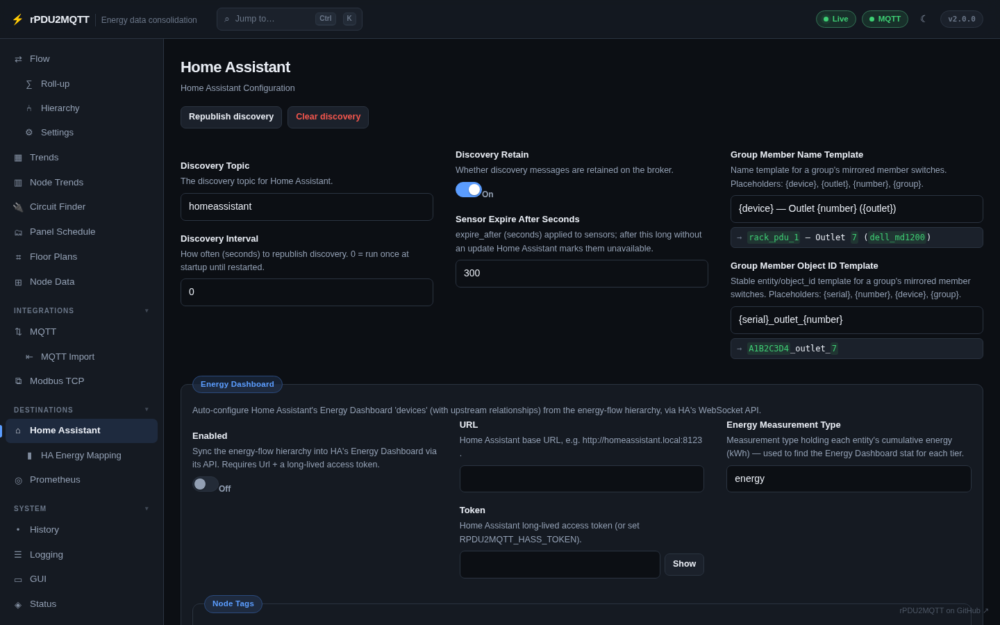
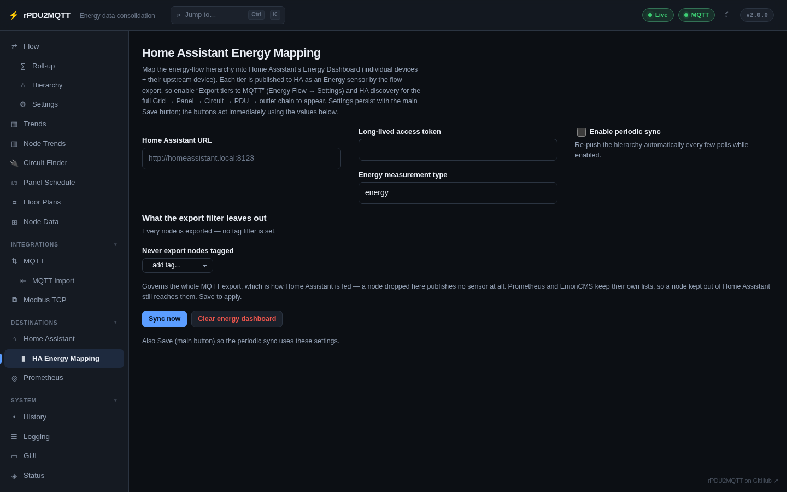

# Home Assistant

rPDU2MQTT talks to Home Assistant two ways: **MQTT discovery**, which creates the devices and entities,
and the optional **Energy Dashboard sync**, which uses Home Assistant's own API.



## Discovery

```yaml
HomeAssistant:
  DiscoveryEnabled: true
  DiscoveryTopic: "homeassistant"   # must match Home Assistant's MQTT discovery prefix
  DiscoveryInterval: 300            # seconds between republishing; 0 = once at startup
  DiscoveryRetain: true
  SensorExpireAfterSeconds: 300     # expire_after on sensors
```

The bridge, each PDU, every outlet, each OneView group and, with `EnergyFlow.MqttExport` on, every
energy-flow tier appear as Home Assistant devices. The discovery topics are listed under
[MQTT topics](../reference/mqtt-topics.md#home-assistant-discovery).

The page's **Republish discovery** button reloads the saved config and re-reads the PDU, so edits to
overrides, names and templates apply without a restart. **Clear discovery** removes the retained
discovery messages, so the entities disappear from Home Assistant until discovery runs again.

Availability follows `MQTT.LastWill`; see [MQTT › Last Will / Availability](mqtt.md#last-will-availability-optional).

### OneView group members

A group's member switches are mirrored onto the group device. Their names and object ids come from:

| Setting | Default | Placeholders |
| --- | --- | --- |
| `GroupMemberNameTemplate` | `{device} — Outlet {number} ({outlet})` | `{device}`, `{outlet}`, `{number}`, `{group}` |
| `GroupMemberObjectIdTemplate` | `{serial}_outlet_{number}` | `{serial}`, `{number}`, `{device}`, `{group}` |

## Energy Dashboard

`HomeAssistant.EnergyDashboard` configures Home Assistant's Energy Dashboard devices, with their upstream
relationships, from the energy-flow hierarchy over Home Assistant's WebSocket API.

```yaml
HomeAssistant:
  EnergyDashboard:
    Enabled: true
    Url: http://homeassistant.local:8123
    # Token: from RPDU2MQTT_HASS_TOKEN
    EnergyMeasurementType: energy
```

Which nodes make up the dashboard's grid, solar and battery sources comes from
[`EnergyFlow.Balance`](../energy-flow/index.md#the-energy-balance-what-counts-as-solar-grid-battery-and-home).
`NodeTags.Include` / `NodeTags.Exclude` limit which nodes are sent.



The **HA Energy Mapping** page (under Destinations) syncs on demand with **Sync now**, can clear what it
created with **Clear energy dashboard**, and turns on a periodic sync.

The same URL and token are used to read [Home Assistant entities as sources](../energy-flow/sources.md#live-sources-from-home-assistant-entities),
as a [history backend](history.md), and by *Tools › Publish rooms to Home Assistant* on the
[Floor plans](../energy-flow/floor-plans.md#rooms-in-home-assistant) page.

All settings: [Home Assistant settings reference](../reference/settings/homeassistant.md).
