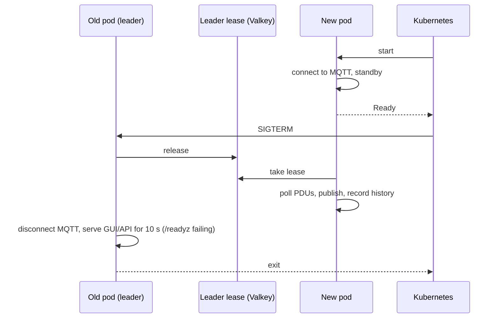
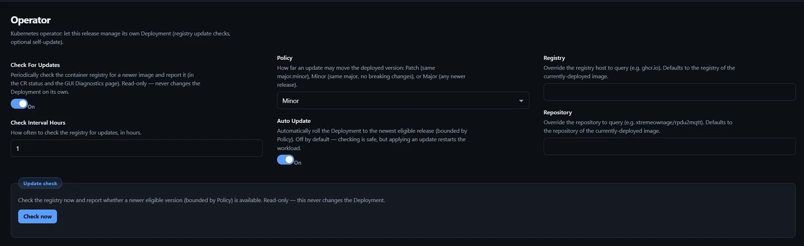
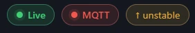

# Updates and restarts

Kubernetes (Helm chart). Seamless restarts and automatic image updates.

## Seamless restarts

A restart or update starts the new pod, waits for it to be Ready, then stops the old one. Readings, MQTT publishing and the GUI continue through the rollout.

### Enable

On by default in the Helm chart:

```yaml
gracefulRollout:
  enabled: true     # default
valkey:
  enabled: true     # default; or config.Cache.Enabled with your own Valkey/Redis
```

| Condition | Deployment strategy |
| --- | --- |
| `gracefulRollout.enabled` and a cache (`valkey.enabled` or `config.Cache.Enabled`) | `RollingUpdate`, `maxSurge: 1`, `maxUnavailable: 0` |
| No cache, or a `ReadWriteOncePod` history or floor plan volume | `Recreate` |

With a `ReadWriteOnce` history or floor plan volume, both pods are scheduled on the same node (a `podAffinity`, unless `affinity` is set).

### Rollout sequence



- Only the lease holder polls, publishes, accumulates energy and writes history.
- A standby takes the lease only while connected to MQTT.
- The old pod disconnects from MQTT cleanly once the new pod holds the lease, so Home Assistant entities stay available.
- A pod that is killed holds the lease for at most 15 s.

| Variable | Default | |
| --- | --- | --- |
| `RPDU2MQTT_SHUTDOWN_DRAIN_SECONDS` | `10` | Seconds the old pod keeps serving after SIGTERM |
| `RPDU2MQTT_LEADER_LEASE_SECONDS` | `15` | Lease length |

The chart sets `terminationGracePeriodSeconds: 45` on the pod.

### What rolls the Deployment

| Action | Where |
| --- | --- |
| **Restart** | **Diagnostics** page |
| **Switch**, **Force update** | **Operator** page, [Deployed version](#deployed-version) |
| Automatic update | [Auto Update](#automatic-updates) |
| Config change | `helm upgrade` with a changed `config:` |
| Scheduled restart | `autoRestart.enabled` ([Helm](helm.md#key-values)) |

### In the GUI

After **Restart**, **Switch**, **Force update** or an automatic update, the **Live** badge shows **Updating** and the page shows **Waiting for the bridge to come back** until the new pod answers. **Dismiss** appears after 30 s.

After any restart the page reconnects on its own. When the new pod runs a different version, the page reloads; with unsaved edits it asks you to save or discard first.

### Without Helm

On every instance:

| Setting | Value |
| --- | --- |
| `RPDU2MQTT_LEADER_LEASE` | `true` |
| `Cache.Enabled` | `true` (the lease is kept in the cache) |
| `RPDU2MQTT_DEPLOYMENT` | Deployment name, so **Restart** rolls it instead of deleting the pod |
| Deployment strategy | `RollingUpdate`, `maxSurge: 1`, `maxUnavailable: 0` |

## Automatic updates

The app checks the container registry for a newer image and can roll its own Deployment to it.

### Enable

Needs the [Kubernetes CRD](kubernetes-crd.md) config source. Turn the feature on in the chart values:

```yaml
kubernetesConfigSource:
  enabled: true
config:
  Operator:
    Enabled: true
```

The **Operator** page then appears in the GUI.

Without Helm, also set `RPDU2MQTT_IMAGE` to the deployed image and `RPDU2MQTT_POD_NAME` to the pod name (`fieldRef: metadata.name`).

### Settings

**Operator** page:



| Setting | Default | Values |
| --- | --- | --- |
| **Check For Updates** | On | Check the registry on a schedule. Reports only |
| **Check Interval Hours** | `6` | Hours between checks. Minimum 1 |
| **Policy** | `Minor` | How far an update may move the version (below) |
| **Auto Update** | Off | Roll the Deployment to the newest eligible image |
| **Registry** | registry of the deployed image | e.g. `ghcr.io` |
| **Repository** | repository of the deployed image | e.g. `xtremeownage/rpdu2mqtt` |

Press **Save**. All keys: [Operator settings](../reference/settings/operator.md).

### Policy

Applies to version tags (`2.0.1`, `v2.0.1`).

| Policy | Deployed `2.1.3` may move to |
| --- | --- |
| `Patch` | `2.1.x` |
| `Minor` | `2.x.y` |
| `Major` | any newer release |

Pre-release tags (`2.2.0-beta.1`) are never selected.

### Channel tags

For a moving tag (`unstable`, `dev`, `edge`, `main`, `latest`, `stable`) the check compares the tag's digest in the registry with the digest the pod is running. **Policy** does not apply. With **Auto Update** on, a newer build is pulled under the same tag, pinned by digest.

### Update check

**Operator › Update check › Check now** runs a check immediately. It does not change the Deployment.

### Deployed version

**Operator › Deployed version**:

| Control | Action |
| --- | --- |
| **Switch** | Roll the Deployment to the selected channel or release |
| **Force update** | Re-pull the deployed tag now, pinned by digest |

### Header badge



| Badge | Meaning |
| --- | --- |
| `↑ 2.1.4` (amber) | Newer release available. On a channel tag, shows the channel (`↑ unstable`): a newer build of it is available |
| `✓ 2.1.3` (green) | Up to date |
| **Check updates** | No result yet, or the check could not run. Hover for the reason |

Click the badge to check now. Hidden without the Kubernetes config source.

When **Auto Update** rolls the Deployment, the GUI shows **Update applied — rolling to …** and waits for the new pod ([In the GUI](#in-the-gui)).

### What is updated

Every Deployment in the release that runs the app image: the container image and `RPDU2MQTT_IMAGE`. The Valkey Deployment is not changed. Each Deployment rolls with its own strategy, so the update is [seamless](#seamless-restarts) when that is enabled.

### Status

The result is written to the `RpduConfig` status:

```shell
kubectl get rpduconfig rpdu2mqtt -n rpdu2mqtt -o jsonpath='{.status.update}'
```

| Field | |
| --- | --- |
| `available` | Newer eligible image exists |
| `current`, `latest` | Deployed and newest eligible tag |
| `policy`, `autoUpdate` | Settings used |
| `applied`, `appliedAt` | Tag and time of the last automatic roll |
| `checkedAt` | Time of the last check |
| `message` | Result text |

### Schedule

First check 20 s after start. Checks then run every **Check Interval Hours**.
