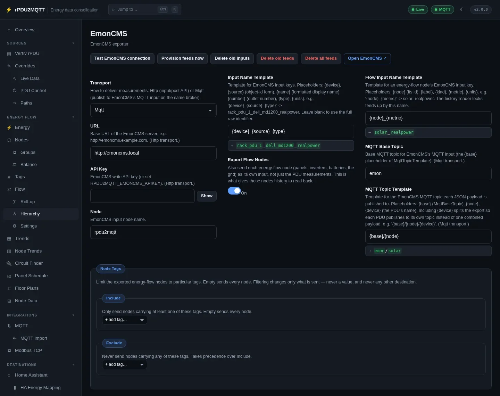
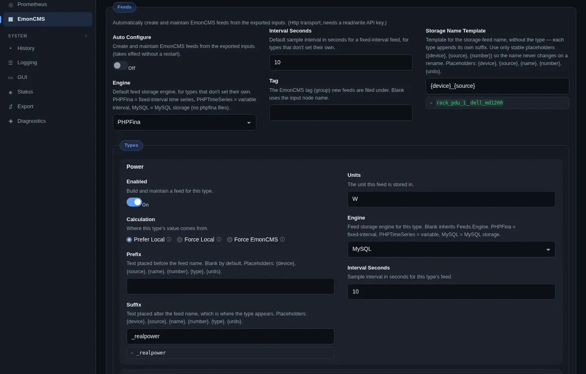

# EmonCMS

Sends measurements to EmonCMS every poll. EmonCMS creates the inputs. Bundled plugin: `plugins/rPDU2MQTT.Plugin.EmonCms`.

Turn on with `EmonCMS.Enabled: true` in the config file. The page appears under **Destinations** once enabled.

## GUI

**Destinations › EmonCMS**.



| Field | Setting | Default | Notes |
| --- | --- | --- | --- |
| Transport | `EmonCMS.Transport` | `Http` | `Http` (input/post API) or `Mqtt` (EmonCMS MQTT input on the same broker) |
| URL | `EmonCMS.Url` | | Http |
| API Key | `EmonCMS.ApiKey` | | Write key. Or `RPDU2MQTT_EMONCMS_APIKEY`. Http |
| Node | `EmonCMS.Node` | `rpdu2mqtt` | Input node name |
| Input Name Template | `EmonCMS.InputNameTemplate` | `{device}_{source}_{type}` | Blank = full raw identifier |
| Export Flow Nodes | `EmonCMS.ExportFlowNodes` | on | Send each energy-flow node as an input |
| Flow Input Name Template | `EmonCMS.FlowInputNameTemplate` | `{node}_{metric}` | |
| MQTT Base Topic | `EmonCMS.MqttBaseTopic` | `emon` | Mqtt |
| MQTT Topic Template | `EmonCMS.MqttTopicTemplate` | `{base}/{node}` | Mqtt. Add `{device}` for one topic per PDU |
| Node Tags › Include / Exclude | `EmonCMS.NodeTags` | all nodes | |

`EmonCMS.Path` (default `input/post`) sets the API path for Http.

### Template placeholders

| Template | Placeholders |
| --- | --- |
| Input Name Template | `{device}`, `{source}`, `{name}`, `{number}`, `{type}`, `{units}` |
| Flow Input Name Template | `{node}`, `{label}`, `{kind}`, `{metric}`, `{units}` |
| MQTT Topic Template | `{base}`, `{node}`, `{device}` |

Results are lower-cased; non-alphanumeric characters become `_`.

### Buttons

| Button | Action |
| --- | --- |
| Test EmonCMS connection | Checks the server and API key (Http) or the broker (Mqtt). |
| Provision feeds now | Creates and updates feeds. |
| Delete old inputs / Delete old feeds | Lists inputs or feeds this bridge no longer sends or provisions, and deletes them on confirmation. |
| Delete all feeds | Deletes every feed this bridge created, and its data. Asks three times. |
| Open EmonCMS | Opens the server. |

## Feeds

Under **Feeds**. Http transport; needs a read/write API key.



| Field | Setting | Default |
| --- | --- | --- |
| Auto Configure | `EmonCMS.Feeds.AutoConfigure` | off |
| Engine | `EmonCMS.Feeds.Engine` | `PHPFina` |
| Interval Seconds | `EmonCMS.Feeds.IntervalSeconds` | `10` |
| Tag | `EmonCMS.Feeds.Tag` | |
| Storage Name Template | `EmonCMS.Feeds.StorageNameTemplate` | `{device}_{source}` |

Per type (`realpower`, `energy`, `energy_d`, `apparentpower`, `current`, `voltage`, `frequency`, `powerfactor`), under **Types**: Enabled, Calculation, Prefix, Suffix, Units, Engine, Interval Seconds.

| Calculation | Value written |
| --- | --- |
| Prefer Local | The bridge's reading. Where it has none, EmonCMS works it out. |
| Force Local | The bridge's reading only. |
| Force EmonCMS | EmonCMS works it out. Default for `energy_d`. |

**Virtual** (`EmonCMS.Feeds.Virtual`): optional friendly-named virtual feeds. Name Template default `{name} {type}`.

## Reading feeds back

Node sources of type `emoncms` read feed values back ([Nodes › Bindings](../energy-flow/nodes.md#bindings)). Poll interval: `EmonCMS.Source.PollIntervalSeconds`, default `30`, range 5–3600.

EmonCMS is also a [history backend](../system/history.md).

The **Diagnostics** page shows the last export result.

## YAML

```yaml
EmonCMS:
  Enabled: true
  Transport: Http
  Url: "http://emoncms.example.com"
  # ApiKey: RPDU2MQTT_EMONCMS_APIKEY
  Node: rpdu2mqtt
  InputNameTemplate: "{device}_{source}_{type}"
  Feeds:
    AutoConfigure: true
    Engine: PHPFina
    IntervalSeconds: 10
```

All settings: [EmonCMS settings reference](../reference/settings/emoncms.md).
