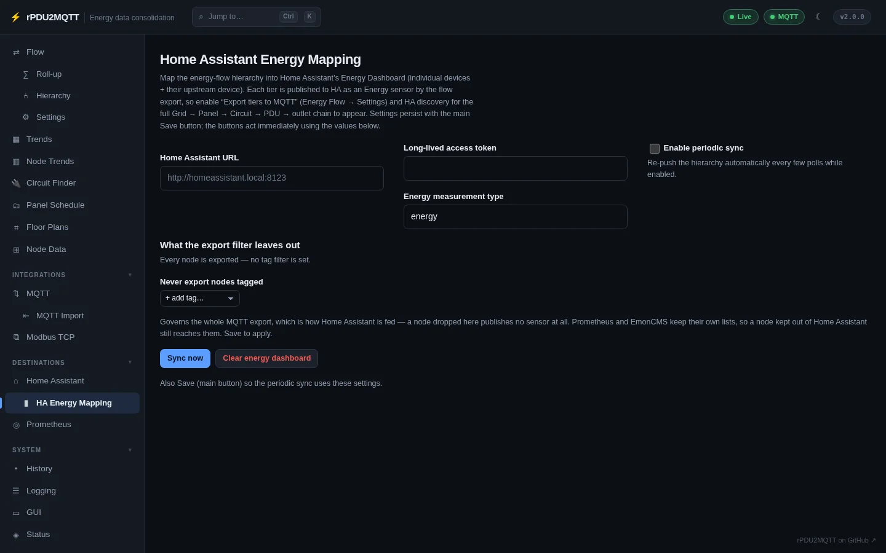

# Home Assistant

Two parts:

- **MQTT discovery** creates the devices and entities. Needs [MQTT](../integrations/mqtt.md).
- **Energy Dashboard sync** fills Home Assistant's Energy Dashboard over its WebSocket API.

## Discovery

GUI: **Destinations › Home Assistant**.


| Field | Setting | Notes |
| --- | --- | --- |
| Discovery Topic | `HomeAssistant.DiscoveryTopic` | Must match Home Assistant's MQTT discovery prefix. Usually `homeassistant`. |
| Discovery Interval | `HomeAssistant.DiscoveryInterval` | Seconds between republishing. `0` = once at startup. |
| Discovery Retain | `HomeAssistant.DiscoveryRetain` | Retain discovery messages on the broker. |
| Sensor Expire After Seconds | `HomeAssistant.SensorExpireAfterSeconds` | `expire_after` on sensors. |
| Group Member Name Template | `HomeAssistant.GroupMemberNameTemplate` | Default `{device} — Outlet {number} ({outlet})`. Placeholders `{device}`, `{outlet}`, `{number}`, `{group}`. |
| Group Member Object ID Template | `HomeAssistant.GroupMemberObjectIdTemplate` | Default `{serial}_outlet_{number}`. Placeholders `{serial}`, `{number}`, `{device}`, `{group}`. |

`HomeAssistant.DiscoveryEnabled` turns discovery on or off.

Devices created: the bridge, each PDU, every outlet, each OneView group, and every energy-flow tier when **Export tiers to MQTT** is on ([Flow settings](../energy-flow/flow.md#settings)). Topics: [MQTT topics](../reference/mqtt-topics.md).

Availability follows the MQTT Last Will ([MQTT](../integrations/mqtt.md)).

### Buttons

| Button | Action |
| --- | --- |
| Republish discovery | Reloads the saved config, re-reads the PDU and republishes. Applies name, override and template edits without a restart. |
| Clear discovery | Removes the retained discovery messages. Entities disappear until discovery runs again. |
| Find orphaned configs / Clear them | Lists retained discovery configs under this bridge's prefix that the current setup no longer publishes, and retracts them. |
| Find stale devices / Delete them | Lists this bridge's Home Assistant devices with no entities left, or only entities no longer provided, and deletes them through Home Assistant's API. Needs the Home Assistant URL and token. |

## Connection

The Energy Dashboard sync, rooms as areas, entity bindings, history and device cleanup all use one URL and token:

| Field | Setting | Notes |
| --- | --- | --- |
| URL | `HomeAssistant.Url` | e.g. `http://homeassistant.local:8123` |
| Token | `HomeAssistant.Token` | Long-lived access token. Or `RPDU2MQTT_HASS_TOKEN`. |

`HomeAssistant.EnergyDashboard.Url` and `Token` from older configs are moved here on load.

## Energy Dashboard

Fields on the same page, under **Energy Dashboard**:

| Field | Setting | Notes |
| --- | --- | --- |
| Enabled | `HomeAssistant.EnergyDashboard.Enabled` | Default off. |
| Energy Measurement Type | `HomeAssistant.EnergyDashboard.EnergyMeasurementType` | Default `energy`. |
| Node Tags › Include / Exclude | `HomeAssistant.EnergyDashboard.NodeTags` | Limit the sync to tagged nodes. Empty = all. |
| Exclude Device Kinds | `HomeAssistant.EnergyDashboard.ExcludeDeviceKinds` | Kinds left out of the individual devices list. Default `grid`, `solar`, `battery`, `inverter`. |

Grid, solar and battery sources on the dashboard come from [Balance](../energy-flow/index.md).

### HA Energy Mapping page

GUI: **Destinations › HA Energy Mapping**.



| Control | Action |
| --- | --- |
| Home Assistant URL, Long-lived access token, Energy measurement type | Same settings as above. |
| Enable periodic sync | Re-pushes the hierarchy every few polls. Save to apply. |
| Never export nodes tagged | `EnergyFlow.MqttExportTags.Exclude`. A node excluded here publishes no MQTT sensor. Prometheus and EmonCMS have their own tag filters. |
| Sync now | Pushes the hierarchy to the Energy Dashboard. |
| Clear energy dashboard | Removes what the sync created. |

Requires **Export tiers to MQTT** and discovery on, so each tier exists as a Home Assistant sensor.

## YAML

```yaml
HomeAssistant:
  DiscoveryEnabled: true
  DiscoveryTopic: homeassistant
  DiscoveryInterval: 300
  DiscoveryRetain: true
  SensorExpireAfterSeconds: 300
  EnergyDashboard:
    Enabled: true
    Url: http://homeassistant.local:8123
    # Token: RPDU2MQTT_HASS_TOKEN
    EnergyMeasurementType: energy
```

The same URL and token are used for [Home Assistant entities as node sources](../energy-flow/nodes.md#bindings), the Home Assistant [history backend](../system/history.md), and **Tools › Publish rooms to Home Assistant** on [Floor plans](../energy-flow/floor-plans.md).

All settings: [Home Assistant settings reference](../reference/settings/homeassistant.md).
