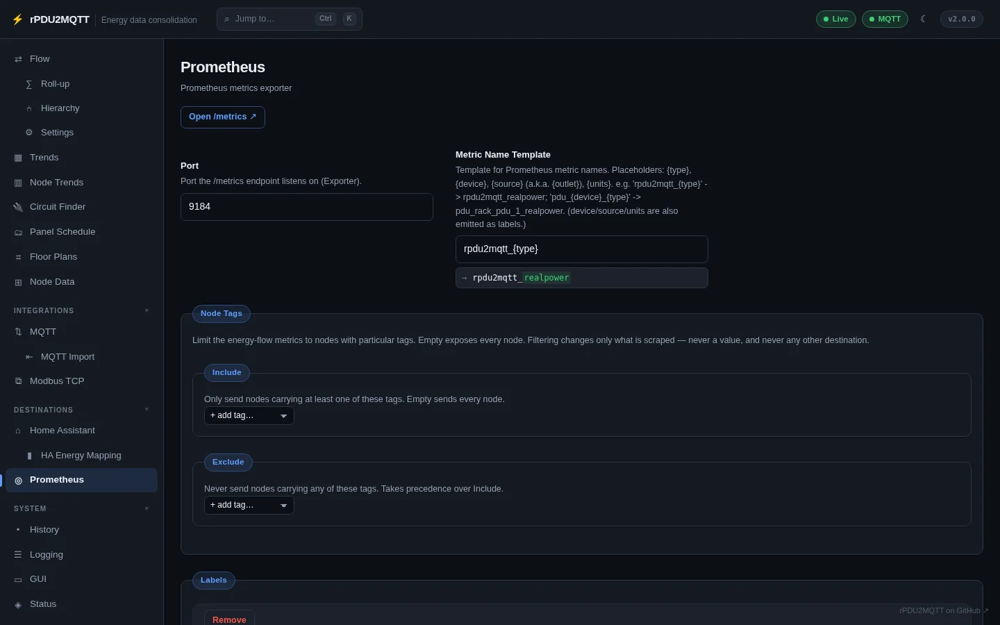

# Prometheus

Two delivery methods, either or both:

| Method | Setting |
| --- | --- |
| Scrape `/metrics` | `Prometheus.Exporter: true` (config file only) |
| Push to a Pushgateway | `Prometheus.Pushgateway.Enabled` |

`Prometheus.Enabled: true` (older key) is read as `Exporter: true`.

## GUI

**Destinations › Prometheus**. **Open /metrics** opens the endpoint.



| Field | Setting | Default |
| --- | --- | --- |
| Port | `Prometheus.Port` | `9184` |
| Metric Name Template | `Prometheus.MetricNameTemplate` | `rpdu2mqtt_{type}` |
| Node Tags › Include / Exclude | `Prometheus.NodeTags` | all nodes |
| Labels | `Prometheus.Labels` | `device`, `source`, `units` |
| Pushgateway › Enabled | `Prometheus.Pushgateway.Enabled` | off |
| Pushgateway › URL | `Prometheus.Pushgateway.Url` | e.g. `http://pushgateway:9091/metrics` |
| Pushgateway › Job | `Prometheus.Pushgateway.Job` | `rpdu2mqtt` |
| Pushgateway › Interval Seconds | `Prometheus.Pushgateway.IntervalSeconds` | `0` = PDU poll interval |

## Metric names

`MetricNameTemplate` placeholders:

| Placeholder | Value |
| --- | --- |
| `{type}` | Measurement type, or its `Overrides.Measurements` ID |
| `{device}` | Device name |
| `{source}` / `{outlet}` | Outlet or entity name |
| `{units}` | Units |

The result is lower-cased; non-alphanumeric characters become `_`. Example: `pdu_{device}_{type}` → `pdu_rack_pdu_1_realpower`.

Rename one type with an override:

```yaml
Overrides:
  Measurements:
    realPower:
      ID: power      # rpdu2mqtt_power
```

The **Paths** page shows the resulting names.

## Labels

| Label | Example |
| --- | --- |
| `device` / `device_name` | `rack_pdu_1` / `Rack PDU 1` |
| `source` / `name` | `outlet_10` / `Dell MD1200` |
| `type` / `type_name` | `realpower` / `Real Power` |
| `number` | `10` |
| `units` | `W` |
| `instance` | `rack-b` (PDU instance key) |
| `hierarchy` | `Rack Circuit A` (energy-flow tier feeding it) |

Changing the label set changes the identity of every existing series.

HELP text is the measurement name and unit, e.g. `Real Power (W), measured by rPDU2MQTT.`

## Energy-flow metrics

`rpdu2mqtt_flow_realpower`, `rpdu2mqtt_flow_energy`, `rpdu2mqtt_flow_energy_d`, labelled `node`, `name`, `kind`, `tier`. See [Totals and counters](../energy-flow/totals.md#published-fields).

## YAML

```yaml
Prometheus:
  Exporter: true
  Port: 9184
  MetricNameTemplate: "rpdu2mqtt_{type}"
  Labels: [device, device_name, source, name, units]
  Pushgateway:
    Enabled: false
    Url: "http://pushgateway:9091/metrics"
    Job: "rpdu2mqtt"
    IntervalSeconds: 0
```

All settings: [Prometheus settings reference](../reference/settings/prometheus.md).
