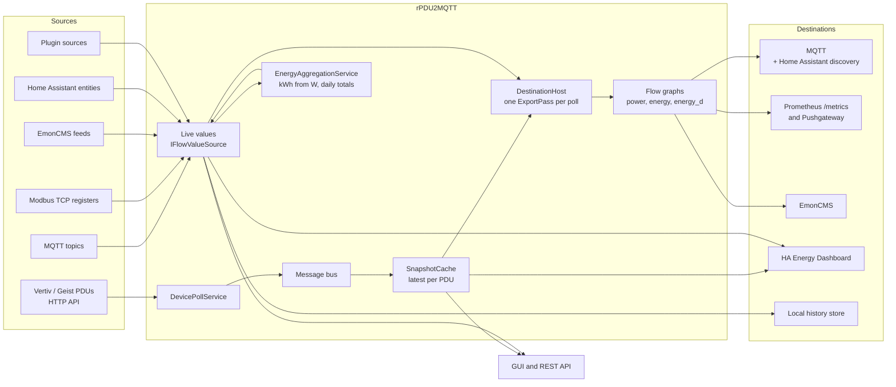
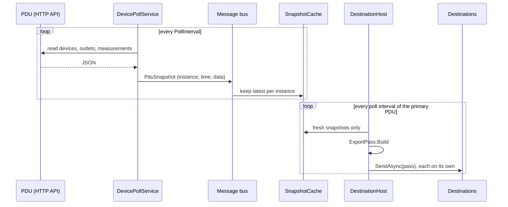
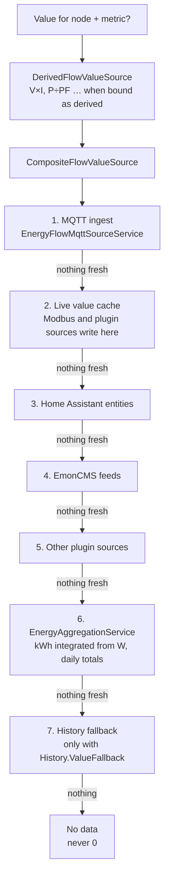
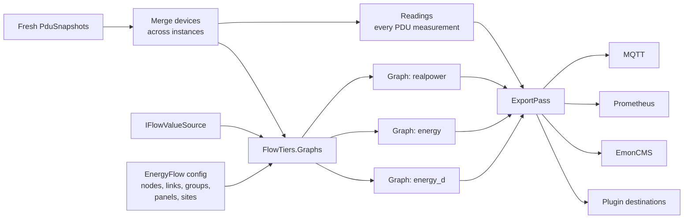
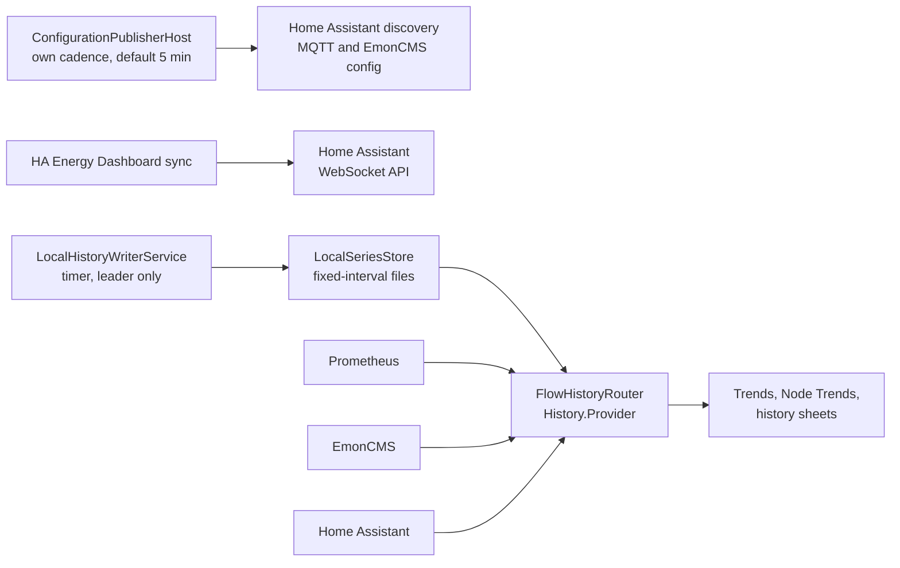
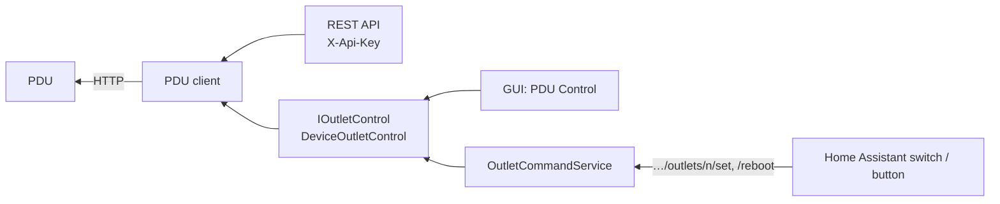

# How data flows

Source to destination, with the class names used in the code. All of it runs in one process under the default role (`all`); see [Roles](#roles) for the split.

## The whole picture

- **PDU snapshots** — a whole PDU's devices, outlets and measurements, read in one poll.
- **Live values** — one reading per node and metric, from any bound source.

Both feed the flow graph, handed to the destinations once per poll.

## PDU readings

- `DevicePollService` polls every configured PDU instance, plus any device a plugin supplies, and
  publishes each snapshot on the in-process bus (`ChannelMessageBus`).
- Each bus subscriber has its own bounded channel. A slow consumer drops its oldest snapshot.
- `SnapshotCache` keeps the latest snapshot per instance. The GUI and the REST API read it, never the
  PDU, so a page load does not cause a poll.
- `DestinationHost` skips stale snapshots.

## Live values for energy-flow nodes

Every node binding (`EnergyFlow.Nodes[].Sources`) is read through one seam, `IFlowValueSource`. The
sources are asked in order and **the first one with a fresh reading wins**:

- **MQTT** (`EnergyFlowMqttSourceService`) subscribes to the bound topics and keeps the latest value.
  Subscriptions are reconciled on a timer, so a topic bound in the GUI works without a restart.
- **Modbus** (`ModbusPollService`) polls each physical device (`host:port:unitId`) once per cycle, however many connections name it.
- **Home Assistant, EmonCMS and plugin sources** are kept in step with their bindings by
  `ValueSourcePluginHost`.
- **Aggregation** reads the measured sources only (never its own output), integrates watts into kWh for
  nodes with no energy counter when `Aggregation.Enabled` is on, and keeps each node's total since the
  period boundary when `TrackPeriods` is on. Those totals are saved to the cache (Valkey/Redis) when
  `Cache.Enabled`, otherwise to `energy-totals.json`. See
  [Totals and counters](../energy-flow/totals.md).
- A reading older than its binding's `StaleAfterSeconds` is skipped; the next source is tried. With none left, the node has no value.

## The export pass

Once per poll, `DestinationHost` builds one `ExportPass` and offers it to every destination that is
switched on:

- The graphs are built once per pass and shared by every destination.
- PDU devices and outlets become nodes (`pdu:<device>`, `outlet:<device>:<n>`) automatically; your
  nodes, links, groups, breakers and rooms are added from `EnergyFlow`.
- Each tier's value comes from a live value, a PDU measurement, or the sum of its children. See
  [Energy flow › Accuracy](../energy-flow/index.md#how-a-node-gets-its-value).
- Each destination applies its own node-tag filter (`TiersFor`).
- A failing destination is shown on the Status board; the others continue.

### What each destination does with it

| Destination | PDU readings | Flow tiers |
| --- | --- | --- |
| MQTT (`MqttPduIntegration`, `MqttIntegration`) | `<parent>/<serial>/…` topics | `<parent>/energyflow/<id>` JSON, when `EnergyFlow.MqttExport` is on |
| Home Assistant discovery | a device per PDU, outlet and group | a device per exported tier |
| Prometheus | `rpdu2mqtt_<type>` gauges | `rpdu2mqtt_flow_*` gauges |
| EmonCMS | inputs / feeds | flow-node feeds |

Topic and metric names are listed under [MQTT topics](../reference/mqtt-topics.md) and on the GUI's
**Paths** page.

## Slower paths

- **Configuration.** `ConfigurationPublisherHost` republishes discovery and other configuration on its own interval.
- **History.** `LocalHistoryWriterService` records every node's readings
  into the local store whatever `History.Provider` says; the pages read through whichever backend
  `Provider` names. See [History](../system/history.md).

## Commands back to the PDU

Only when `ActionsEnabled` is on:

The next poll reads the new state back.

## Roles

`RPDU2MQTT_ROLE` / `--role` ([Command line](../reference/cli.md#roles)):

| Part | worker | api | ui |
| --- | --- | --- | --- |
| PDU polling, MQTT and Modbus ingest, plugin sources | ✓ | | |
| Energy aggregation | writes | reads | reads |
| Destinations, discovery, outlet commands | ✓ | | |
| REST API | | ✓ | |
| GUI | | | ✓ |

The health endpoints run in every role.

### Leader lease

With `RPDU2MQTT_LEADER_LEASE=true` (set by the chart for graceful rollouts), only the lease holder runs destinations and writes local history. Every process serves and refreshes its own Prometheus `/metrics`.
