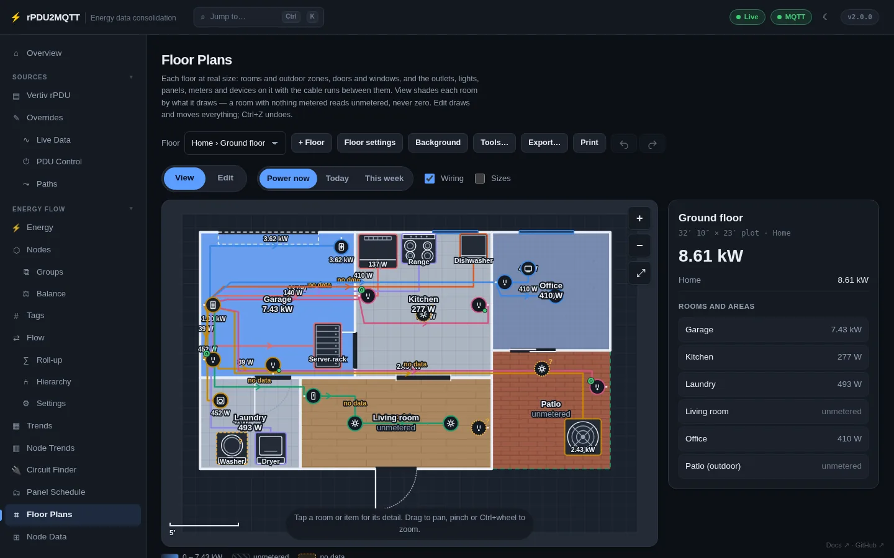
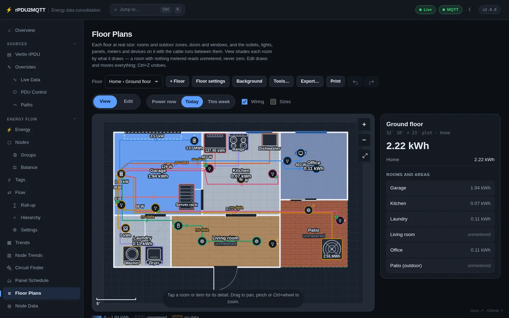
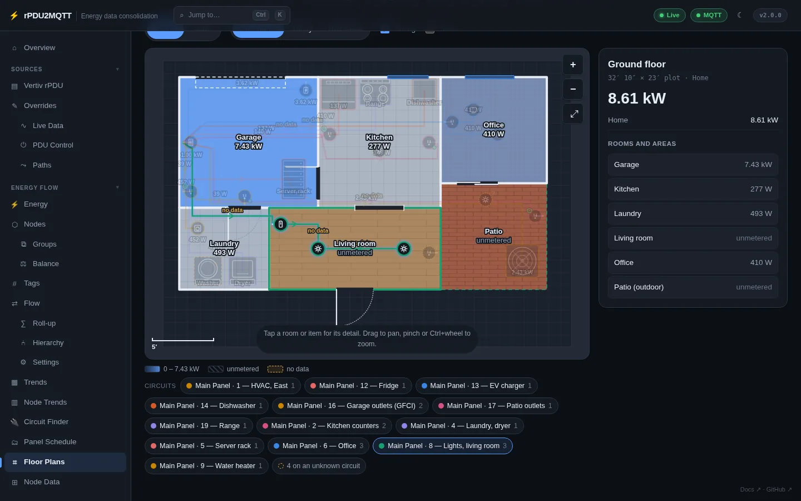
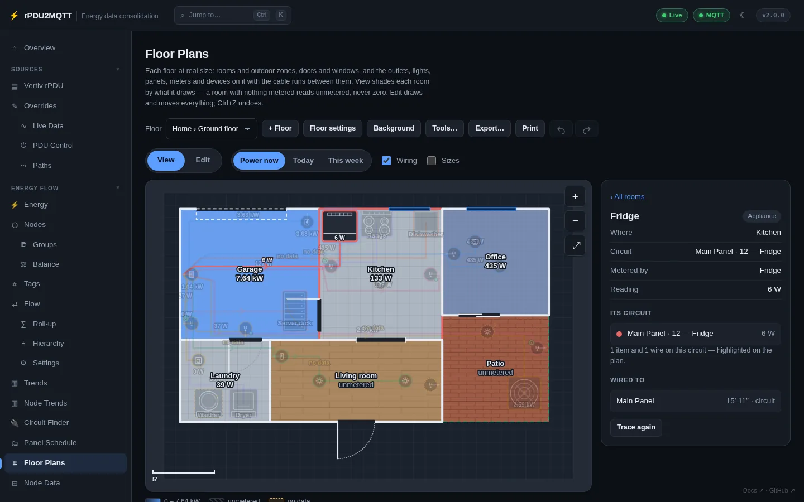
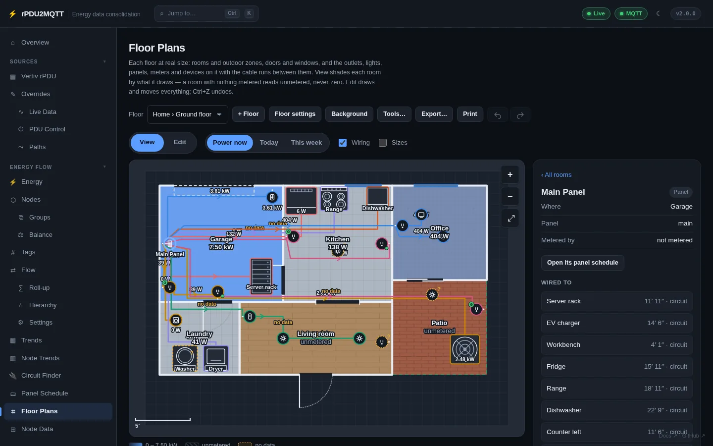
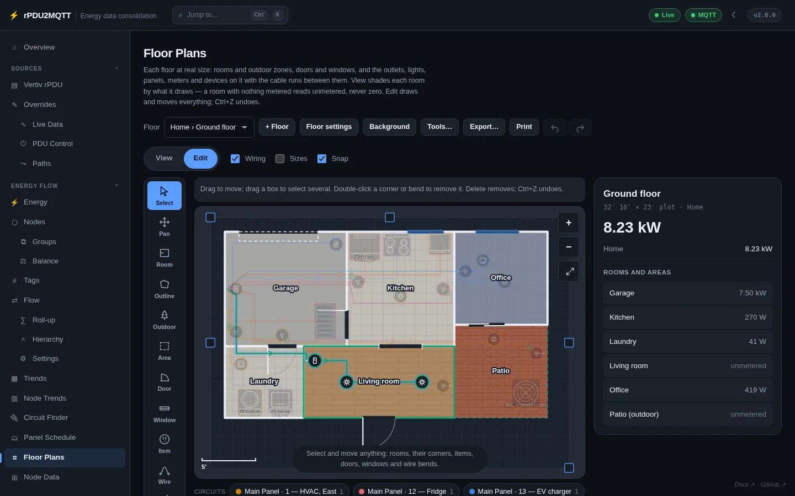
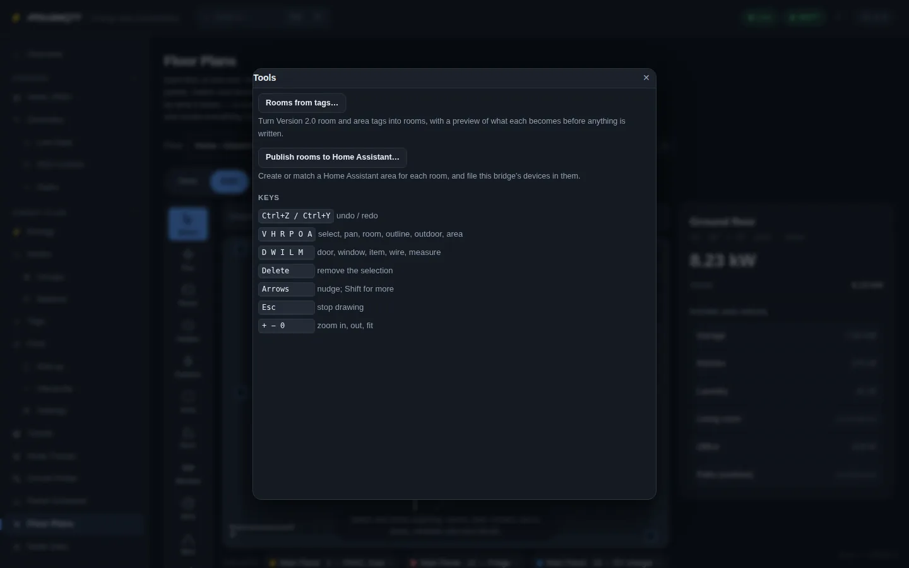

# Floor plans

**Energy Flow › Floor Plans**. Each floor at real size: rooms, outdoor zones, doors, windows, placed items and the cable runs between them. Rooms are shaded by what they draw. Bundled plugin: `plugins/rPDU2MQTT.Plugin.FloorPlan`.



## View

| Control | |
| --- | --- |
| Floor | Pick site and floor |
| View / Edit | Mode |
| Power now / Today / This week | Room shading |
| Wiring | Show cable runs |
| Sizes | Wall lengths and floor areas |
| Circuits (below the plan) | One chip per breaker with its item count. Click to highlight the circuit. |

=== "Today"

    

=== "Circuit highlighted"

    

Click an item for its circuit, meter, reading and what it is wired to.

=== "Appliance"

    

=== "Panel"

    

- A room with nothing metered is **unmetered** (hatched). A total missing a reading is **no data**.
- Rooms count toward their areas, floor and site.
- A circuit lists its metered devices and its unmetered remainder. Metered devices reading more than the circuit are flagged.

## Edit



| Tool | Key | |
| --- | --- | --- |
| Select | V | Select, drag, box-select. Shift / Ctrl / ⌘-click toggles. Ctrl+A all. Arrows nudge. |
| Pan | H | Drag to pan |
| Room | R | Drag a rectangle, or **Add a room by size** |
| Outline | P | Click each corner; click the first to close |
| Outdoor | O | Yard, porch, patio, driveway, deck |
| Area | A | Area spanning rooms |
| Door / Window | D / W | Click a wall. Door, double, sliding, garage, window, opening |
| Item | I | Place an item |
| Wire | L | From the supply item, each bend, to the load item |
| Constrain | K | Coincident, in line, parallel, square, level, plumb, fixed length, angle |
| Measure | M | Measure, or set the scale from a known distance |

Keys: Ctrl+Z / Ctrl+Y undo / redo, Delete removes, Esc stops drawing, `+` `−` `0` zoom.



### Items

`outlet`, `switch`, `fixture`, `fan`, `appliance`, `device`, `hvac`, `ev-charger`, `junction`, `panel`, `meter`, `pole`, `transformer`, `solar`, `battery`, `inverter`, `generator`.

- **At real size**: washer, dryer, fridge, freezer, range, dishwasher, water heater, furnace, condenser, rack, hot tub.
- Wall items (outlets, switches) snap to the nearest wall and face the room.
- **GFCI outlet**: everything wired from its load side is protected.
- **Circuit**: the breaker feeding it. **Metered by**: the node measuring it.
- **Trace its circuit**: switch a load on the item on and off; the matching channel is offered.

### Wires

| Kind | |
| --- | --- |
| `circuit` | Breaker to what it feeds |
| `feeder` | Panel to subpanel |
| `service` | Pole or transformer to meter and main panel |

Wiring an item with no circuit to one on a known circuit puts it on that circuit.

### Rooms and walls

- Shared corners move together. Alt pulls a shared corner apart. Double-click a wall's middle dot to add a corner.
- Rooms, areas and single walls can be locked.
- Surfaces: wood, tile, carpet, concrete, stone, grass, gravel, dirt, deck, pavers, water, snow, stairs. `SurfaceColor` recolours.

### Units

`Gui.DistanceUnits`: `auto`, `imperial`, `metric`. Lengths accept `12' 6"`, `12ft 6in`, `150"`, `3.75 m`, `375 cm`. `Scale` is drawing units per metre (default 100).

## Other controls

| Control | |
| --- | --- |
| + Floor | Add a floor |
| Floor settings | Name, level, plot size, ground, **Arrange** |
| Background | Upload a plan image (PNG, JPEG, WebP, SVG) |
| Tools… › Rooms from tags | Turn room-like tags into rooms and areas, with a preview |
| Tools… › Publish rooms to Home Assistant | Create or match HA areas and file devices into them, with a preview |
| Export… | SVG, PNG, or all floors as JSON. **Import floor plans…** reads it back. |
| Print | Print the floor |

## Where a node is

In order: its `Location`; an `AutoLocations` rule for its exact id; a placement metering it; a wildcard `AutoLocations` rule; the rooms its circuit serves; its feeder's location.

## Home Assistant

- Devices carry their room as `suggested_area` in discovery.
- With MQTT export on, every room, area, floor and site is published as a tier with power, energy and energy today.

## Plan storage

Plan images are stored outside the configuration, referenced by id. Max size `PlanStorage.MaxMegabytes` (10).

| Deployment | Setting |
| --- | --- |
| Helm | `floorPlans.persistence.enabled: true` (or `existingClaim`) |
| Docker | Mount a volume; set `PlanStorage.Directory` or `RPDU2MQTT_PLANS_DIRECTORY` |
| S3 bucket | `PlanStorage.ObjectStore`; secret in `RPDU2MQTT_PLANS_SECRET_KEY` |
| Cache on, nothing else set | Stored in Valkey |

A banner shows when no persistent storage is configured.

## YAML

```yaml
Gui:
  DistanceUnits: imperial
EnergyFlow:
  Sites:
    - Id: home
      Name: Home
      Floors:
        - Id: ground
          Name: Ground floor
          Level: 0
          Width: 1000
          Height: 700
          Scale: 100
          Ground: grass
          Rooms:
            - { Id: garage, Name: Garage, Surface: concrete, Shape: [ {X: 40, Y: 40}, {X: 380, Y: 40}, {X: 380, Y: 360}, {X: 40, Y: 360} ] }
            - { Id: patio, Name: Patio, Outdoor: true, Surface: pavers, Shape: [ {X: 680, Y: 300}, {X: 940, Y: 300}, {X: 940, Y: 560}, {X: 680, Y: 560} ] }
          Openings:
            - { Id: o_front, Kind: door, X: 470, Y: 560, Angle: 0, Width: 90 }
            - { Id: o_gdoor, Kind: garage-door, X: 190, Y: 40, Angle: 0, Width: 220 }
  Placements:
    - { Id: p_panel, Kind: panel, Label: Main Panel, Room: garage, Floor: ground, X: 48, Y: 200, Facing: 0, Panel: main }
    - { Id: p_fridge, Kind: appliance, Label: Fridge, Room: kitchen, Floor: ground, X: 430, Y: 82, Width: 85, Depth: 75, Footprint: fridge, Circuit: main/12, Node: fridge }
    - { Id: p_ko1, Kind: outlet, Label: Counter left, Room: kitchen, Floor: ground, X: 388, Y: 180, Facing: 0, Gfci: true, Circuit: main/2 }
  Runs:
    - { Id: r_fridge, Kind: circuit, Floor: ground, Circuit: main/12, From: p_panel, To: p_fridge, Points: [ {X: 76, Y: 180}, {X: 430, Y: 180} ] }
  AutoLocations:
    - { Match: "outlet:rack_pdu_1:*", Location: garage }
PlanStorage:
  Directory: /data/plans
  MaxMegabytes: 10
```

`Circuit` is `<panel id>/<breaker number>`. Ids are unique across sites, floors, rooms and areas.
