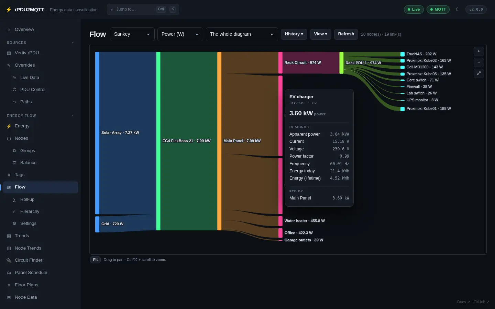
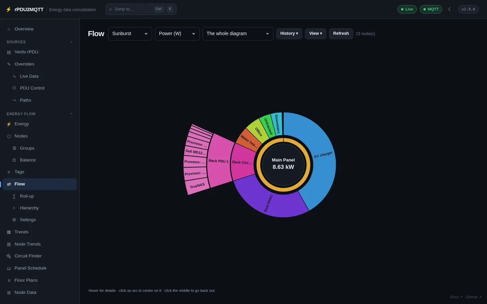
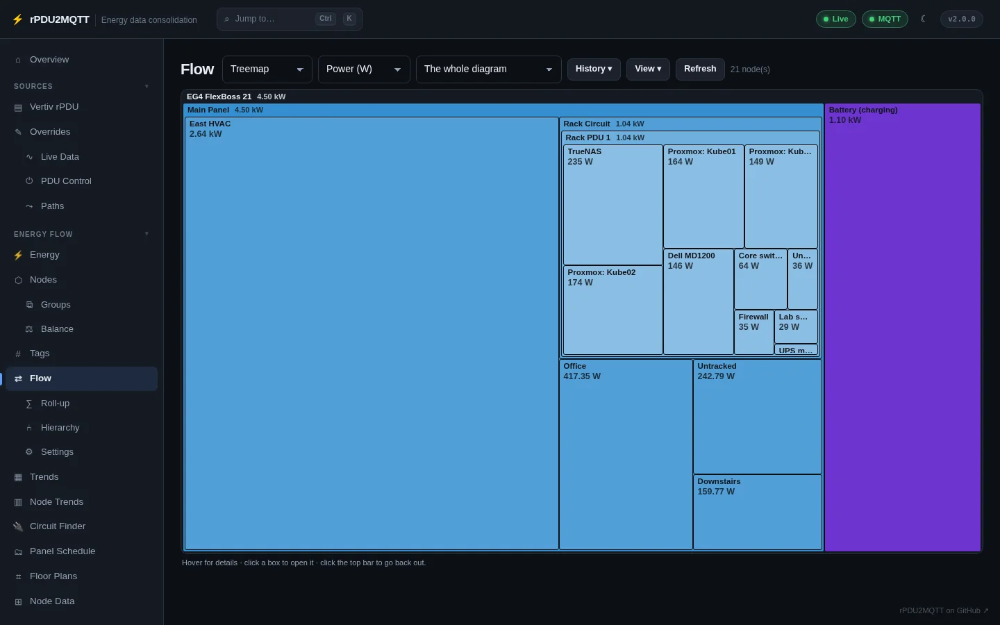
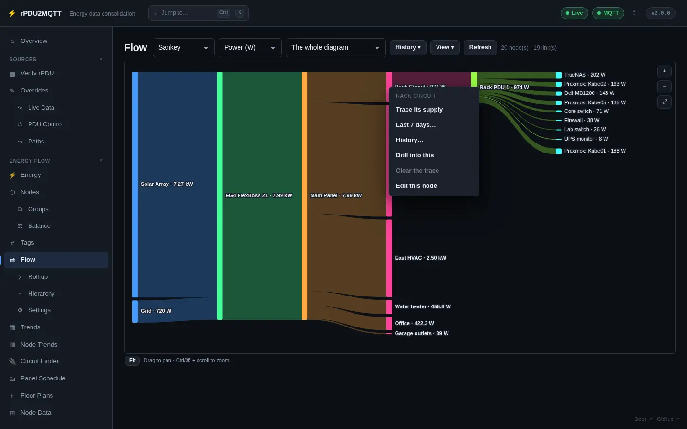
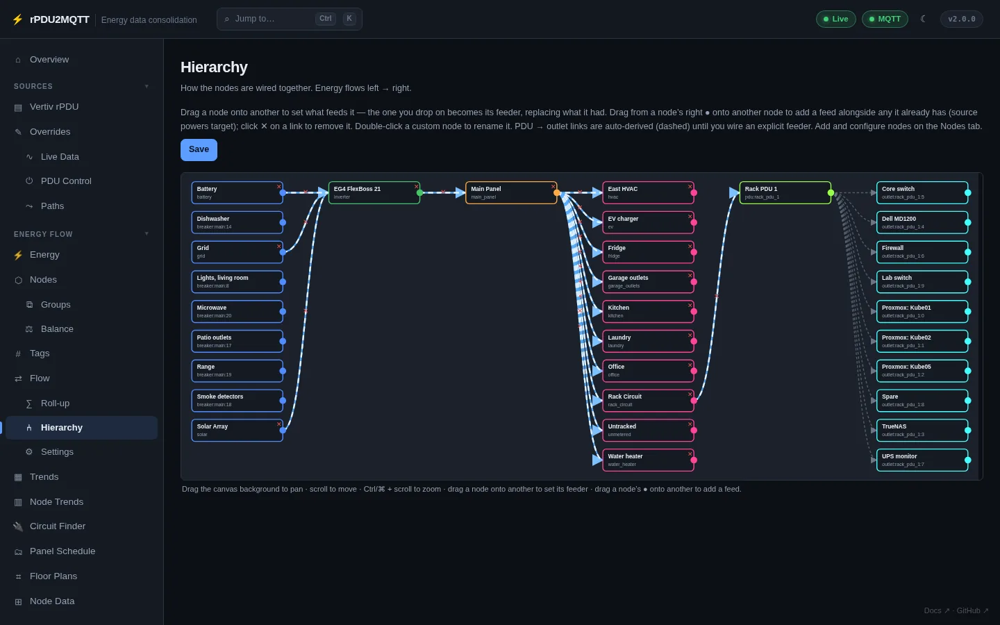
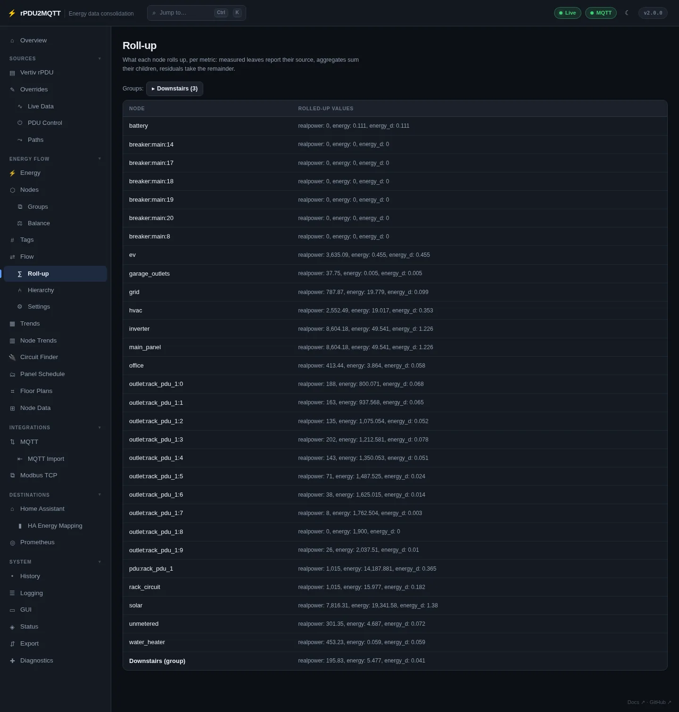
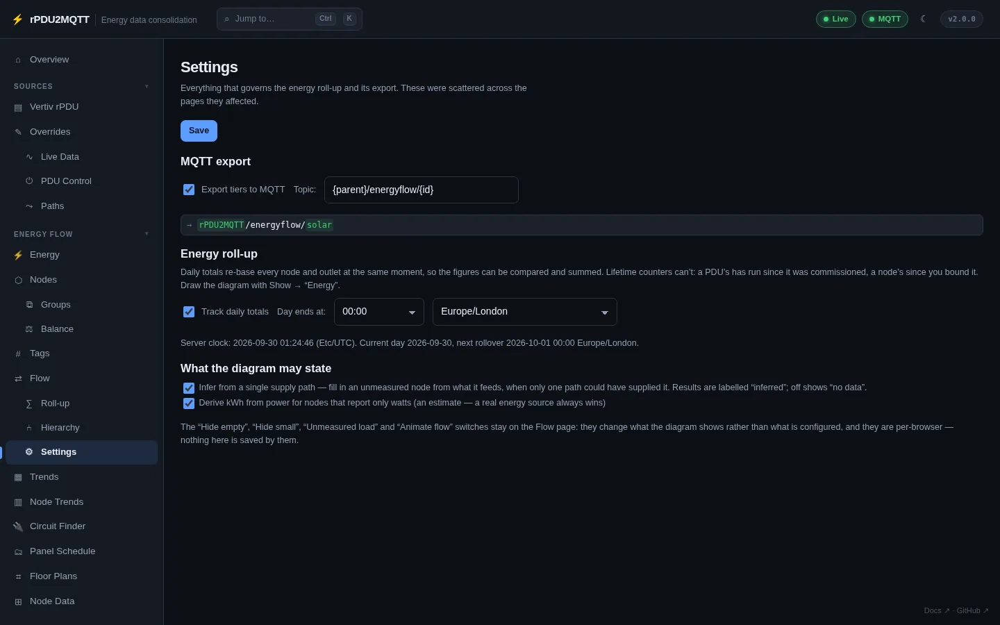

# Flow diagrams

## Flow

**Energy Flow › Flow**.

=== "Sankey"

    

=== "Sunburst"

    

=== "Treemap"

    

| Control | Options |
| --- | --- |
| View | Sankey, Sunburst, Treemap. Sunburst and Treemap draw two charts from the hub node: Sources (what feeds it) and Destinations (what it feeds). |
| Metric | Power (W), Energy (kWh), Cost ($), Apparent (VA), Current (A) |
| Showing | The whole diagram, or one node and everything under it |
| History | Show a past moment |
| View menu | Hide small branches, ribbon style (curved, wiring, wiring rounded), hide empty, hide no data, animate flow |
| Refresh | Redraw now |

Mouse:

| Action | Result |
| --- | --- |
| Hover | Node value, readings (apparent power, current, voltage, power factor, frequency, energy), feeders and what it feeds |
| Click or right-click a node | **Trace its supply**, **Last 7 days…**, **History…**, **Drill into this**, **Clear the trace**, **Edit this node** |
| Click a group | Expand or collapse it |
| Double-click a node | Drill into it. Double-click the top node to go back one level. |
| Right-click the canvas | Clear trace, fit, refresh |
| Drag / Ctrl + scroll | Pan / zoom. **Fit** resets. |



- **Energy (kWh)** is today's energy (`energy_d`). See [Totals and counters](totals.md).
- **Cost ($)** uses `Gui.EnergyPrice`.
- Nodes marked **⚠** have more leaving than arriving. A banner lists sources being withheld and why.
- **Last 7 days…** opens **History…** on the last 7 days.
- **History…** charts the last hour, 6 hours, 24 hours, 7 days or 30 days, with what the node feeds broken out.

## Hierarchy

**Energy Flow › Hierarchy**. Drag-and-drop editor for links. Energy flows left to right.



- Drop a node onto another to make that node its feeder.
- Drag from a node's right handle to another node to add a feed.
- **✕** on a link removes it. Double-click a node to rename it.
- PDU → outlet links are dashed and automatic.
- **Save** applies.

## Roll-up

**Energy Flow › Roll-up**. Every node's rolled-up value per metric.



## Settings

**Energy Flow › Settings**.



| Field | Setting | Default |
| --- | --- | --- |
| Export tiers to MQTT | `EnergyFlow.MqttExport` | off |
| Topic | `EnergyFlow.MqttTopicTemplate` | `{parent}/energyflow/{id}` |
| Track daily totals | `EnergyFlow.Aggregation.TrackPeriods` | on |
| Day ends at | `EnergyFlow.Aggregation.PeriodStartHour` | `0` |
| Time zone | `EnergyFlow.Aggregation.PeriodTimeZone` | host zone |
| Infer from a single supply path | `EnergyFlow.InferFromConservation` | on |
| Derive kWh from power | `EnergyFlow.Aggregation.Enabled` | off |

Topic placeholders: `{parent}`, `{id}`, `{label}`, `{kind}`, `{metric}`, `{units}`.

Hide empty, Hide small, Unmeasured load and Animate flow are per-browser settings on the Flow page.

```yaml
EnergyFlow:
  MqttExport: true
  MqttTopicTemplate: "{parent}/energyflow/{id}"
  InferFromConservation: true
  Aggregation:
    Enabled: true
    TrackPeriods: true
    PeriodTimeZone: America/Chicago
    PeriodStartHour: 0
```
