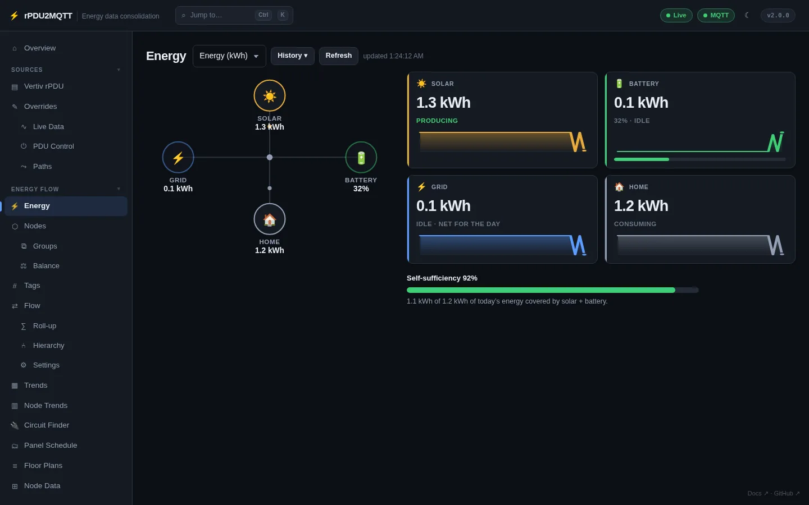
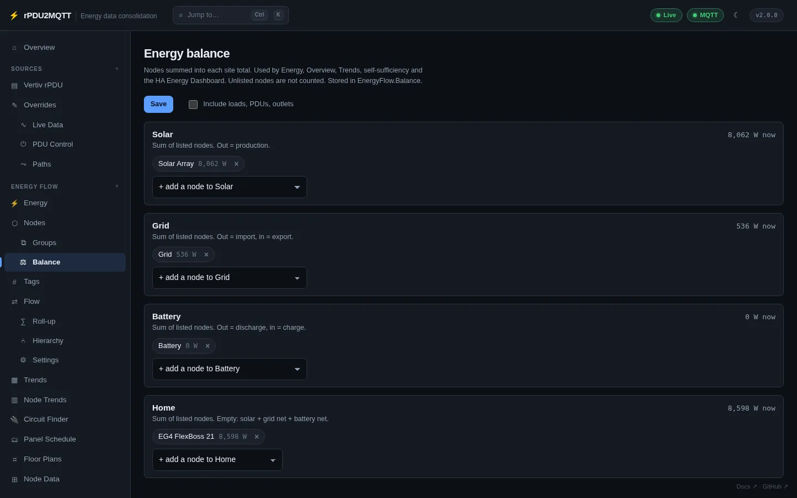

# Energy flow

A hierarchy of nodes: grid, solar, battery, inverter, panels, breakers, loads. PDUs and their outlets are added automatically. Each node rolls up the nodes it feeds, per metric.

## Pages

| GUI page | |
| --- | --- |
| **Energy** | Solar, battery, grid and home tiles, gauges, self-sufficiency |
| **Nodes** | Add and edit nodes and their live sources. [Nodes](nodes.md) |
| **Groups** | Several nodes shown as one. [Groups](nodes.md#groups) |
| **Balance** | Which nodes make up Solar, Grid, Battery and Home |
| **Tags** | Tags for filters and exports. [Tags](nodes.md#tags) |
| **Flow**, **Roll-up**, **Hierarchy**, **Settings** | Diagrams and the roll-up. [Flow](flow.md) |
| **Trends**, **Node Trends**, **Node Data** | History. [Trends](trends.md) |
| **Circuit Finder**, **Panel Schedule** | Breaker panels. [Panels and circuits](panels.md) |
| **Floor Plans** | Rooms, items and wiring. [Floor plans](floor-plans.md) |

## Energy

**Energy Flow › Energy**. Live or today's energy for Solar, Battery, Grid and Home. **History** shows a past moment. Click a tile for that node's day.



A tile shows a gauge when the node has **Gauge max** set on [Nodes](nodes.md).

## Balance

**Energy Flow › Balance**. Which nodes are summed into each site total. Used by Energy, Overview, Trends, self-sufficiency and the Home Assistant Energy Dashboard.



| Total | Nodes | Direction |
| --- | --- | --- |
| Solar | PV totals, not the strings under them | out = production |
| Grid | Grid meters | out = import, in = export |
| Battery | Battery banks | out = discharge, in = charge |
| Home | Inverter load output or whole-house meter | Empty = solar + grid net + battery net |

- **Counts toward** on a node edits the same lists. A node counts toward one total.
- With every list empty, totals follow each node's **Kind**.

```yaml
EnergyFlow:
  Balance:
    Solar: [solar]
    Grid: [grid]
    Battery: [battery]
    Home: [inverter]
```

## How a node gets its value

In order:

1. A live source bound to the node, or its fixed **Value**.
2. The sum of the nodes it feeds.
3. Inferred: the one unmeasured path into a node with measured demand. Labelled **inferred**. Off with **Infer from a single supply path** on [Flow settings](flow.md#settings).

Otherwise the node shows **no data**, publishes nothing, and the API returns `null`. Several unmeasured feeders into one node all show **no data**. Set one to **Mode** `residual` to give it the remainder.

| Mode | Value |
| --- | --- |
| `auto` | Roll-up of what it feeds (default) |
| `static` | Fixed **Value** |
| `residual` | What its target still needs after measured feeders |
| `untracked` | Measured parent minus its measured children |
| `none` | Never inferred |

A live source always wins over the mode.

## Related

- [Totals and counters](totals.md): daily vs lifetime energy, where totals are stored.
- [How data flows](../development/data-flow.md).
- [EnergyFlow settings reference](../reference/settings/energyflow.md).
