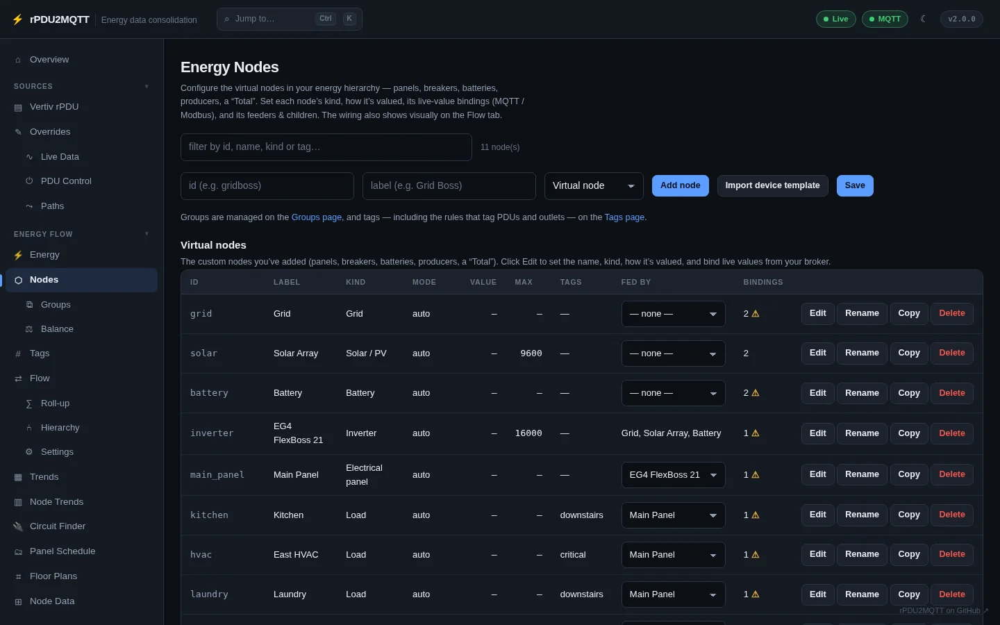
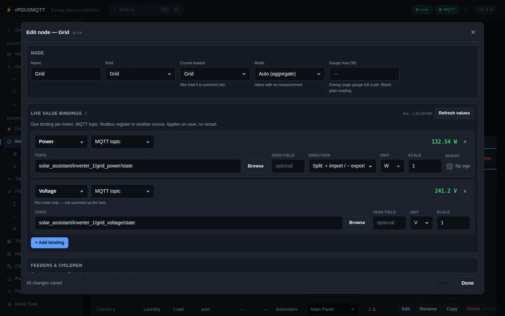
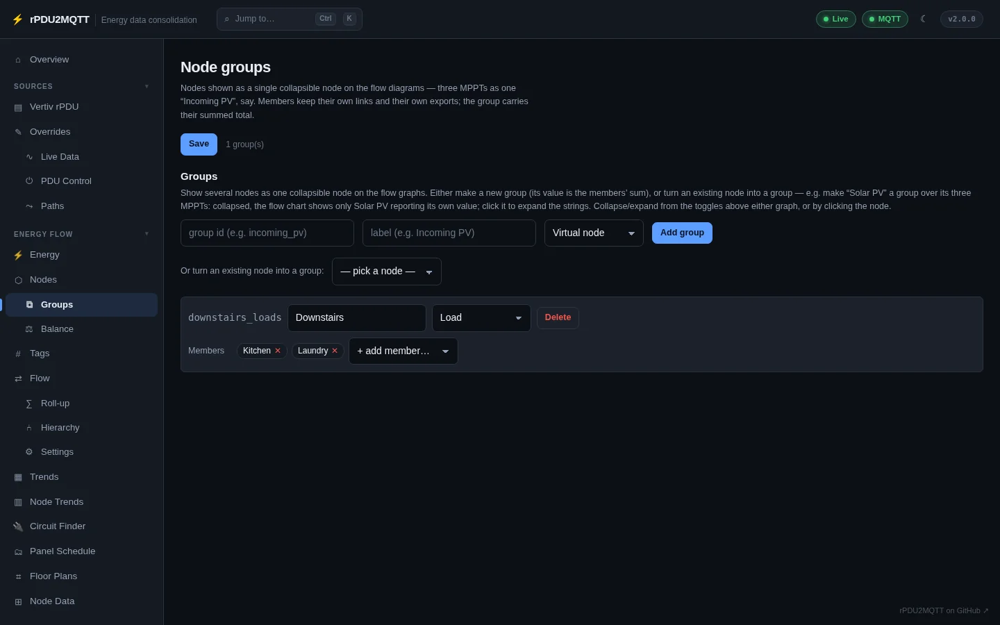
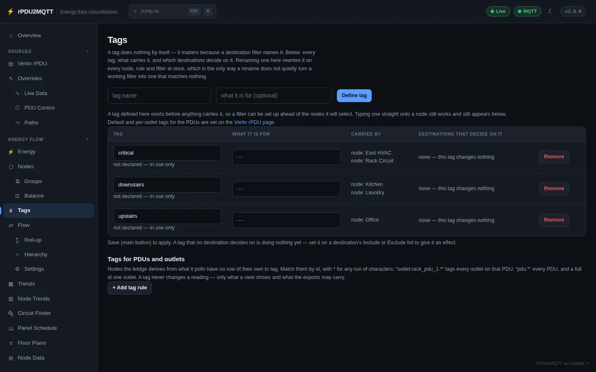

# Nodes

## Nodes page

**Energy Flow › Nodes**. Every node you added. PDUs and outlets are added automatically and are not listed.



- **Add node**: id, label, kind.
- **Hide managed** (on by default): hides nodes an integration maintains, such as Tigo panels and strings.
- **Import device template**: adds pre-wired nodes and the Modbus connection for a known device (EG4 FlexBoss 21). Check register addresses and scales against your device.
- **Fed by** sets the feeder from the table.
- **Edit** opens the node editor. **Rename** changes the id and keeps its links. **Copy** duplicates it.
- The bindings column shows a warning when a measured node has no energy (kWh) source.
- **Save** applies. Bindings apply without a restart.

## Node editor



| Field | Setting |
| --- | --- |
| Name | `Label` |
| Kind | `Kind`: `node`, `panel`, `breaker`, `inverter`, `battery`, `solar`, `grid`, `load` |
| Counts toward | `Balance` list: Solar, Grid, Battery, Home or nothing |
| Mode | `Mode`. See [How a node gets its value](index.md#how-a-node-gets-its-value) |
| Gauge max | `Max`, in the metric's unit |
| Live value bindings | `Sources[]`, one per metric |
| Fed by / Feeds | `Links` |
| Hidden | `Hidden`: left off the flow diagrams, with any feeders that only feed it |

A `load` cannot feed anything.


## Bindings

**+ Add binding**, pick the metric and the source type. The live value shows at the right of each binding.

| Type | Reads | Key fields |
| --- | --- | --- |
| MQTT topic (`mqtt`) | A topic on the configured broker | `Topic`, `JsonField` |
| Modbus register (`modbus`) | A register on a [Modbus TCP](../integrations/modbus.md) connection | `Connection`, `Register`, `RegisterType`, `DataType`, `WordOrder` |
| EmonCMS feed (`emoncms`) | A feed's current value | `Feed` (name, `tag/name` or id) |
| Home Assistant entity (`homeassistant`) | An entity's state over the REST API | `Settings.Entity` |
| Derived (`derived`) | Worked out from the node's other readings | none |

Fields on every binding:

| Field | Setting | Default |
| --- | --- | --- |
| Metric | `Metric`: `realpower`, `apparentpower`, `energy`, `current`, `voltage`, `frequency`, `powerfactor`, `soc`, `percent`, `temperature` | `realpower` |
| Direction | `Direction`: `out`, `in`, `split` | `out` |
| Unit | `Unit`, converted to W, kWh, V, A | canonical |
| Scale | `Scale` | `1` |
| Invert (flip sign) | `Scale: -1` | off |
| Counter | `Accumulation`: `lifetime` or `period` (resets daily) | `lifetime` |
| Stale after | `StaleAfterSeconds`, `0` = never | `900` |

- **Browse** lists topics on the broker, feeds on EmonCMS, or entities in Home Assistant, with current values.
- **Direction** `split`: one signed value. Positive is out, negative is in. Grid: out = import, in = export. Battery: out = discharge, in = charge.
- **Accumulation**: check the topic across midnight. A daily counter drops at midnight; a lifetime counter does not.
- A live reading replaces the node's fixed **Value**. Negative readings count as `0`.
- EmonCMS bindings need `EmonCMS.Url` and a read API key. `EmonCMS.Enabled` is not required.
- Home Assistant bindings use `HomeAssistant.Url` and its token.
- `unavailable` or non-numeric values supply nothing.

### Derived values

| Relation | Exact |
| --- | --- |
| `S = V × I` | Always (single phase) |
| `P = S × PF` | Always |
| `P = V × I` | Power factor 1 only. Marked *assumes a power factor of 1* |

A measured reading replaces a derived one. Missing operands give no value.

### YAML

```yaml
EnergyFlow:
  Nodes:
    - Id: solar
      Label: Solar Array
      Kind: solar
      Max: 9600
      Sources:
        - { Type: mqtt, Metric: realpower, Topic: solar_assistant/inverter_1/pv_power/state }
        - { Type: mqtt, Metric: energy, Topic: solar_assistant/total/pv_energy/state }
    - Id: grid
      Label: Grid
      Kind: grid
      Sources:
        - { Type: mqtt, Metric: realpower, Topic: solar_assistant/inverter_1/grid_power/state, Direction: split }
        - { Type: mqtt, Metric: voltage, Topic: solar_assistant/inverter_1/grid_voltage/state }
        - { Type: derived, Metric: current, Direction: split }
    - Id: server_rack
      Label: Server rack
      Sources:
        - { Type: emoncms, Metric: realpower, Feed: 2_power }
  Links:
    - { From: solar, To: main_panel }
    - { From: grid, To: main_panel }
```

!!! warning "Kubernetes"
    An older `RpduConfig` CRD rejects `Type: derived` with `Unsupported value: "derived"`. Apply `charts/rpdu2mqtt/files/rpduconfig-crd.yaml`.

## Groups

**Energy Flow › Groups**. Several nodes drawn as one collapsible node on the flow diagrams. Members keep their own links and exports. The group publishes the sum of members that have data.



- **Add group**: id, label, kind, then **+ add member**.
- **Or turn an existing node into a group**: the node becomes the group's anchor (for example Solar PV over its MPPTs).
- **Not nested / In …**: nest the group in another group. It shows only while that group is expanded.
- **Expanded**: *Replace with members* (default), *Nest members as parents* (members feed the group node) or *Nest members as children* (the group node feeds the members).
- **Expand all children**: expanding the group also expands every group nested in it.
- Click a group on the Flow diagram to expand it. Click its dashed outline, tab or members to collapse it.

```yaml
EnergyFlow:
  Groups:
    - { Id: downstairs_loads, Label: Downstairs, Kind: load, Members: [kitchen, laundry, fridge] }
```

## Tags

**Energy Flow › Tags**. Tags filter the diagram and decide what each destination exports. A tag never changes a value.



- **Define tag**: name and description. Declaring is optional.
- The table lists each tag, what carries it, and which destinations filter on it.
- **Tags for PDUs and outlets**: rules matched by node id with `*`, for example `outlet:rack_pdu_1:*`. Per-PDU and per-outlet tags are on [Vertiv rPDU](../vertiv/index.md).
- Destination filters: `EnergyFlow.MqttExportTags`, `HomeAssistant.EnergyDashboard.NodeTags`, `Prometheus.NodeTags`, `EmonCMS.NodeTags`. `Exclude` wins over `Include`.

```yaml
EnergyFlow:
  Tags:
    - { Name: critical, Description: On the UPS }
  AutoTags:
    - { Match: "outlet:rack_pdu_1:*", Tags: [rack] }
  MqttExportTags:
    Include: [critical]
```
