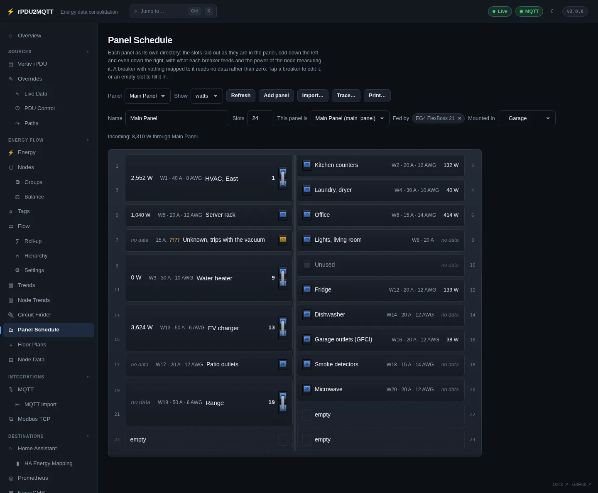
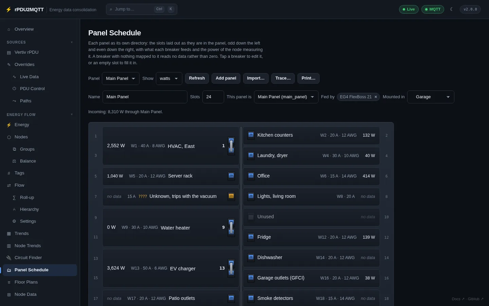
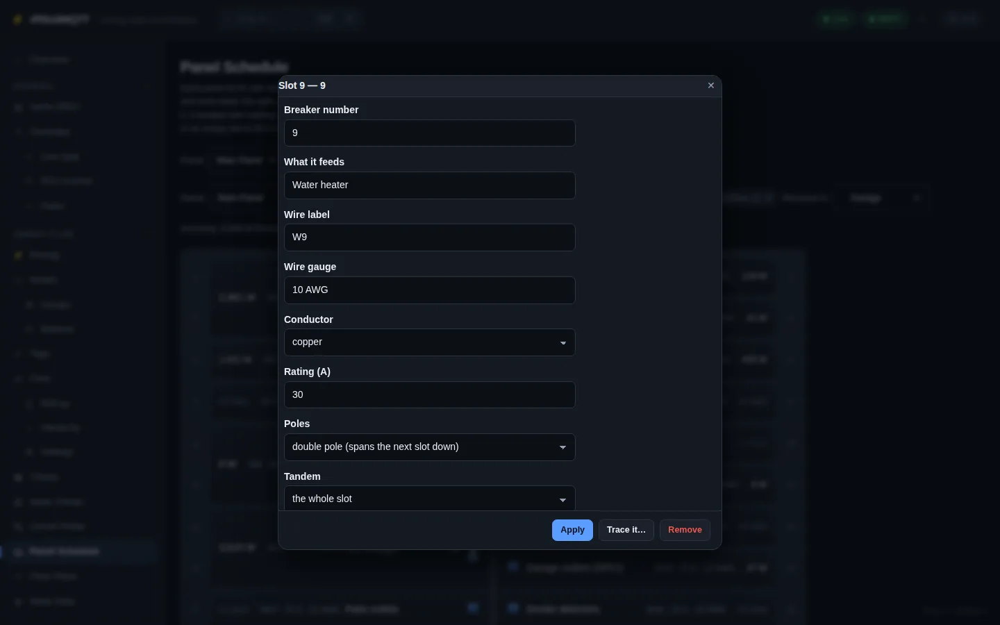
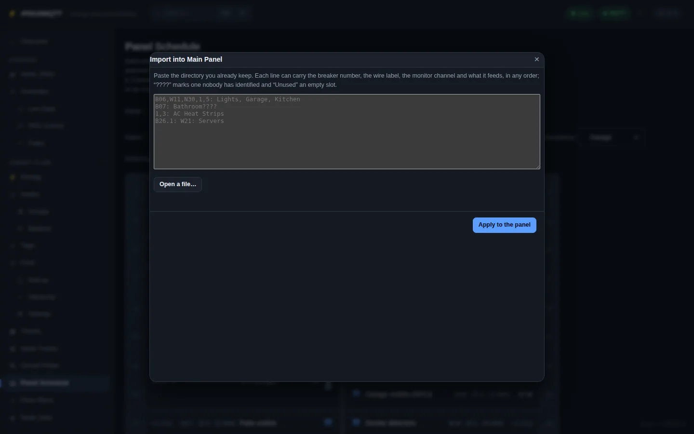
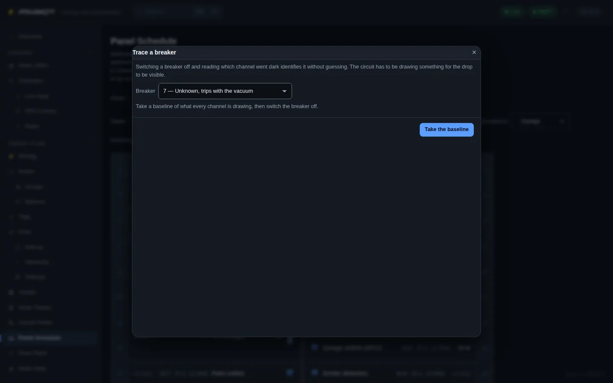
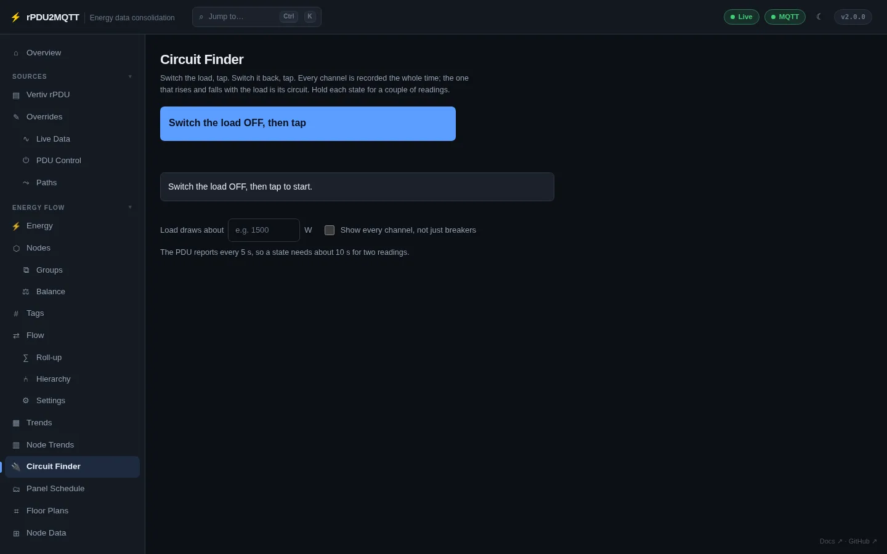

# Panels and circuits

## Panel Schedule

**Energy Flow › Panel Schedule**. One directory per panel: odd slots down the left, even down the right. Each breaker shows live power or current, wire, rating, gauge and what it feeds.




| Control | |
| --- | --- |
| Panel | Pick the panel |
| Show | watts or amps |
| Add panel | New panel |
| Import… | Paste a paper directory |
| Trace… | Identify an unknown breaker |
| Print… | Printable schedule for the panel door (fits one Letter or A4 page at 42 slots) |
| Name, Slots, This panel is, Fed by, Mounted in | Panel settings |

=== "Amps"

    

### Breakers

Click a breaker, or an empty slot, to edit it.



| Field | Setting |
| --- | --- |
| Breaker number | `Number` (tandem half: `26.1`) |
| What it feeds | `Description` |
| Wire label | `Wire` |
| Wire gauge | `Gauge` |
| Conductor | `Conductor`: `copper`, `aluminium` |
| Rating (A) | `Amps` |
| Poles | `Poles`: 1 or 2. Double-pole takes the next slot in the column. |
| Tandem | `Half`: whole slot, upper or lower |
| State | `State`: `identified`, `unknown`, `unused` |
| Channel (per leg) | Writes a clamp: `Clamps[].Channel` |
| One CT measures the whole circuit | `Clamps[].Whole` (double-pole) |
| Serves | `Rooms` |
| Placed on it | Floor-plan items on this circuit |

**Trace it…** opens Trace for that breaker.

### Breakers in the energy flow

| Breaker | Node |
| --- | --- |
| Measured by one channel | That channel's node, renamed to the breaker's description if it has a generic name |
| Measured by two channels (clamp per leg) | `breaker:<panel>:<number>`, the sum of both legs. Unknown if a leg is missing. |
| `Node` set | That node |
| Identified, not measured | `breaker:<panel>:<number>`, no data |
| Unused | None |

Breakers reach the Flow diagram, Home Assistant, EmonCMS and Prometheus with no extra wiring. A panel has one feeder.

### Checks

Shown on the page and on Diagnostics (`panelFindings`):

- Channel mapped to more than one breaker
- Channel drawing power with no breaker
- Unused breaker whose channel draws power
- Double-pole breaker with one clamp
- Breaker current above its rating
- Clamp on a breaker's own tier
- Panel with more than one feeder
- Circuit fed from somewhere besides its panel

### Import



One line per breaker: number, wire label, channel and description in any order. `????` = unknown, `Unused` = empty slot.

```
B06,W11,N30,1,5: Lights, Garage, Kitchen
B07: Bathroom????
1,3: AC Heat Strips
B26.1: W21: Servers
```

Each line shows as new, update or clash before **Apply to the panel**. **Save** keeps it.

### Trace



1. Pick the breaker. **Take the baseline**.
2. Switch the breaker off.
3. The channel that dropped is shown. Take it to map the breaker and mark it identified.

A 240 V breaker drops two legs; both can be taken. The circuit must be drawing power at the baseline.

### YAML

```yaml
EnergyFlow:
  Panels:
    - Id: main
      Name: Main Panel
      Slots: 24
      Node: main_panel
      Location: garage
      Breakers:
        - { Slot: 1, Number: "1", Poles: 2, Amps: 40, Wire: W1, Gauge: 8 AWG, Conductor: copper, Description: "HVAC, East", Rooms: [garage], Node: hvac, State: identified }
        - { Slot: 2, Number: "2", Amps: 20, Wire: W2, Gauge: 12 AWG, Description: Kitchen counters, Rooms: [kitchen], State: identified }
        - { Slot: 7, Number: "7", Amps: 15, State: unknown }
        - { Slot: 10, Number: "10", State: unused }
  Clamps:
    - { Label: CT1, Amps: 50, Panel: main, Breaker: "1", Channel: hvac, Whole: true }
    - { Label: CT2, Amps: 50, Panel: main, Breaker: "2", Channel: kitchen }
```

| Clamp field | |
| --- | --- |
| `Channel` | Node id of the monitor channel |
| `Leg` | 1, or 2 for the second pole |
| `Whole` | One clamp measures the whole double-pole breaker |
| `Reversed` | Clamp is on backwards; reading is flipped |

## Circuit Finder

**Energy Flow › Circuit Finder**. Find which channel a load is on by switching the load.



1. Switch the load off, tap.
2. Switch it on, tap. Repeat.
3. The channel that rises and falls with the load is the circuit.

- **Load draws about** narrows the match.
- **Show every channel** includes channels not mapped to breakers.
- Hold each state for two readings.
