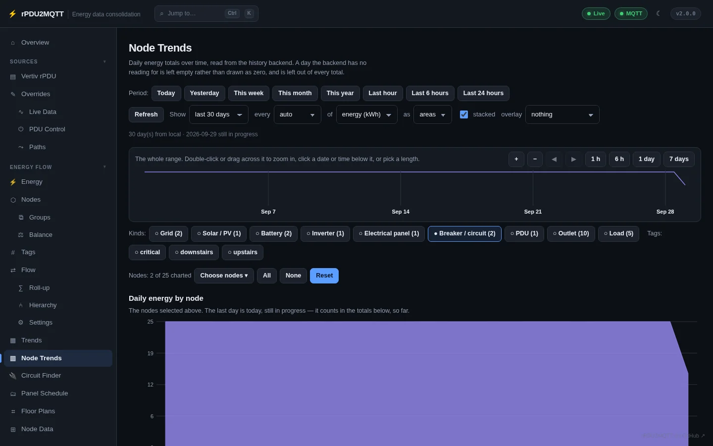
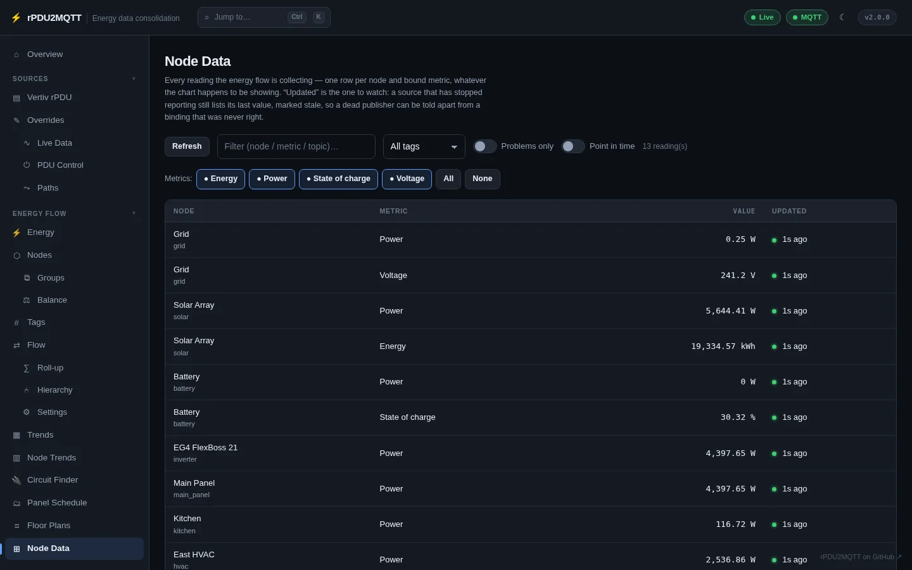

# Trends and node data

History is read from the backend set in [History](../system/history.md).

## Trends

**Energy Flow › Trends**. Site totals from the [Balance](index.md#balance): grid import and export, solar, battery, home, self-sufficiency, and a per-day table.

| Control | Options |
| --- | --- |
| Period | Today, Yesterday, This week, This month, This year, Last hour, Last 6 hours, Last 24 hours |
| Show | Today so far through last 90 days |
| Every | auto, 1 min to 12 hours, per day |
| Of | power (W), energy (kWh), cost ($) |
| As | bars, lines, areas |

A day with no reading is empty, not zero, and is left out of totals.

## Node Trends

**Energy Flow › Node Trends**. Any set of nodes over time.

- Filter by **Kinds** and **Tags**, or **Choose nodes**.
- **stacked** stacks the series. **overlay** adds a second series.
- The timeline above the chart zooms: drag across it, double-click, or pick **1 h**, **6 h**, **1 day**, **7 days**.

## Node Data

**Energy Flow › Node Data**. Every bound reading: node, metric, value, last update.

- **Problems only** shows stale and failing bindings.
- **Point in time** shows readings at a past moment.
- Filter by text, tag and metric.
