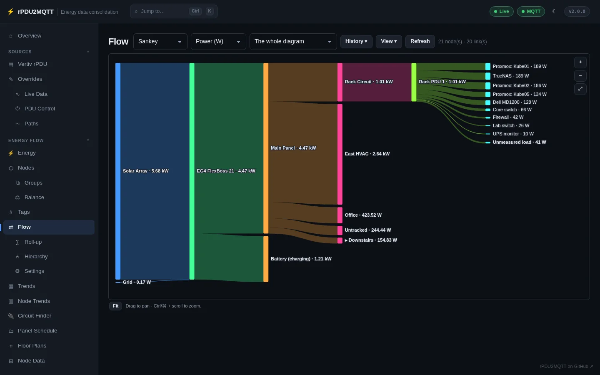
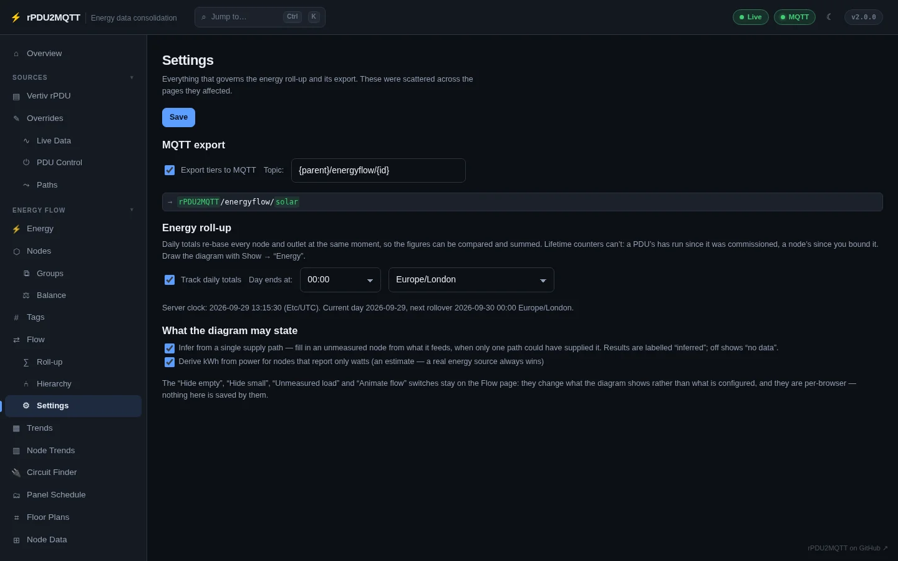
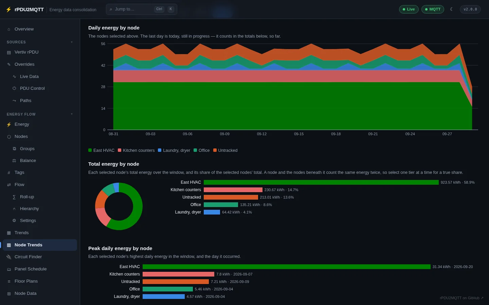
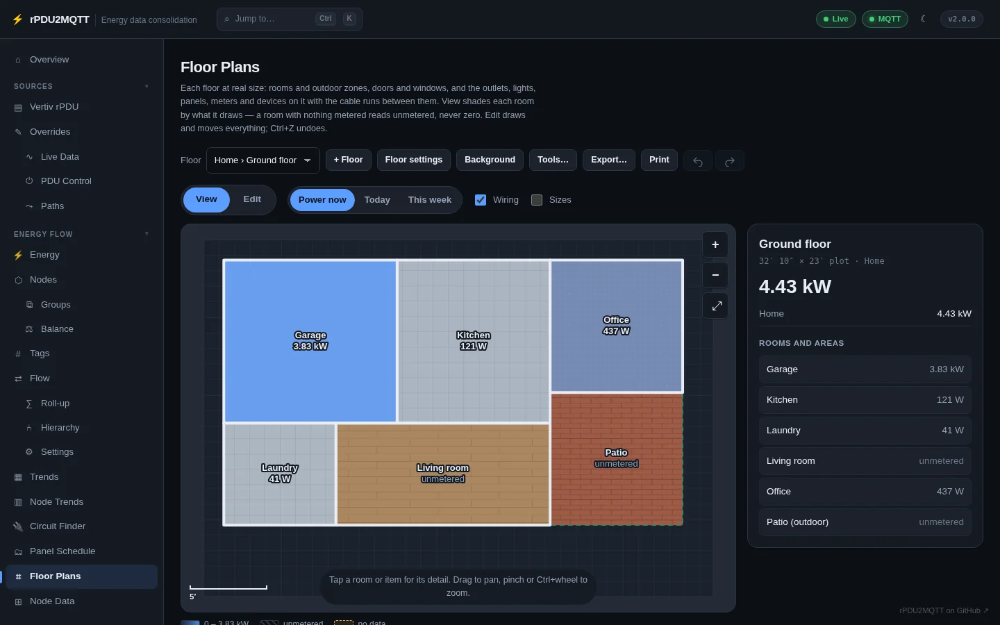

# Energy flow pages

These pages edit and draw the [energy flow](../energy-flow/index.md). In the demo, a grid connection,
a solar array and a battery feed an inverter, which feeds a main panel; the panel feeds five circuits,
and one of them feeds the simulated rack PDU.

## Energy

Solar, battery, grid and home as a live diagram and four cards, in power or today's energy, with
self-sufficiency for the day. **History** charts any of them.

## Nodes

The nodes you define: id, label, kind, mode, gauge maximum, tags, what feeds each one and its live
bindings. **Add node** creates one, **Import device template** drops in a known device, and **Edit**
opens the node editor. A ⚠ beside the bindings count means the node is bound but has no energy (kWh)
source, so it will not appear on Home Assistant's Energy Dashboard.

## Groups

Nodes shown as one collapsible node on the flow diagrams. Members keep their own links and exports; the
group carries their summed total. The demo groups Kitchen and Laundry as **Downstairs**.

## Balance

Which nodes are summed into each site total: Solar, Grid, Battery and Home. Used by Energy, Overview,
Trends, self-sufficiency and the Home Assistant Energy Dashboard. Stored in `EnergyFlow.Balance`.

## Tags

Every tag, what carries it, and which destinations filter on it. A tag does nothing by itself; it
matters because a destination filter names it. Renaming a tag here rewrites it on every node, rule and
filter at once.

## Flow

The live diagram, drawn by power, energy, apparent power or current (and cost, once an energy price is
set). **Showing** draws one node and what is beneath it; right-click a node for its history, to drill
in, or to trace its supply.

=== "Sankey"

    

=== "Sunburst"

    

=== "Treemap"

    

## Roll-up

What each node rolls up, per metric: measured leaves report their source, aggregates sum their
children, residuals take the remainder.

## Hierarchy

How the nodes are wired together, left to right. Drag a node onto another to set its feeder, drag from a
node's right handle to add a feed, and click ✕ on a link to remove it. PDU → outlet links are derived
(dashed) until you wire them yourself.

## Settings

Everything that governs the energy roll-up and its export: MQTT export and topic template, the period
time zone and start hour, deriving kWh from power, and inference from a single supply path. See
[Totals and counters](../energy-flow/totals.md).

## Trends

Daily energy totals from the history backend: grid import and export per day, self-sufficiency per day,
and more below, over a chosen window and interval. A day with no reading is left empty rather than
drawn as zero.

## Node Trends

Each selected node's own series over the window, with totals, shares and peaks. Pick nodes by kind or
tag. Here the five loads under the main panel:

## Circuit Finder

Switch a load, tap; switch it back, tap. Every channel is recorded the whole time, and the one that rises
and falls with the load is its circuit.

## Panel Schedule

Each panel as its own directory: slots laid out as in the panel, what each breaker feeds, and the power
of the node measuring it. A breaker nothing measures reads *no data* rather than zero. See
[Panels and breakers](../energy-flow/panels.md).

## Floor Plans

Each floor at real size, with each room shaded by what it draws now, today or this week. A room with
nothing metered reads *unmetered*. See [Floor plans](../energy-flow/floor-plans.md).

## Node Data

Every reading the energy flow is collecting: one row per node and bound metric, with how long ago it
updated. A source that stopped reporting keeps its last value, marked stale.

