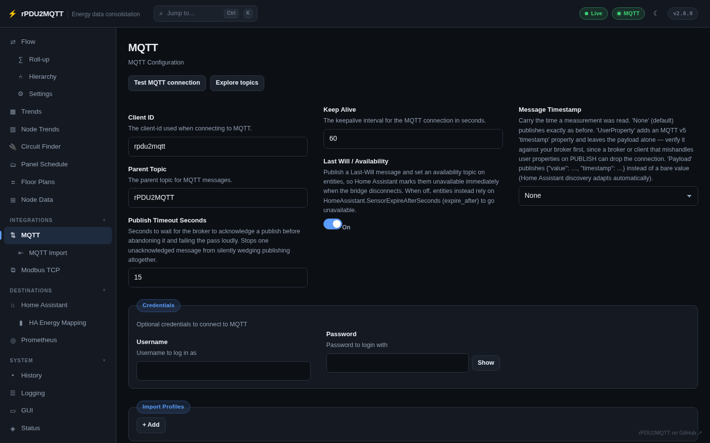
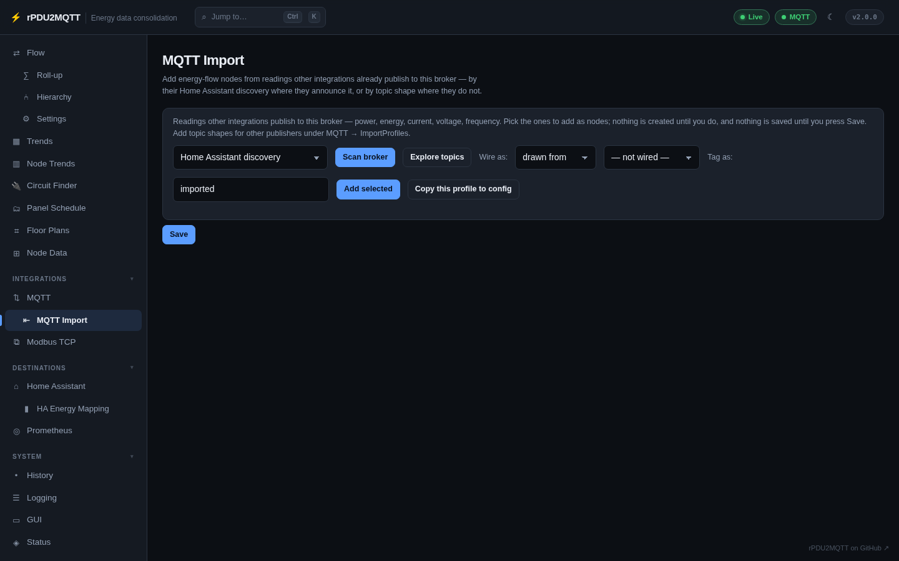
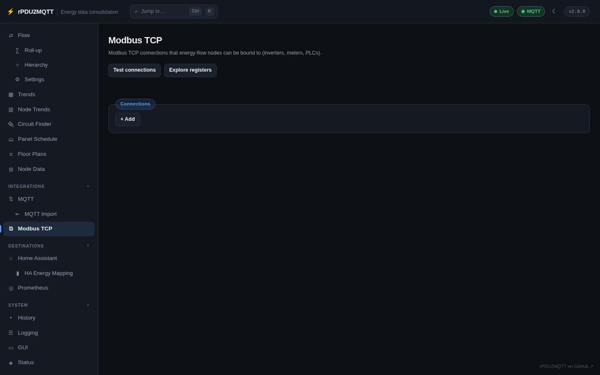
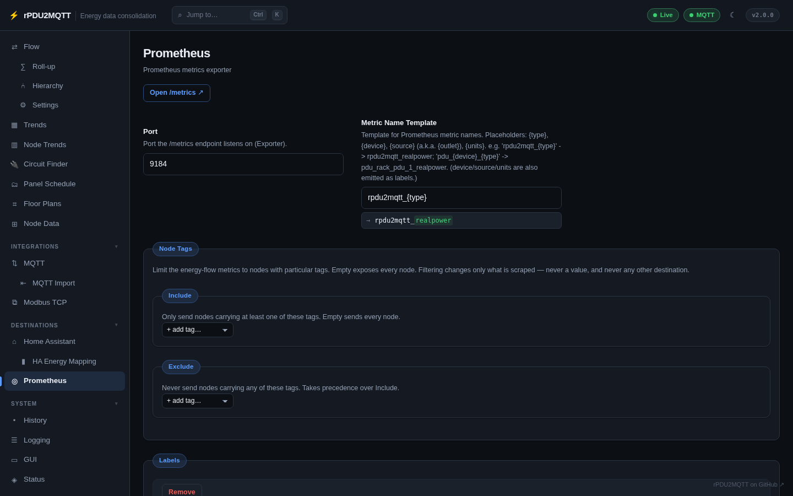

# Integrations and destinations pages

## Integrations

### MQTT

The broker connection, parent topic, keep-alive, Last Will, message timestamps, credentials and import
profiles. **Test MQTT connection** checks the broker; **Explore topics** browses what is on it. See
[MQTT](../configuration/mqtt.md).

### MQTT Import

Adds energy-flow nodes from readings other integrations already publish to the broker: by their Home
Assistant discovery where they announce it, or by topic shape where they do not. **Scan broker**, tick
the readings, then **Add selected**; nothing is saved until **Save**. More topic shapes go under
`MQTT.ImportProfiles`.

### Modbus TCP

Modbus TCP connections that nodes can be bound to (inverters, meters, PLCs). **Test connections**
checks each one; **Explore registers** reads a block of registers and shows each decoding. See
[Live sources › Modbus TCP](../energy-flow/sources.md#live-sources-from-modbus-tcp). The demo has no
Modbus device, so the list is empty.

## Destinations

### Home Assistant

Discovery topic, interval, retain, sensor expiry and the OneView member templates, with **Republish
discovery** and **Clear discovery**, and the Energy Dashboard sync settings. See
[Home Assistant](../configuration/home-assistant.md).

### HA Energy Mapping

Maps the energy-flow hierarchy into Home Assistant's Energy Dashboard, with the tag filter that governs
the MQTT export, **Sync now** and **Clear energy dashboard**.

### Prometheus

The `/metrics` exporter and port, the metric-name template, labels and the Pushgateway. See
[Prometheus](../configuration/prometheus.md).

### EmonCMS

Hidden while EmonCMS is off, as in the demo. See [EmonCMS](../configuration/emoncms.md).
