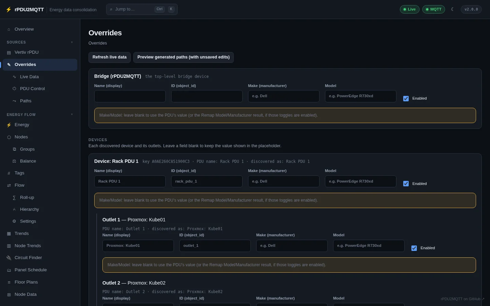
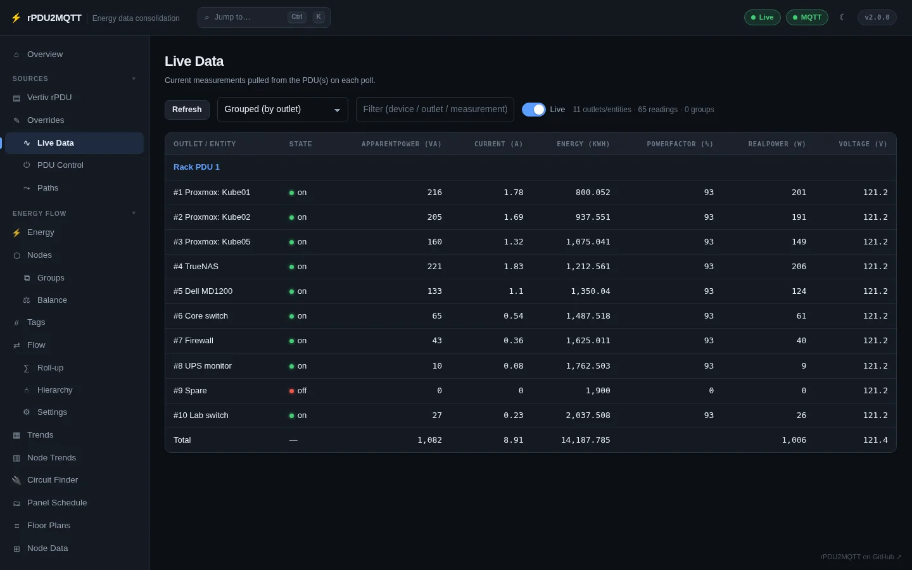

# Sources pages

## Vertiv rPDU

PDU instances to bridge, keyed by instance name: connection, credentials, poll interval, write
actions, Home Assistant model/manufacturer remapping and EmonCMS tags. **Open default ↗** opens the
PDU's own web UI. See [PDUs](../configuration/pdus.md).

## Overrides

Names, ids and enabled state for the bridge, each device, each outlet, each measurement type and each
OneView group, listed from the live PDU data. See [Overrides](../configuration/overrides.md).

## Live Data

Current measurements pulled from the PDUs on each poll. **Grouped (by outlet)** gives one row per
outlet or entity with a column per measurement and the outlet state; the flat view gives one row per
reading. Both filter, and the **Live** toggle keeps it updating.

## PDU Control

Turn outlets on or off, reboot them, reset their statistics, or rename them on the PDU. Needs
`ActionsEnabled` and PDU credentials on the instance; OneView groups get group-wide actions here too.

## Paths

The MQTT topic, Prometheus metric and EmonCMS key generated for each measurement, reflecting your
overrides. Click any value to copy it. See [MQTT topics](../reference/mqtt-topics.md).

