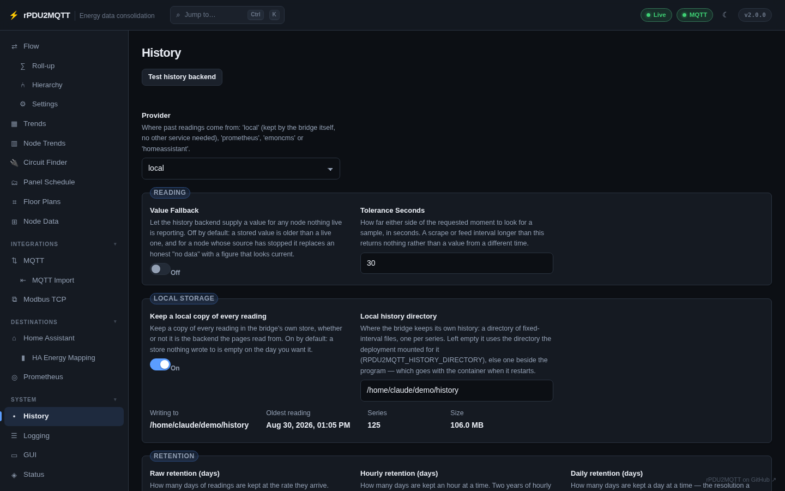
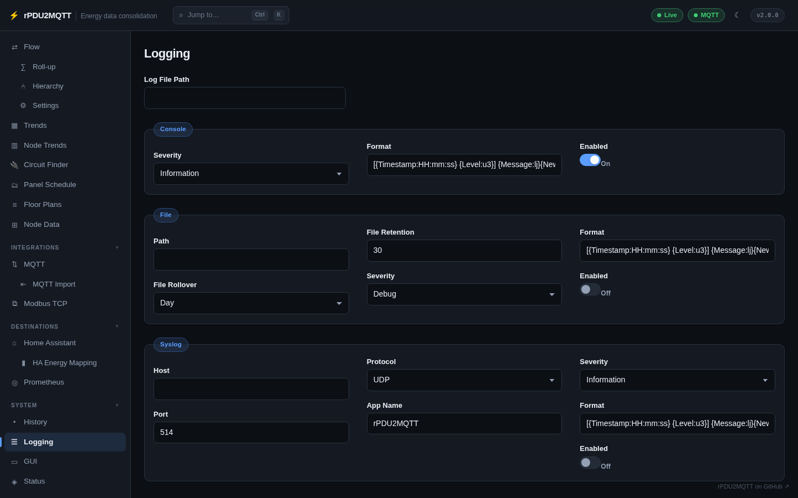
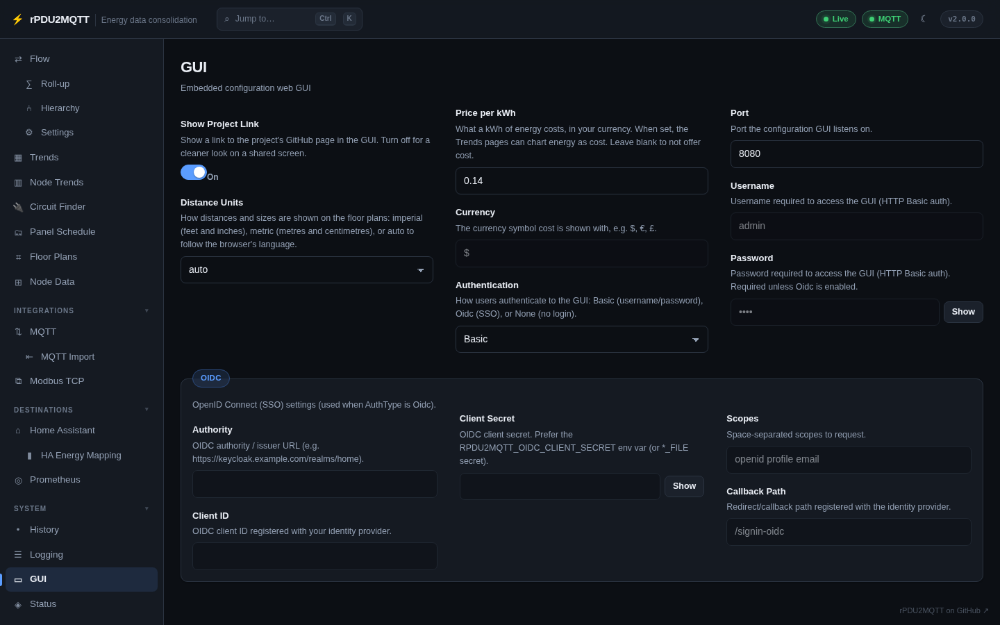
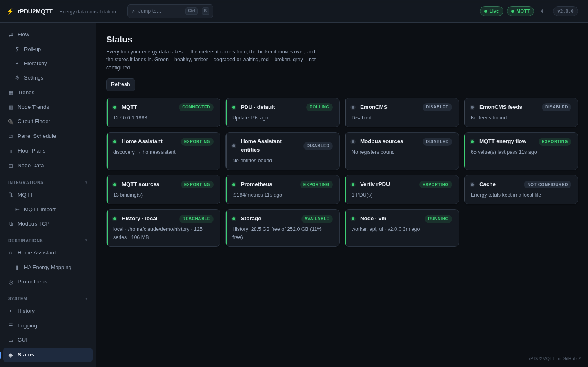
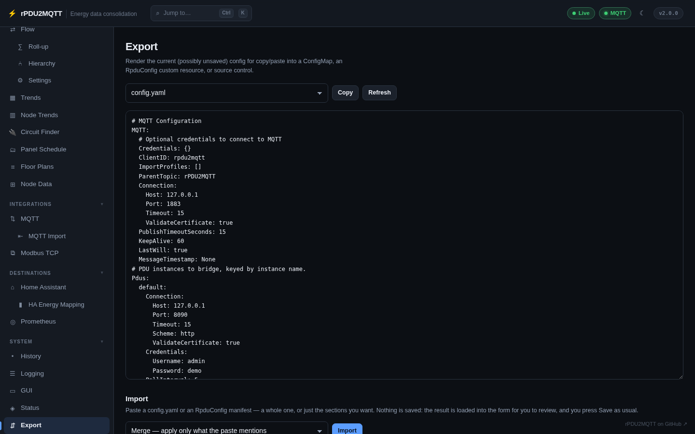
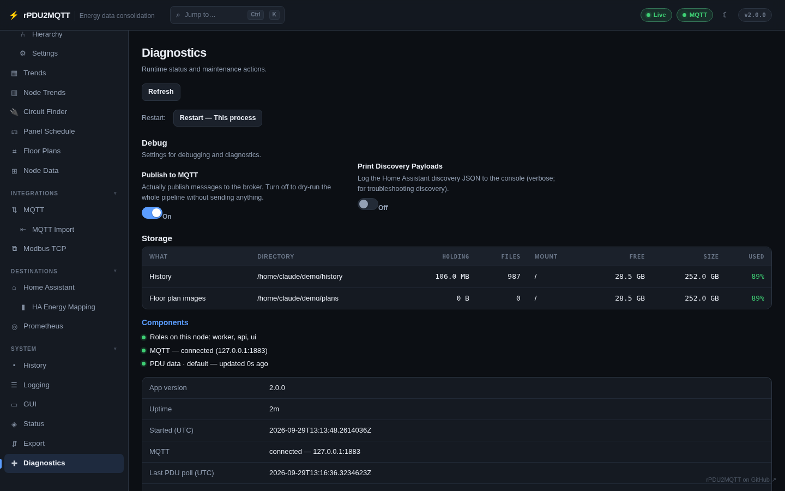

# System pages

## History

Which backend the history pages read from, and the bridge's own local store: where it writes, the
oldest reading, how many series and how large, and retention per resolution. **Test history backend**
checks the chosen backend. See [History](../configuration/history.md).

## Logging

Console, file and syslog sinks, each with its own severity. See
[Logging and debug](../configuration/logging.md).

## GUI

The GUI's own settings: port, authentication (Basic, OIDC or none), the price per kWh and currency the
Trends pages use for cost, distance units for floor plans, and the project link. See
[Configuration GUI](../configuration/gui.md).

## Status

Every hop the data takes, as cards: sources, the broker, destinations, history, storage and the running
node. Green is healthy, amber degraded or waiting, red broken, grey not configured.

## Export

Renders the current config, including unsaved edits, as `config.yaml` or an `RpduConfig` manifest
to copy into source control. **Import** pastes one back in, whole or in part, for review before
**Save**.

## Diagnostics

Restart, the `Debug` switches, every directory this process writes to with its free space, the
components running on this node, and runtime details such as the version, uptime, MQTT connection and
last PDU poll.

