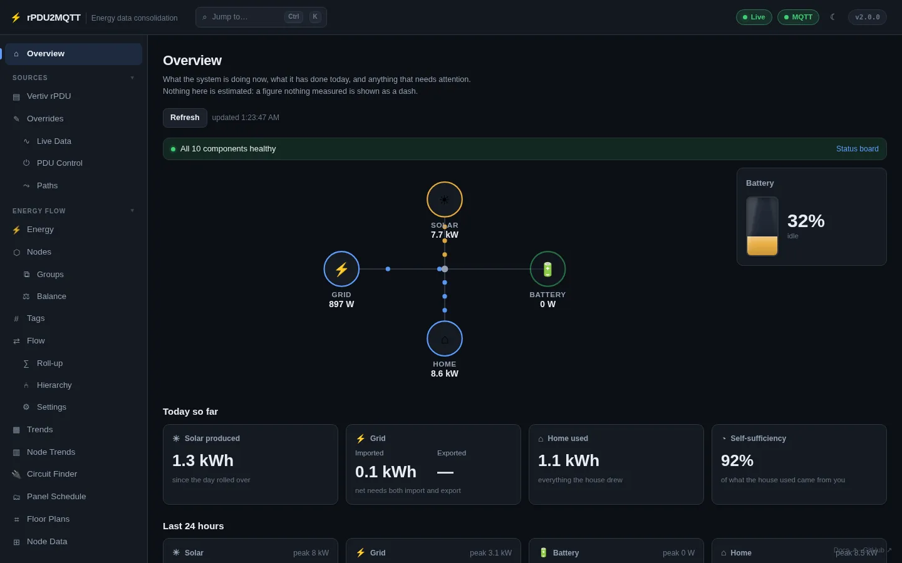

# rPDU2MQTT

**Map the energy flow of an entire house, end to end — from individual solar panels to individual
appliances — and publish it to MQTT, Home Assistant, Prometheus and EmonCMS.**

rPDU2MQTT is a small, container-friendly .NET service. It started as a bridge for Vertiv/Geist rack PDUs,
and still is one, but a PDU is now one tier of a bigger picture: every producer, panel, circuit and device,
measured wherever it can be measured, joined into one hierarchy and rolled up so each tier's number is the
sum of what's beneath it.

!!! note "About the screenshots"
    Every screenshot on this site is the real rPDU2MQTT 2.0.0 GUI in dark mode. The data behind them comes
    from a demo setup: a simulated Vertiv PDU, simulated Solar Assistant and IotaWatt topics on a local
    broker, and 30 days of generated history. None of it is a live installation.

## What it does

- **Sources in:** the PDUs' own HTTP API, **MQTT** topics, **Modbus TCP** registers, **EmonCMS** feeds
  and **Home Assistant** entities.
- **Destinations out:** **MQTT**, **Home Assistant** (auto-discovery, including the Energy Dashboard),
  **Prometheus** and **EmonCMS**.
- **Energy flow:** a user-defined hierarchy of nodes (grid, solar, battery, inverter, panels, breakers,
  loads) that rolls up per metric, drawn as a Sankey, sunburst or treemap.
- **PDU bridge:** per-outlet measurements, Home Assistant devices and alarms, opt-in outlet control, and
  OneView cluster roll-ups with group actions.
- **Web GUI:** configuration, live data, outlet control, trends, panel schedules and floor plans.
- **Kubernetes:** a Helm chart, an optional `RpduConfig` custom resource as a writable config source,
  health probes and graceful rollouts.
- **Plugins:** every integration implements one set of contracts; an external plugin is a .NET class
  library dropped into `plugins/`.

## Where to start

| If you want to… | Read |
| --- | --- |
| Run it for the first time | [Installation](getting-started/installation.md), then the [Quick start](getting-started/quickstart.md) |
| Upgrade from 1.x | [Upgrading to 2.0](getting-started/upgrading-to-2.0.md) |
| Look up a setting | [Configuration](configuration/index.md) and the generated [settings reference](reference/settings/index.md) |
| Model solar, battery, panels and circuits | [Energy flow](energy-flow/index.md) |
| See every GUI page | [Web GUI tour](gui/index.md) |
| Deploy to Docker or Kubernetes | [Deployment](deployment/index.md) |
| Integrate over MQTT or HTTP | [MQTT topics](reference/mqtt-topics.md), [REST API](reference/rest-api.md) |

## Help

- Ask in [Discord](https://static.xtremeownage.com/discord) (tag **@XtremeOwnage**).
- Or open a [new issue](https://github.com/XtremeOwnage/rPDU2MQTT/issues/new/choose).
