# rPDU2MQTT

Whole-house energy monitoring, from the solar array to the outlet. Configured in a web GUI.

- Reads PDUs, MQTT, Modbus TCP, EmonCMS and Home Assistant.
- Builds one hierarchy: grid, solar, battery, inverter, panels, breakers, circuits, devices, outlets.
- Publishes to MQTT, Home Assistant (including the Energy Dashboard), Prometheus and EmonCMS.

[Install](getting-started/installation.md){ .md-button .md-button--primary } [Quick start](getting-started/quickstart.md){ .md-button }

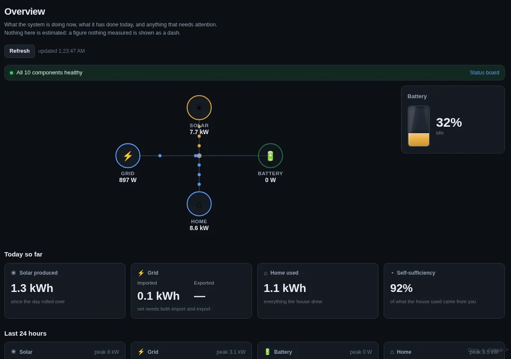

## Energy flow

Every node, every metric, live. Sankey, sunburst or treemap.

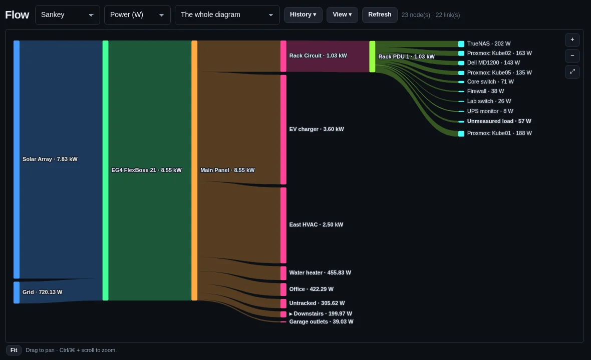

=== "Treemap"

    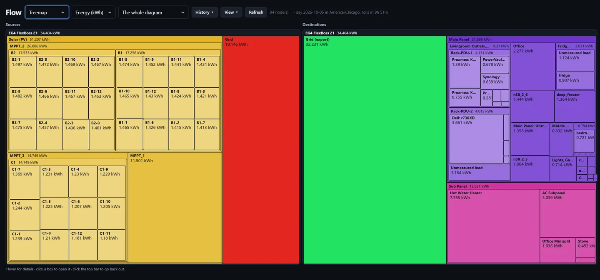

=== "Sunburst"

    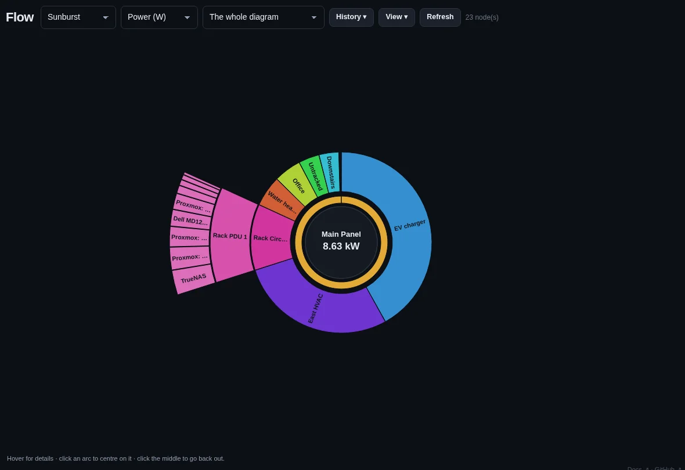

[Energy flow](energy-flow/flow.md)

## Breaker panels

The panel schedule as it is in the box: slot, breaker, wire, gauge, rating and live load per circuit.

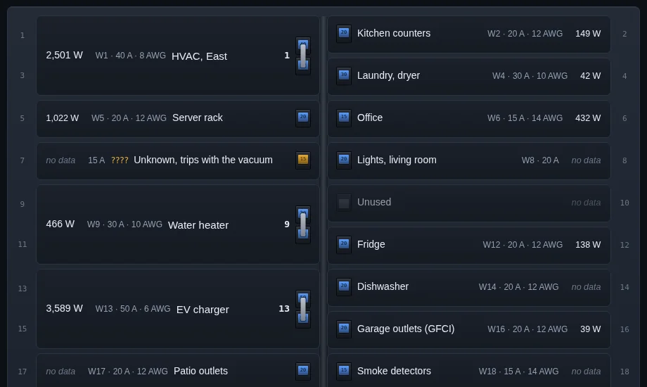

[Panels and circuits](energy-flow/panels.md)

## Floor plans and circuit mapping

Rooms, doors and windows, outlets, lights and appliances, and the cable runs between them. Rooms are shaded by what they draw.

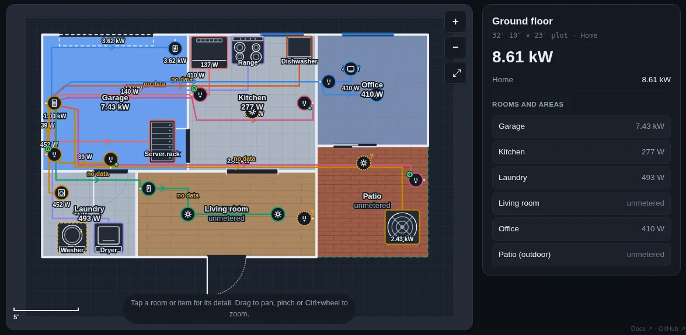

Click an item for its circuit, meter and wiring.

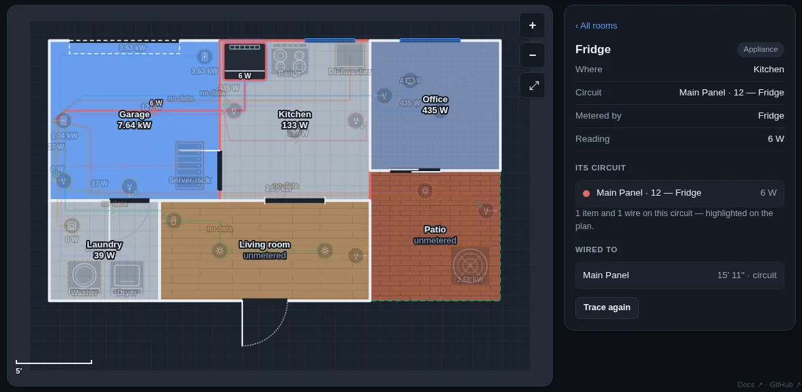

Draw rooms, place items and route wires in the editor.

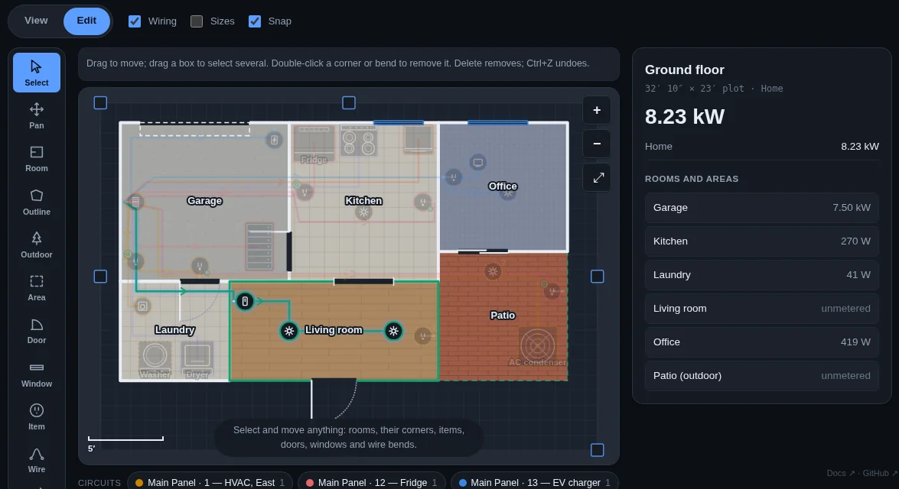

[Floor plans](energy-flow/floor-plans.md)

## Vertiv / Geist rack PDUs

Per-outlet power, energy, current and voltage. Outlet on, off and reboot from the GUI or Home Assistant. OneView cluster roll-ups and group actions.

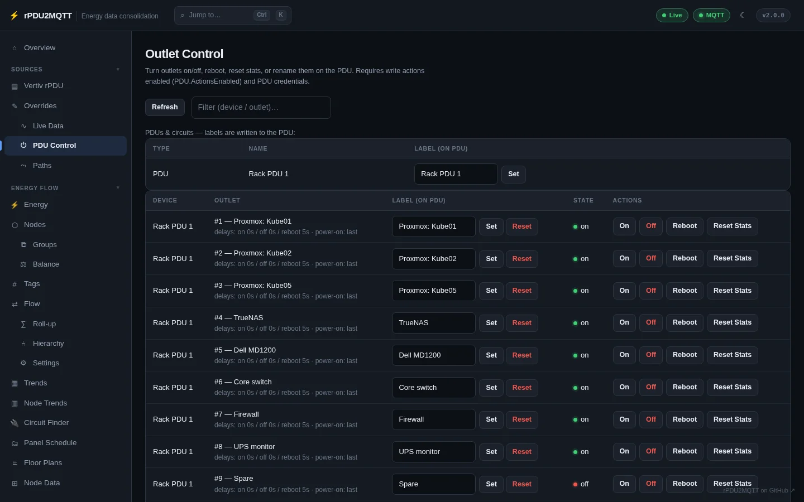

[Vertiv rPDU](vertiv/index.md)

## Everything in the GUI

Every setting has a page. No YAML needed.

=== "MQTT"

    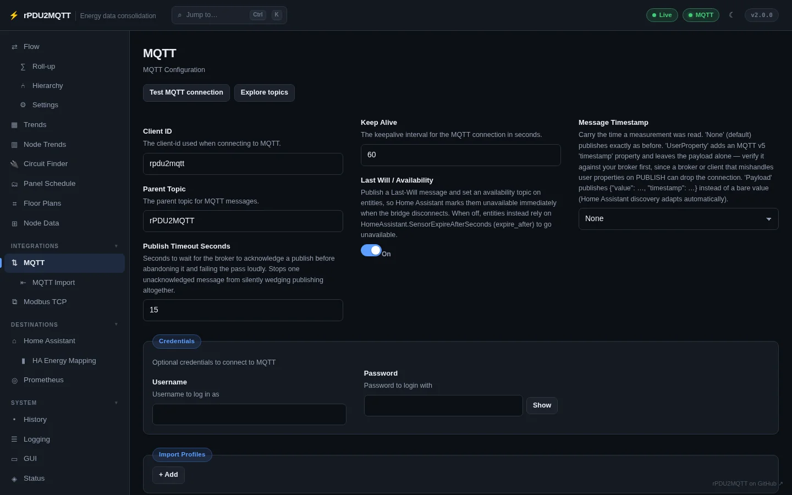

=== "Home Assistant"

    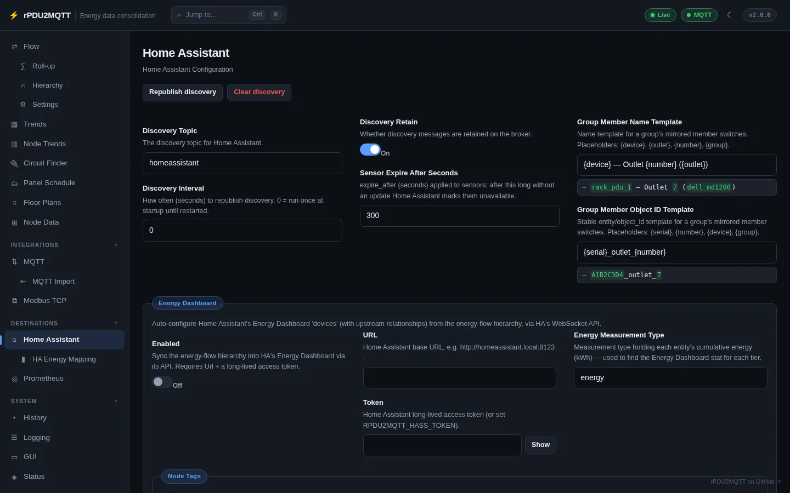

=== "Nodes"

    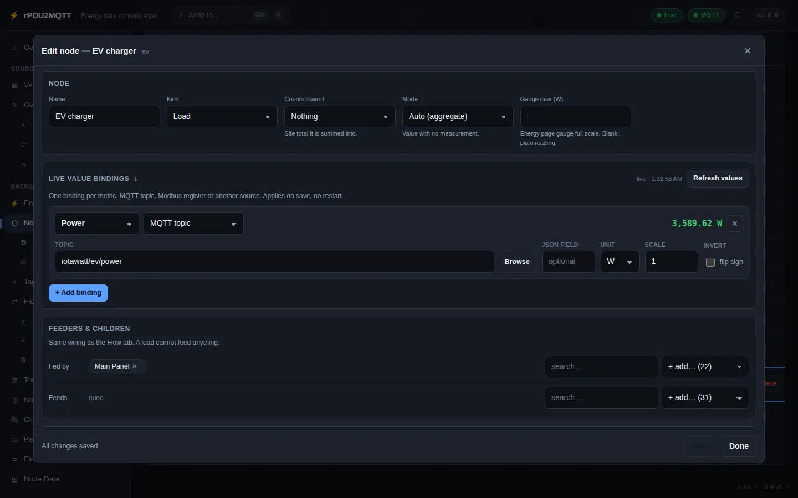

=== "Trends"

    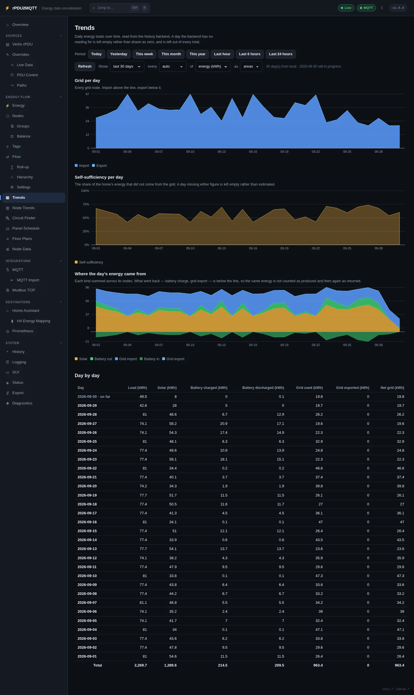

## Sources and destinations

| Sources | Destinations |
| --- | --- |
| Vertiv / Geist PDUs (HTTP API) | MQTT |
| MQTT topics (Solar Assistant, IotaWatt, ESPHome, Tasmota, …) | Home Assistant discovery and Energy Dashboard |
| Modbus TCP registers | Prometheus (`/metrics`, Pushgateway) |
| EmonCMS feeds | EmonCMS |
| Home Assistant entities | Local history store |
| Plugins | Plugins |

## Deployment

Docker, Docker Compose, Helm chart, Argo CD, optional `RpduConfig` custom resource. [Deployment](deployment/index.md)

## Help

- [Discord](https://static.xtremeownage.com/discord) (tag **@XtremeOwnage**)
- [GitHub issues](https://github.com/XtremeOwnage/rPDU2MQTT/issues/new/choose)

!!! note "Screenshots"
    Screenshots are rPDU2MQTT 2.0.0 running against simulated devices.
