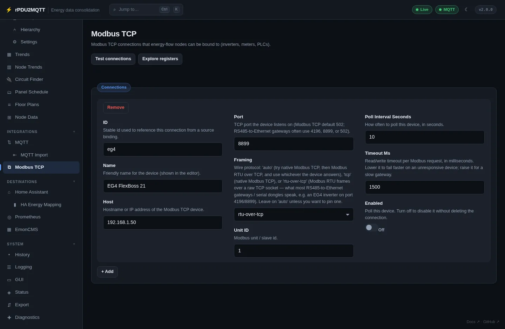

# Modbus TCP

Modbus TCP devices (inverters, meters, PLCs) that node bindings read registers from.

## In the GUI

**Integrations › Modbus TCP**. **+ Add** a connection per device, **Save**.



| Field | Setting | Default |
| --- | --- | --- |
| ID | `Modbus.Connections[].Id` | |
| Name | `Name` | |
| Host | `Host` | |
| Port | `Port` | `502` |
| Framing | `Framing`: `auto`, `tcp`, `rtu-over-tcp` | `auto` |
| Unit ID | `UnitId` | `1` |
| Poll Interval Seconds | `PollIntervalSeconds` | `10` |
| Timeout Ms | `TimeoutMs` | `1500` |
| Enabled | `Enabled` | on |

- **Test connections** reads each connection once.
- **Explore registers** reads a block of registers and shows each decoding.
- Bind a register on a node: [Bindings](../energy-flow/nodes.md#bindings).
- **Import device template** on the Nodes page adds a connection and nodes for a known device.

## Framing

| Framing | Use |
| --- | --- |
| `auto` | Tries Modbus TCP, then RTU over TCP. The result is remembered. |
| `tcp` | Native Modbus TCP, usually port 502 |
| `rtu-over-tcp` | RS485-to-Ethernet gateways, often port 4196 or 8899 |

## Polling

- One poller per device (`host:port:unitId`), in the worker role only.
- The Nodes editor shows values from the worker's cache. **Test device read** opens a separate connection.

## In YAML

```yaml
Modbus:
  Connections:
    - Id: eg4
      Name: EG4 FlexBoss 21
      Host: 192.168.1.50
      Port: 8899
      Framing: rtu-over-tcp
      UnitId: 1
      PollIntervalSeconds: 10
EnergyFlow:
  Nodes:
    - Id: meter
      Label: Meter
      Sources:
        - { Type: modbus, Metric: realpower, Connection: eg4, Register: 0, RegisterType: holding, DataType: int32, WordOrder: big }
```

Register fields: `Register` (0-based), `RegisterType` (`holding`, `input`), `DataType` (`uint16`, `int16`, `uint32`, `int32`, `float32`), `WordOrder` (`big`, `little`).

All settings: [Modbus reference](../reference/settings/modbus.md).
