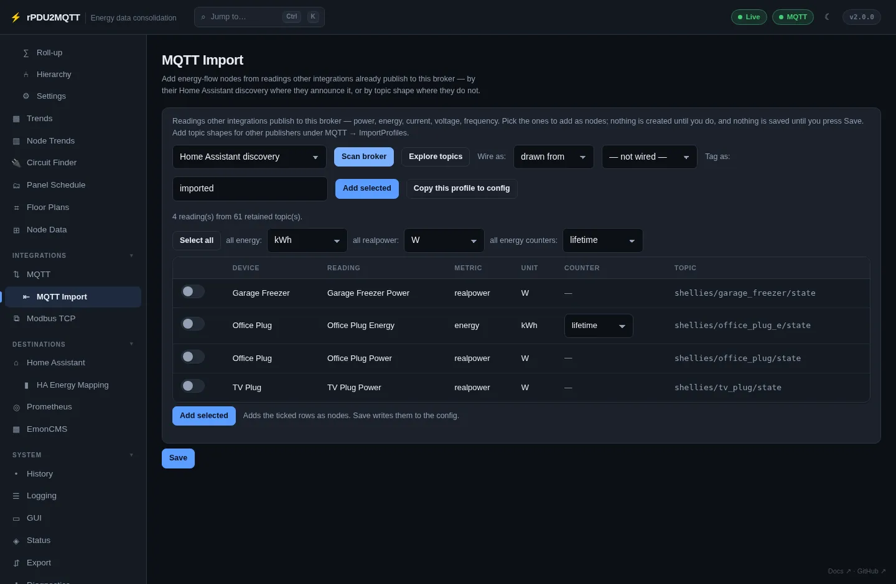

# MQTT Import

Create energy-flow nodes from readings other integrations already publish to the broker.

## In the GUI

**Integrations › MQTT Import**.



1. Pick a source: **Home Assistant discovery**, **ESPHome topics**, **ESPHome (multi-channel) topics**, **Z-Wave JS topics**, or a custom profile.
2. **Scan broker**.
3. Tick readings. Set the unit per metric and **lifetime** or **period** for energy counters.
4. **Wire as**: `drawn from` a feeder, or not wired.
5. **Tag as**: tag for every imported node (default `imported`).
6. **Add selected**, then **Save**.

- One node per device, one binding per metric.
- Appliances are imported as loads.
- **Copy this profile to config** copies a built-in profile into `Mqtt.ImportProfiles` for editing.

## Custom profiles

For publishers with no discovery. Add under **Integrations › MQTT › Import Profiles**.

| Field | |
| --- | --- |
| `Name` | Name in the source list |
| `Filter` | Subscription, for example `tele/#` |
| `Pattern` | Topic shape with `{device}` and `{measure}`, `+` for any segment |
| `JsonField` | Field holding the value, dotted for nesting. Blank = bare number |
| `Metrics` | Map of captured `{measure}` to metric. Unlisted measures are ignored |
| `Tags` | Tags added to every node from this profile |

```yaml
Mqtt:
  ImportProfiles:
    - Name: Plugs
      Filter: tele/#
      Pattern: tele/{device}/SENSOR/{measure}
      Metrics:
        Power: realpower
      Tags: [plugs]
```
