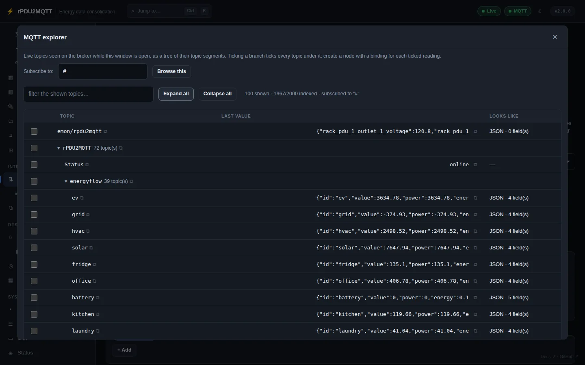

# MQTT

The broker rPDU2MQTT publishes to and subscribes to.

## In the GUI

**Integrations › MQTT**. Changes apply on **Save**.


| Field | Setting | Default |
| --- | --- | --- |
| Client ID | `Mqtt.ClientID` | |
| Parent Topic | `Mqtt.ParentTopic` | `rPDU2MQTT` |
| Publish Timeout Seconds | `Mqtt.PublishTimeoutSeconds` | `15` |
| Keep Alive | `Mqtt.KeepAlive` | |
| Last Will / Availability | `Mqtt.LastWill` | on |
| Message Timestamp | `Mqtt.MessageTimestamp`: `None`, `UserProperty`, `Payload` | `None` |
| Credentials › Username / Password | `Mqtt.Credentials.Username` / `Password` | |
| Connection › Connection Scheme | `Mqtt.Connection.Scheme` | from port |
| Connection › Host | `Mqtt.Connection.Host` | |
| Connection › Port | `Mqtt.Connection.Port` | from scheme |
| Connection › Connection Timeout | `Mqtt.Connection.Timeout` | `15` |
| Connection › Validate Certificate | `Mqtt.Connection.ValidateCertificate` | on |
| Import Profiles | `Mqtt.ImportProfiles` | See [MQTT Import](mqtt-import.md) |

- **Test MQTT connection** connects with the unsaved values.
- **Explore topics** opens the topic explorer.

### Explorer



Live topics as a tree, with last value and detected fields. Tick readings to create nodes with bindings. Copy a topic, value or JSON field path.

## Schemes

| Scheme | Transport | Default port |
| --- | --- | --- |
| `mqtt` | TCP | 1883 |
| `mqtts` | TLS | 8883 |
| `ws` | WebSocket | 8000 |
| `wss` | WebSocket over TLS | 8884 |

With no scheme, it is taken from the port. With no port, the scheme's default is used.

## Last Will

On: entities go unavailable when the bridge disconnects. `<parent>/Status` carries `online` / `offline`.

Off: sensors go unavailable after `HomeAssistant.SensorExpireAfterSeconds`. Switches do not expire.

## Message Timestamp

| Mode | Payload |
| --- | --- |
| `None` | Bare value |
| `UserProperty` | Bare value, MQTT v5 `timestamp` user property. Test against your broker first. |
| `Payload` | `{"value": "123.4", "timestamp": "2026-07-21T18:30:15.250Z"}`. HA discovery adds a `value_template`. |

Energy-flow tier payloads always include `timestamp`.

## In YAML

```yaml
Mqtt:
  Connection:
    Scheme: mqtts
    Host: broker.example.com
    Port: 8883
    Timeout: 15
    ValidateCertificate: true
  Credentials:
    Username: rpdu2mqtt
    Password: secret
  ClientID: rpdu2mqtt
  ParentTopic: rPDU2MQTT
  KeepAlive: 60
  LastWill: true
  MessageTimestamp: None
```

Credentials can come from `RPDU2MQTT_MQTT_USERNAME` / `RPDU2MQTT_MQTT_PASSWORD`. See [Environment variables](../system/environment-variables.md).

Topics: [MQTT topics](../reference/mqtt-topics.md). All settings: [Mqtt reference](../reference/settings/mqtt.md).
