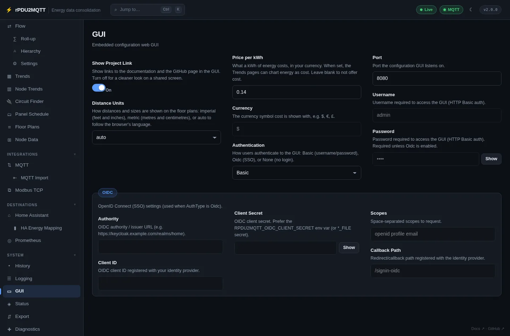

# GUI and authentication

Turn the GUI on with `Gui.Enabled: true` in the config file. Browse to `http://<host>:<port>`.

GUI: **System › GUI**.



| Field | Setting | Default | Notes |
| --- | --- | --- | --- |
| Port | `Gui.Port` | `8080` | Restart to apply |
| Authentication | `Gui.AuthType` | `Basic` | `Basic`, `Oidc`, `None` |
| Username | `Gui.Username` | | Basic |
| Password | `Gui.Password` | | Basic. Or `RPDU2MQTT_GUI_PASSWORD` |
| Show Project Link | `Gui.ShowProjectLink` | on | Docs and GitHub links in the footer |
| Distance Units | `Gui.DistanceUnits` | `auto` | `auto`, `imperial`, `metric`. Floor plans |
| Price per kWh | `Gui.EnergyPrice` | blank | Enables cost charts on Trends |
| Currency | `Gui.Currency` | `$` | |

## Basic

Username and password over HTTP Basic auth. Use TLS (reverse proxy) outside a trusted network.

## OIDC

Set **Authentication** to `Oidc` and fill the **OIDC** box.

| Field | Setting | Default |
| --- | --- | --- |
| Authority | `Gui.Oidc.Authority` | e.g. `https://keycloak.example.com/realms/home` |
| Client ID | `Gui.Oidc.ClientId` | |
| Client Secret | `Gui.Oidc.ClientSecret` | Or `RPDU2MQTT_OIDC_CLIENT_SECRET` |
| Scopes | `Gui.Oidc.Scopes` | `openid profile email` |
| Callback Path | `Gui.Oidc.CallbackPath` | `/signin-oidc` |

- Register `https://<gui-host>/signin-oidc` as the redirect URI with the provider.
- `X-Forwarded-Proto` and `X-Forwarded-Host` are honoured behind a TLS-terminating proxy.
- A **Log out** link appears in the header.

## None

No login. Anyone who can reach the port has full access. A warning is logged at startup.

## Saving

- **Save** writes `config.yaml` and keeps the previous file as `config.yaml.bak`.
- A read-only config (ConfigMap, `:ro` mount) disables Save. With the `RpduConfig` custom resource, Save patches the resource. See [Kubernetes CRD](../deployment/kubernetes-crd.md).
- In Docker, mount `config.yaml` without `:ro` and publish the GUI port.
- Host, port and credential changes need a restart (**Diagnostics › Restart**). Name, override and template changes apply with **Republish discovery**.
- Feature switches (`Gui.Enabled`, `HomeAssistant.DiscoveryEnabled`, `Prometheus.Exporter`, `EmonCMS.Enabled`, `History.Enabled`, `Cache.Enabled`, `Api.Enabled`, `Health.Enabled`, `Operator.Enabled`) are set in the config file or chart values, not the GUI. Pages for disabled features are hidden.
- `Health`, `Api`, `PlanStorage` and `Cache` have no GUI page.

## YAML

```yaml
Gui:
  Enabled: true
  Port: 8080
  AuthType: Basic
  Username: admin
  # Password: RPDU2MQTT_GUI_PASSWORD
  EnergyPrice: 0.14
  Currency: "$"
```

```yaml
Gui:
  Enabled: true
  AuthType: Oidc
  Oidc:
    Authority: "https://keycloak.example.com/realms/home"
    ClientId: "rpdu2mqtt"
    Scopes: "openid profile email"
    CallbackPath: "/signin-oidc"
```

All settings: [GUI settings reference](../reference/settings/gui.md).
