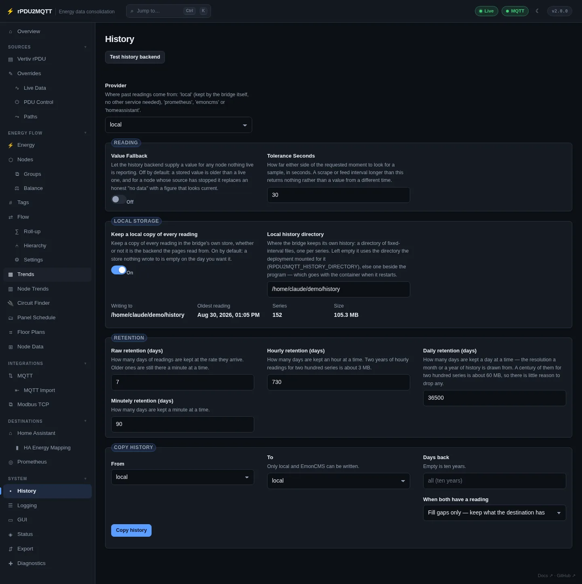

# History

Past readings for the Flow, Energy, Trends, Node Trends and Node Data pages.

Turn on with `History.Enabled: true` in the config file.

## GUI

**System › History**. **Test history backend** checks the selected provider.



### Reading

| Field | Setting | Default | Notes |
| --- | --- | --- | --- |
| Provider | `History.Provider` | `local` | `local`, `prometheus`, `emoncms`, `homeassistant` |
| Value Fallback | `History.ValueFallback` | off | Use the latest stored value for a node with no live reading |
| Tolerance Seconds | `History.ToleranceSeconds` | `30` | Search window either side of the requested time. Range 1–600 |
| Prometheus URL | `History.PrometheusUrl` | | Prometheus server that scrapes the bridge, e.g. `http://prometheus:9090`. Provider `prometheus` |

Provider `emoncms` uses the [EmonCMS](../destinations/emoncms.md) URL and key. Provider `homeassistant` uses the [Home Assistant](../destinations/home-assistant.md#energy-dashboard) URL and token.

### Local storage

| Field | Setting | Default |
| --- | --- | --- |
| Keep a local copy of every reading | `History.LocalEnabled` | on |
| Local history directory | `History.LocalPath` | empty |

- `LocalEnabled` records whatever the provider is.
- Empty `LocalPath` uses `RPDU2MQTT_HISTORY_DIRECTORY`, else a directory beside the program.
- The page shows the directory in use, the oldest reading, the series count and the size.
- Put the directory on a persistent volume. The Helm chart does this by default (`history.persistence.enabled`, mounted at `/data/history`).

### Retention

| Field | Setting | Default | Range |
| --- | --- | --- | --- |
| Raw retention (days) | `History.LocalRawKeepDays` | `7` | 1–3650 |
| Minutely retention (days) | `History.LocalMinuteKeepDays` | `90` | 1–3650 |
| Hourly retention (days) | `History.LocalHourKeepDays` | `730` | 1–36500 |
| Daily retention (days) | `History.LocalDayKeepDays` | `36500` | 1–36500 |

Minute, hour and day tiers store the last reading in each bucket.

About 1 GB a year for 200 series at a 10 second interval, with the defaults.

### Copy history

Copies every node's history from one backend to another, in the background.

| Field | Values |
| --- | --- |
| From | `local`, `emoncms`, `prometheus`, `homeassistant` |
| To | `local`, `emoncms` |
| Days back | Empty = ten years |
| When both have a reading | Fill gaps only (default), or replace (`local` only) |

- EmonCMS is written only into feeds that already exist.
- Only the leader writes to `local`.
- API: `POST /api/history/copy?from=emoncms&to=local&days=45&conflicts=keep`; `GET` for progress.

## Stored metrics

Power, apparent power, energy, daily energy, current, voltage, frequency, power factor, state of charge, other percentages, temperature, battery charge and grid export, for every node that reports them.

## YAML

```yaml
History:
  Enabled: true
  Provider: local
  LocalEnabled: true
  LocalPath: ''
  LocalRawKeepDays: 7
  LocalMinuteKeepDays: 90
  LocalHourKeepDays: 730
  LocalDayKeepDays: 36500
  ToleranceSeconds: 30
```

All settings: [History settings reference](../reference/settings/history.md).
