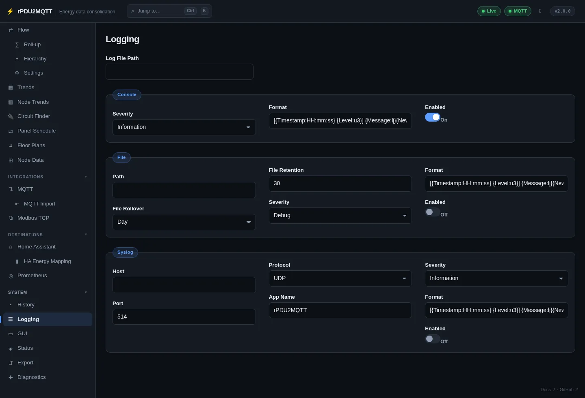

# Logging

GUI: **System › Logging**. Three sinks, each with its own severity.



## Console

| Field | Setting | Default |
| --- | --- | --- |
| Enabled | `Logging.Console.Enabled` | on |
| Severity | `Logging.Console.Severity` | `Information` |
| Format | `Logging.Console.Format` | |

## File

| Field | Setting | Default |
| --- | --- | --- |
| Enabled | `Logging.File.Enabled` | off |
| Path | `Logging.File.Path` | |
| Severity | `Logging.File.Severity` | `Debug` |
| File Rollover | `Logging.File.FileRollover` | `Day` (`Infinite`, `Year`, `Month`, `Day`, `Hour`, `Minute`) |
| File Retention | `Logging.File.FileRetention` | `30` rolled files |
| Format | `Logging.File.Format` | |

## Syslog

RFC 3164 / RFC 5424 over UDP or TCP.

| Field | Setting | Default |
| --- | --- | --- |
| Enabled | `Logging.Syslog.Enabled` | off |
| Host | `Logging.Syslog.Host` | required when enabled |
| Port | `Logging.Syslog.Port` | `514` |
| Protocol | `Logging.Syslog.Protocol` | `UDP` |
| App Name | `Logging.Syslog.AppName` | `rPDU2MQTT` |
| Severity | `Logging.Syslog.Severity` | `Information` |
| Format | `Logging.Syslog.Format` | |

## Severity levels

`Verbose`, `Debug`, `Information`, `Warning`, `Error`, `Fatal`.

| Level | Logs |
| --- | --- |
| `Information` | Startup decisions (roles, config source, sources, destinations), PDU shape changes, every write (outlet actions, config changes, group actions) |
| `Debug` | Each poll with latency and counts, energy-flow provisioning, ingest batches, feed provisioning, subscription changes, repeated failures |
| `Verbose` | Every node value change and every ingested reading. Use a file sink. |

## Debug options

On the **Diagnostics** page:

| Field | Setting | Default |
| --- | --- | --- |
| Publish to MQTT | `Debug.PublishMessages` | on. Off = dry run, nothing sent |
| Print Discovery Payloads | `Debug.PrintDiscovery` | off. Logs Home Assistant discovery JSON |

## YAML

```yaml
Logging:
  Console:
    Enabled: true
    Severity: Information
  File:
    Enabled: true
    Severity: Verbose
    Path: /config/rpdu2mqtt.log
    FileRollover: Day
    FileRetention: 30
  Syslog:
    Enabled: false
    Host: 10.0.0.10
    Port: 514
    Protocol: UDP
```

All settings: [logging](../reference/settings/logging.md), [debug](../reference/settings/debug.md).
