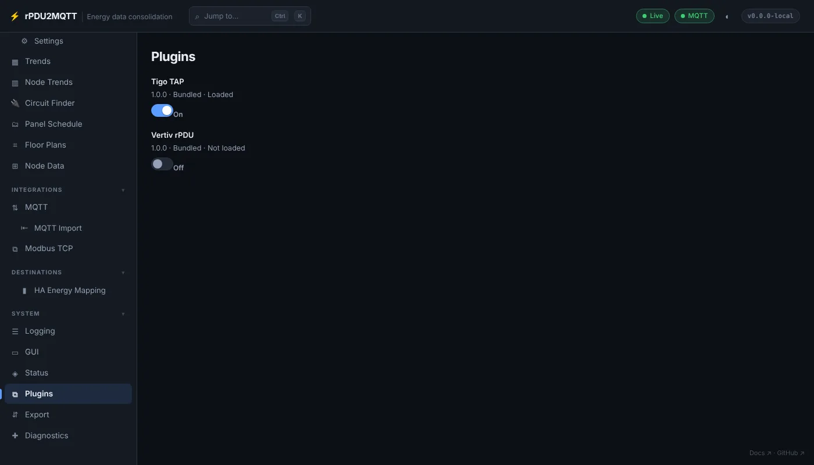

# Plugins

## In the GUI

**System › Plugins**. One switch per plugin found, bundled or in `/app/plugins`. Changes apply on **Save** and a restart.



| Field | Meaning |
| --- | --- |
| Switch | Off: the plugin's DLL is not loaded at startup |
| Version | The plugin assembly's version |
| Bundled / External | Shipped with the bridge, or from `/app/plugins` |
| Loaded / Not loaded / Failed | State in the running process |

- Every plugin is on by default.
- With **Vertiv rPDU** off, its pages (**Vertiv rPDU**, **Overrides**, **Live Data**, **PDU Control**, **Paths**) are hidden.
- With **EmonCMS** off, its page is hidden, nodes cannot read EmonCMS feeds, and `emoncms` is no longer a history backend. Its settings are kept.

## In YAML

```yaml
DisabledPlugins:
  - vertiv
```

Each entry is a plugin folder name (`vertiv`, `tigo`, `emoncms`) or, for a loose DLL in `/app/plugins`, its file name without `.dll`. Case-insensitive.
