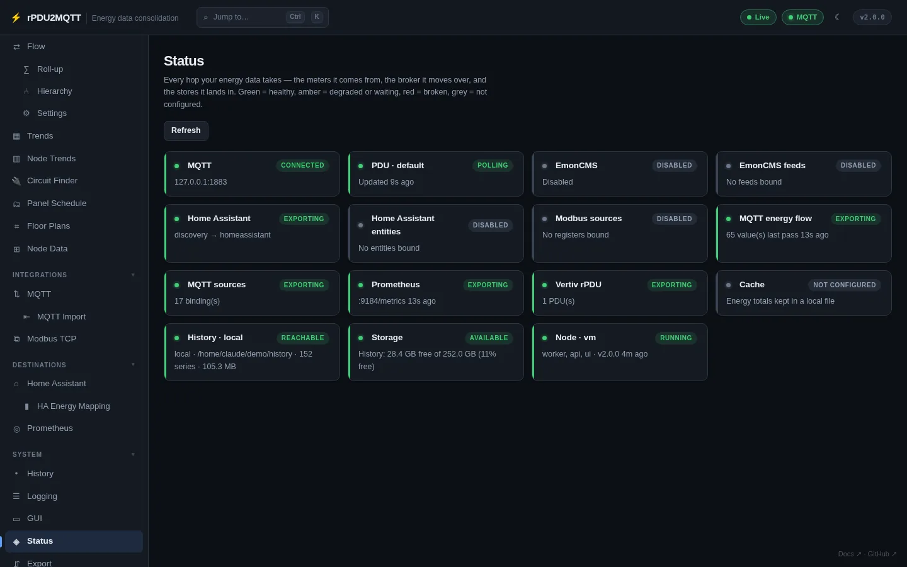
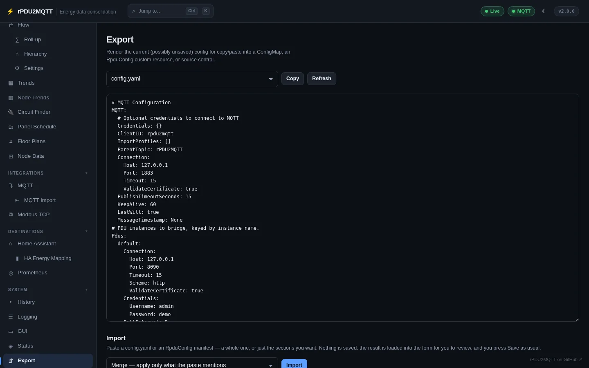
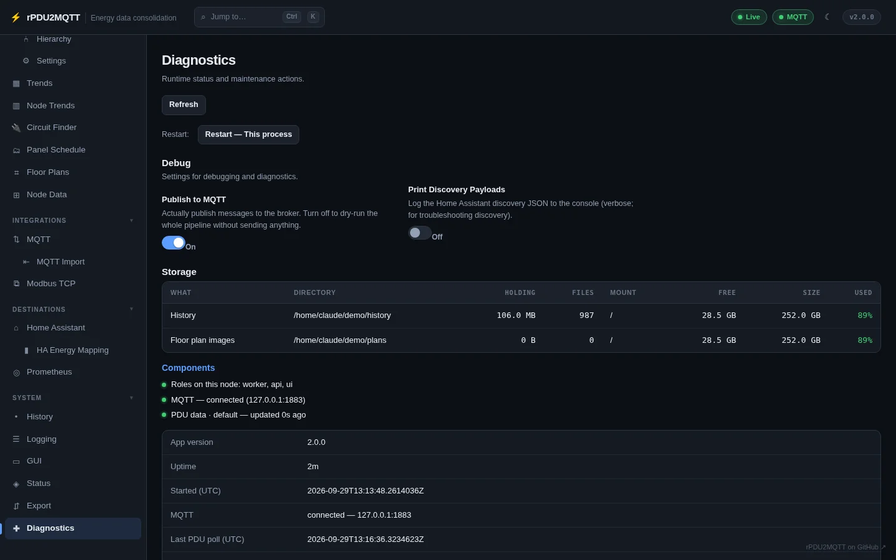

# Status, Export, Diagnostics

## Status

**System › Status**. One card per source and destination.

| Colour | Meaning |
| --- | --- |
| Green | Healthy |
| Amber | Degraded or waiting |
| Red | Broken |
| Grey | Not configured |

Cards: MQTT, each PDU, EmonCMS, EmonCMS feeds, Home Assistant, Home Assistant entities, Modbus sources, MQTT energy flow, MQTT sources, Prometheus, Vertiv rPDU, Cache, History, Storage, and each node (roles, version, uptime).

**Storage** is red when a directory is missing, read-only or full, amber when under 10% free.

## Export

**System › Export**. Renders the current form, including unsaved edits.

| Control | Action |
| --- | --- |
| Format | `config.yaml` or an `RpduConfig` manifest (secrets redacted) |
| Copy | Copies the output |
| Import › Merge | Applies only the keys in the paste. Lists are replaced whole |
| Import › Replace | The paste becomes the whole config. Unmentioned sections go back to defaults |

Import loads into the form. Press **Save** to keep it.

## Diagnostics

**System › Diagnostics**.

| Section | Contents |
| --- | --- |
| Restart | Stops the process so the container or host restarts it. Under a leader lease, rolls the Deployment |
| Debug | Publish to MQTT, Print Discovery Payloads ([Logging](logging.md#debug-options)) |
| Storage | Each directory written to: size, files, mount, free space, used % (amber under 10% free, red under 3% or 64 MB) |
| Components | Roles, MQTT connection, last PDU poll |
| Runtime | Version, uptime, time zone, energy day rollover, config source, .NET, OS, Kubernetes |

With the Kubernetes config source, also pod logs and recent events (needs the RBAC the Helm chart grants: `pods`, `pods/log`, `events`).

## Operator

Kubernetes only. See [Updates and restarts](../deployment/updates.md#automatic-updates).
