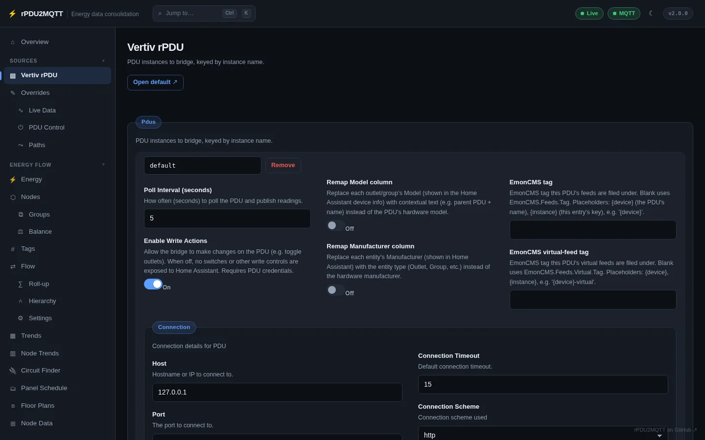

# Vertiv rPDU

Vertiv / Geist rack PDUs, read over their HTTP API. One or more PDUs per install.

## In the GUI

**Sources › Vertiv rPDU**. Changes apply on **Save**.



| Field | Setting | Default |
| --- | --- | --- |
| Instance name | `Pdus.<name>` | `default` |
| Poll Interval (seconds) | `PollInterval` | `5` |
| Enable Write Actions | `ActionsEnabled` | off |
| Remap Model column | `RemapModel` | off |
| Remap Manufacturer column | `RemapMake` | off |
| EmonCMS tag | `EmonCmsTag` | blank |
| EmonCMS virtual-feed tag | `EmonCmsVirtualTag` | blank |
| Connection › Host | `Connection.Host` | |
| Connection › Port | `Connection.Port` | |
| Connection › Connection Scheme | `Connection.Scheme` | `http` |
| Connection › Connection Timeout | `Connection.Timeout` | `15` |
| Connection › Validate Certificate | `Connection.ValidateCertificate` | on |
| Credentials › Username / Password | `Credentials.Username` / `Credentials.Password` | |

- **+ Add** adds another PDU. **Remove** deletes one.
- **Enable Write Actions** needs credentials. It adds outlet switches, reboot buttons, delays and power-on action in Home Assistant and on [PDU Control](control.md).
- The **Tags** table sets default tags for all PDUs, all outlets, and each PDU or outlet. See [Tags](../energy-flow/nodes.md#tags).

## In YAML

```yaml
Pdus:
  default:
    Connection:
      Scheme: http
      Host: 10.0.0.10
      Port: 80
      Timeout: 15
      ValidateCertificate: true
    Credentials:
      Username: admin
      Password: secret
    PollInterval: 5
    ActionsEnabled: true
  rack-b:
    Connection: { Host: 10.0.0.11, Port: 80 }
```

Credentials can come from `RPDU2MQTT_PDU_USERNAME` / `RPDU2MQTT_PDU_PASSWORD` (or `_FILE`). See [Environment variables](../system/environment-variables.md).

A 1.x `PDU:` section is migrated to `Pdus: { default: … }` on load.

## Outlet operations

With **Enable Write Actions** on, each outlet gets:

| Home Assistant entity | Type | Action |
| --- | --- | --- |
| Switch | `switch` | On / off |
| Reboot | `button` | Power-cycle |
| On Delay / Off Delay / Reboot Delay | `number` | Seconds |
| Power-On Action | `select` | `on`, `off`, `last` |
| Reset Statistics | `button` | Reset accumulated energy |

## Pages

| Page | |
| --- | --- |
| [Overrides](overrides.md) | Names, ids, make/model, enable/disable per device, outlet and measurement |
| [OneView](oneview.md) | Clusters of PDUs, group roll-ups and group actions |
| [Live Data, PDU Control, Paths](control.md) | Readings, outlet control, generated topics and metric names |

All settings: [Pdus reference](../reference/settings/pdus.md).
