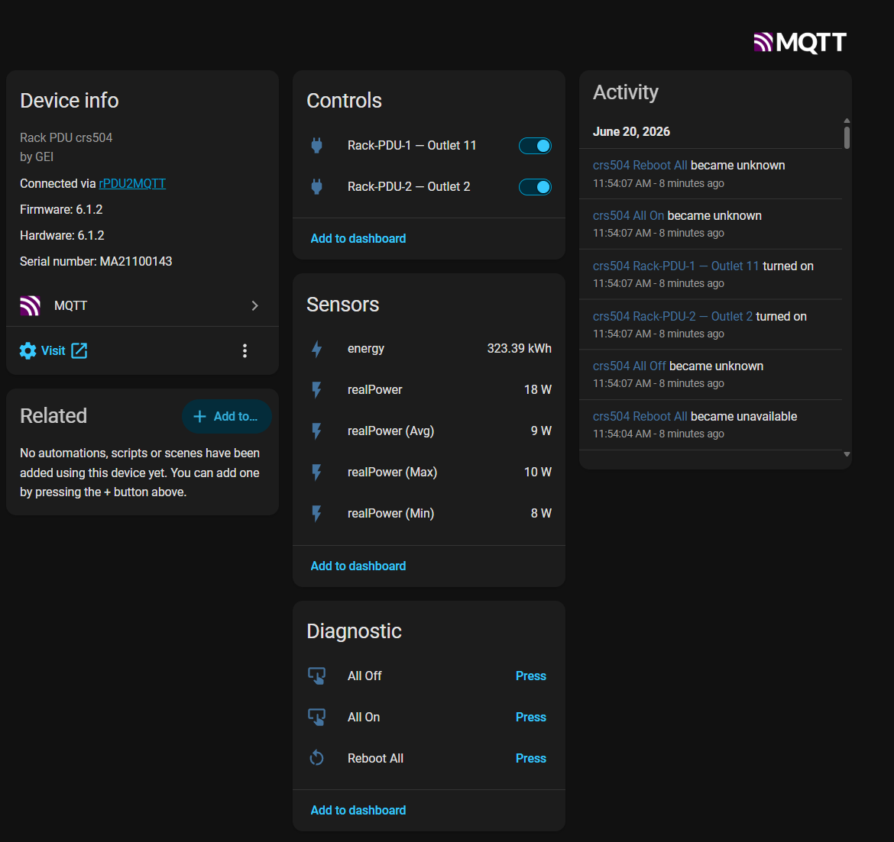
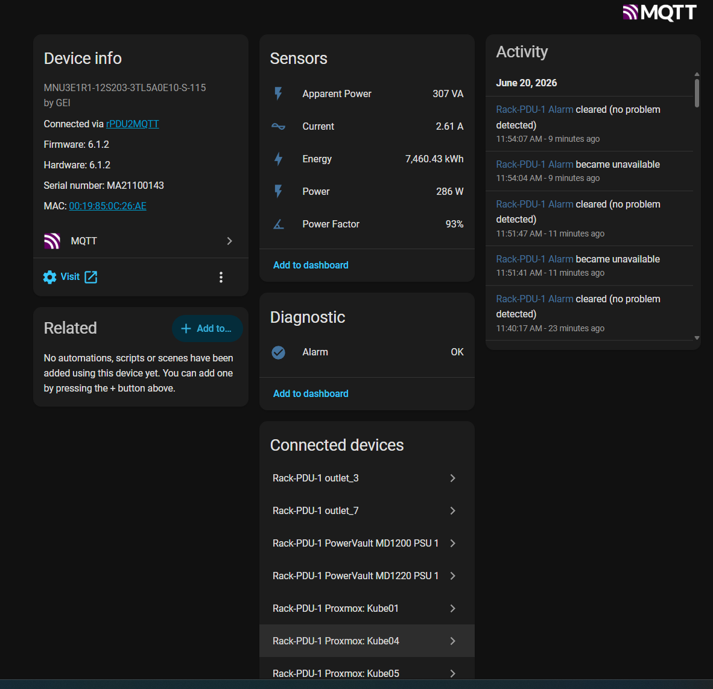
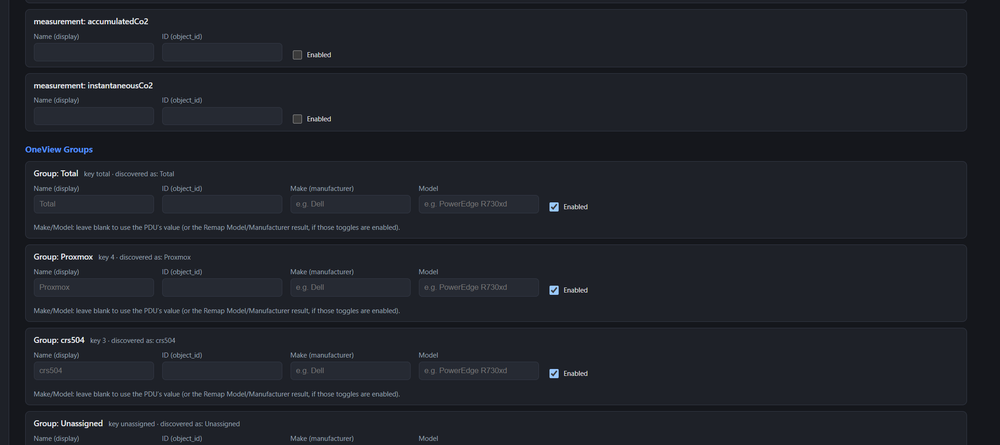

# Device Aggregation (OneView)

Geist/Vertiv PDUs support **OneView**, which clusters several PDUs together so one "master" unit
exposes the data for every member. rPDU2MQTT supports this directly.

## How it works

- rPDU2MQTT **auto-detects** OneView. On startup it checks `/api/conf/oneview/enabled` on the PDU
  you point it at. If aggregation is on, it pulls aggregated data from `/oneview` (all member PDUs
  plus OneView groups); otherwise it uses the single-device `/api` endpoint.
- There is **no setting in `config.yaml` to turn this on/off** — enable OneView on the PDU and point
  the bridge at the master; everything else is automatic.

## Enabling it

1. Enable **OneView / aggregation** on the master PDU (Geist web UI). Add the member PDUs to the
   cluster there.
2. Point rPDU2MQTT's `Pdu.Connection.Host` at the **master**:

   ```yaml
   Pdu:
     Connection:
       Host: rack-pdu-1.example.com   # the OneView master
   ```

3. Start the bridge. The log shows which mode was selected:
   `Detected OneView. Will use /oneview for collecting data.`

Each member PDU and its outlets are published as their own Home Assistant devices, linked to the
master via `via_device`.

## OneView groups

OneView lets you define **groups** (e.g. all the outlets feeding one server). Each group is published
as a Home Assistant device carrying **rollup sensors** — the group's aggregated measurements as
**Sum / Avg / Min / Max** (whichever the PDU reports). The cluster-wide **"Total"** group is included
too (its rollup comes from the PDU's `pduTotal`), giving you whole-cluster Power/Energy/etc. sensors.
The sensor names are overridable via `Overrides.OneviewGroups.Measurements.<type>.Name` (the
"(Sum)/(Avg)/(Min)/(Max)" suffix is appended automatically).

> **Group actions** (`Pdu.ActionsEnabled`): OneView has no group control endpoint, but it *does*
> expose per-outlet group membership (`groupMap`). The bridge resolves a group's member outlets from
> that mapping and **fans out** the per-outlet control, so each group gets **All On / All Off /
> Reboot All** (in the GUI Control tab and Home Assistant). It aborts if it can't resolve a group's
> members, so it never acts on the wrong outlets.

A group as a Home Assistant device — rollup sensors, the member switches, and the group action buttons:



The parent PDU device shows its sensors plus every outlet/group as connected devices (`via_device`):



Customize groups under `Overrides.OneviewGroups`:

```yaml
Overrides:
  OneviewGroups:
    # Override the aggregated group measurements (the ID is used in the topic/entity id).
    Measurements:
      realPower:
        ID: power_sum
        Name: Power (Sum)
        Enabled: true
      energy:
        ID: energy_sum
        Name: Energy (Sum)
        Enabled: true

    # Override a group's id/name, or disable it. Key by the group's numeric id or its name.
    Overrides:
      r730xd:
        ID: dell_r730xd
        Name: "Group: Dell r730XD"
        Enabled: true
      unassigned:
        Enabled: false   # hide the default "unassigned" group
      total:
        Enabled: false   # hide the default "total" group
```

The GUI's **Overrides** editor lists the discovered OneView groups, so you can rename or disable them:



## Outlet control in a cluster

Outlet control (`Pdu.ActionsEnabled`) works across the cluster. Members aren't reachable directly
from the bridge — the master proxies each member on its own port — so rPDU2MQTT automatically routes
control to the owning PDU. Two things to know:

- Create the PDU action user (with **Control** permission) on **every** node in the cluster, not just
  the master, or control will fail for member outlets.
- See [Configuration.md](Configuration.md) (Actions Enabled) for the credential setup.
