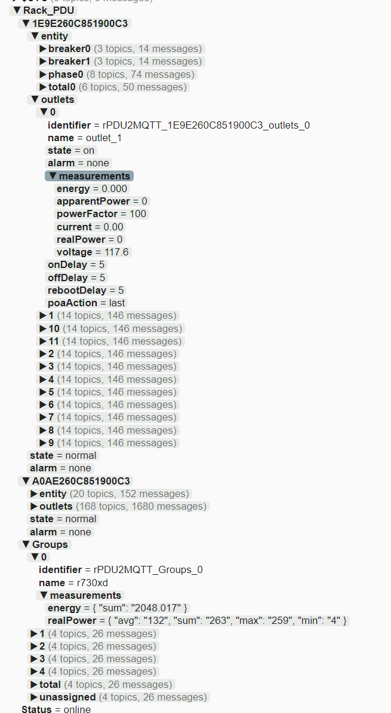
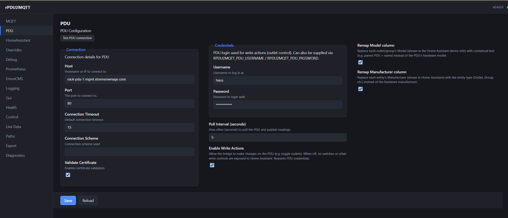
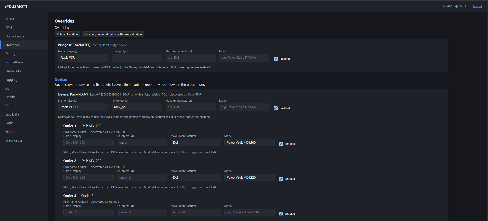
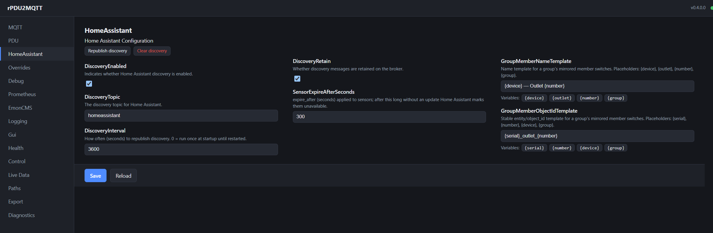
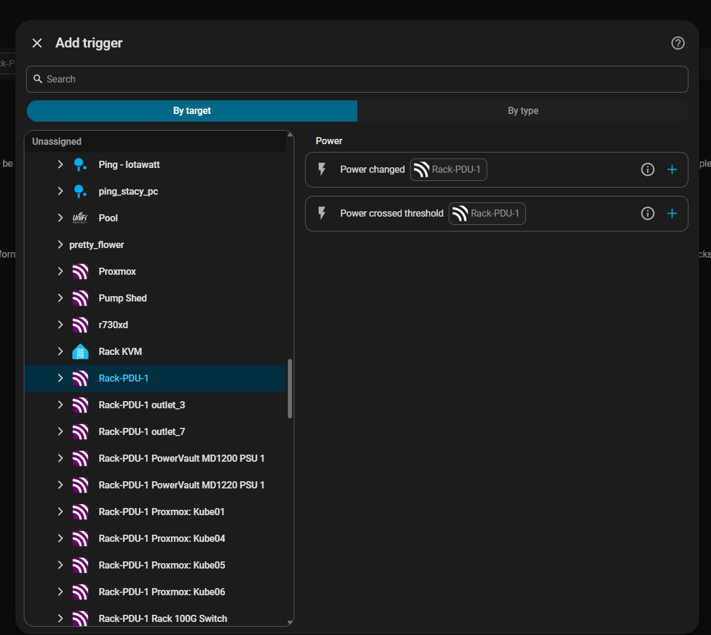
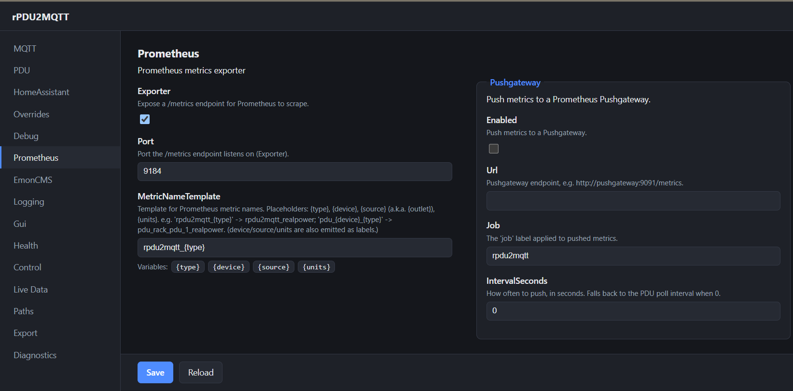
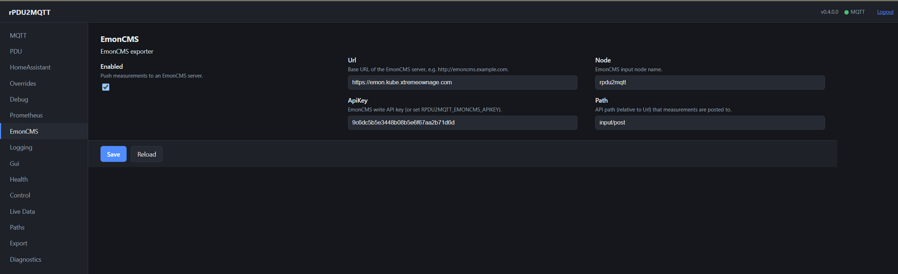
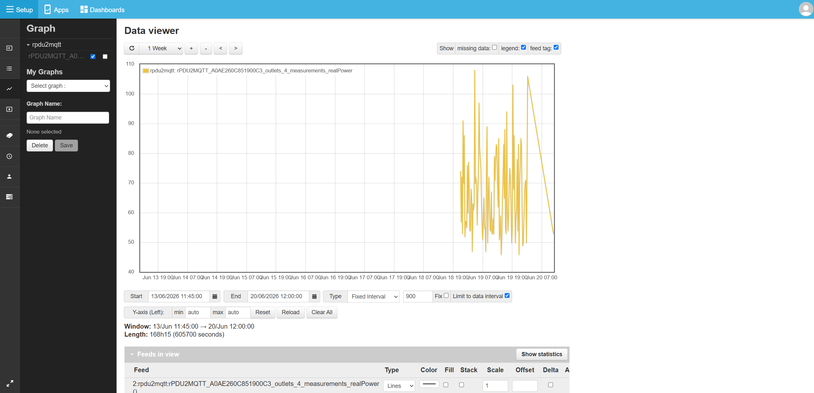
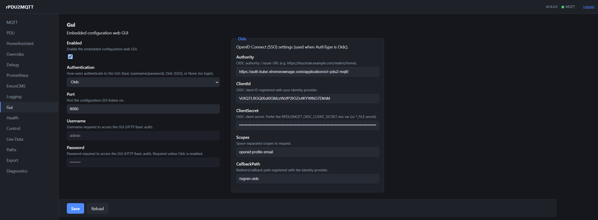
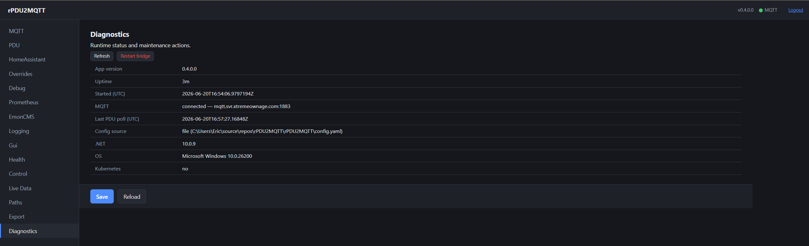

# Configuration Guide

Configuration file: `config.yaml`.

Multiple PDUs: see [Aggregation.md](Aggregation.md) for OneView setup.

## MQTT Configuration

### Credentials (Optional)

Required if the broker requires authentication.

```yaml
Mqtt:
  Credentials:
    Username: "user"
    Password: "password"
```

### Connection (Optional)

- `Scheme` omitted: inferred from `Port` (8883 → `mqtts`, 8000 → `ws`, 8884 → `wss`, anything else → `mqtt`).
- `Port` omitted: the scheme's default port.

| Scheme  | Transport             | Default port |
|---------|-----------------------|--------------|
| `mqtt`  | Plain TCP             | 1883         |
| `mqtts` | TLS                   | 8883         |
| `ws`    | WebSocket             | 8000         |
| `wss`   | WebSocket over TLS    | 8884         |

```yaml
Mqtt:
  Connection:
    Host: "broker.example.com"
    Scheme: "mqtts"          # omit to infer from Port
    ValidateCertificate: true # false accepts a self-signed broker certificate (TLS schemes only)
```

### Parent Topic (Optional)

Parent topic for all published keys.

```yaml
Mqtt:
  ParentTopic: "rpdu2mqtt"
```

### Client ID (Optional)

Client ID used when connecting to the broker.

```yaml
Mqtt:
  ClientID: "rpdu2mqtt"
```

### KeepAlive (Optional)

Keep-alive interval, in seconds.

```yaml
Mqtt:
  KeepAlive: 60
```

### Last Will / Availability (Optional)

`LastWill: true` (default) registers an MQTT Last-Will message and sets an `availability_topic` on every
entity. Home Assistant marks entities unavailable when the bridge disconnects.

```yaml
Mqtt:
  LastWill: true   # default
```

`LastWill: false` disables both. Entities then go unavailable after
**`HomeAssistant.SensorExpireAfterSeconds`** (`expire_after`):

```yaml
Mqtt:
  LastWill: false
HomeAssistant:
  SensorExpireAfterSeconds: 300
```

- `expire_after` applies to sensors and binary sensors only. Outlet switches do not go unavailable with
  `LastWill: false`.

### Message Timestamp (Optional)

Adds the time the PDU was read to each published measurement.

```yaml
Mqtt:
  MessageTimestamp: None   # None (default) | UserProperty | Payload
```

| Mode | Measurement format |
| --- | --- |
| `None` | Bare value, no timestamp. **Default.** |
| `UserProperty` | Bare value; time in an MQTT v5 `timestamp` user property. Test against your broker: a broker or client that mishandles user properties on PUBLISH can drop the connection. |
| `Payload` | `{"value": "123.4", "timestamp": "2026-07-21T18:30:15.250Z"}`. Home Assistant discovery adds `value_template: {{ value_json.value }}`. Other consumers of these topics need updating. |

- Timestamp: ISO-8601 UTC, milliseconds.
- In `Payload` mode the value is a string, as reported by the PDU.
- The energy-flow export (`EnergyFlow.MqttExport`) always includes a `timestamp` field. For a rolled-up tier
  it is the oldest contributing snapshot's time.

### Connection Details (Required)

```yaml
Mqtt:
  Connection:
    Host: "localhost"
    Port: 1883
    Timeout: 15                # seconds
    ValidateCertificate: true  # false for self-signed certificates
```

Published topics under `ParentTopic`, in MQTT Explorer:



## PDU Configuration (Required)

`Pdus:` is a map of named instances. A single PDU is one entry named `default`. Each instance is polled
independently and published under its own MQTT/Home Assistant namespace. A single instance is not
namespaced.

```yaml
Pdus:
  default:                 # instance name (any key; "default" for a single PDU)
    Connection:
      Host: "10.0.0.10"
      Port: 80
    PollInterval: 5
  rack-b:
    Connection:
      Host: "10.0.0.11"
      Port: 80
```

- **v1 configs:** a single `PDU:` section is migrated to `Pdus: { default: ... }` on load, with a one-time
  warning.
- The fields below are per instance, under `Pdus.<name>`.

### Connection Details (Required)

```yaml
Pdus:
  default:
    Connection:
      Scheme: http         # http or https
      Host: "localhost"
      Port: 80
      Timeout: 15          # seconds
      ValidateCertificate: true  # false for self-signed certificates
```

GUI **PDU** section (**Enable Write Actions** enables outlet control):



### Credentials (Optional)

```yaml
Pdus:
  default:
    Credentials:
      Username: "actionsUser"
      Password: "actionsPass"
```

### Credentials via environment / secrets (Optional)

These variables override the config file. Full list and precedence (env, config file, Kubernetes CRD):
[environment-variables.md](../Examples/Configuration/environment-variables.md).

| Variable | Overrides |
| --- | --- |
| `RPDU2MQTT_MQTT_USERNAME` / `RPDU2MQTT_MQTT_PASSWORD` | MQTT broker credentials |
| `RPDU2MQTT_PDU_USERNAME` / `RPDU2MQTT_PDU_PASSWORD` | PDU credentials |
| `RPDU2MQTT_EMONCMS_APIKEY` | EmonCMS write API key |
| `RPDU2MQTT_GUI_PASSWORD` | GUI Basic-auth password |
| `RPDU2MQTT_OIDC_CLIENT_SECRET` | GUI OIDC client secret |

- Each variable has a `<NAME>_FILE` form: a file path (e.g. `/run/secrets/mqtt_password`) whose contents are
  the value.
- `_FILE` takes precedence over the plain variable.

```yaml
# docker-compose example
services:
  rpdu2mqtt:
    environment:
      RPDU2MQTT_MQTT_PASSWORD_FILE: /run/secrets/mqtt_password
    secrets:
      - mqtt_password
```

### Polling Interval (Optional)

Seconds between polls.

```yaml
Pdus:
  default:
    PollInterval: 5
```

### Actions Enabled

Enables write actions on the PDU (e.g. toggling outlets). Requires PDU `Credentials`. Default: disabled.

```yaml
Pdus:
  default:
    ActionsEnabled: true
```

When enabled, each outlet gets these Home Assistant entities, and the GUI gets a **Control** tab:

| Entity | Type | Action |
| --- | --- | --- |
| Switch | `switch` | Turn the outlet on / off |
| Reboot | `button` | Power-cycle the outlet |
| On Delay / Off Delay / Reboot Delay | `number` | On/off/reboot timing (seconds) |
| Power-On Action | `select` | Outlet behaviour when power is restored: `on` / `off` / `last` (restore the pre-outage state) |
| Reset Statistics | `button` | Reset the outlet's accumulated energy statistics |

GUI **Control** tab:

- Controls a single outlet.
- Shows each outlet's current delays and power-on action.
- Renames the outlet's label on the PDU (requires write actions).

## Overrides Configuration (Optional)

Overrides generated `entity_id`, names, and enabled state.

- All fields are optional.
- `Name` can change at any time; Home Assistant updates after the next discovery run.
- `ID` is used only when the device/entity is first created.

GUI **Overrides** editor: lists devices, outlets and measurements from live PDU data, with a preview of
generated paths.



### PDU Override

```yaml
Overrides:
  PDU:
    ID: null
    Name: "Your-PDU"
```

### Devices Override

Keyed by device serial number (shown on the PDU's info tab). Each PDU can expose several devices; outlets and
sensors belong to one of them in Home Assistant.

```yaml
Overrides:
  Devices:
    A0AE260C851900C3:       # device serial number
      ID: null
      Name: "Device Name"
      Enabled: true
```

### Outlets Override

Keyed by outlet number (1-based, as in the PDU UI), under the device serial number.

```yaml
Overrides:
  Devices:
    A0AE260C851900C3:           # device serial number
      Outlets:
        1:
          ID: kube02
          Name: "Proxmox: Kube02"
          Enabled: true
          Make: "Dell"              # manufacturer shown in Home Assistant
          Model: "PowerEdge R730xd" # model shown in Home Assistant
```

- `Make` / `Model` replace the PDU hardware make/model (e.g. `GEI` / `MNU3E1R1-...`) in Home Assistant device
  info.
- They apply to devices, outlets, and OneView groups.
- They take precedence over `RemapMake` / `RemapModel`.

### Measurements Override

Measurement entity ID: `[DEVICE_ID]_[METRIC_TYPE]`, e.g. `kube02_power`.

```yaml
Overrides:
  Measurements:
    apparentPower:
      ID: null
      Name: "Apparent Power"
      Enabled: true
    realPower:
      ID: power
      Name: "Power"
      Enabled: true
```

## Home Assistant Integration

### Discovery Configuration

```yaml
HomeAssistant:
  DiscoveryEnabled: true
  DiscoveryTopic: "homeassistant/discovery"
  DiscoveryInterval: 300                      # seconds between discovery messages
  SensorExpireAfterSeconds: 300               # seconds until sensors are marked unavailable
```

GUI **HomeAssistant** section (also holds the group member name/object-id templates):



The bridge, each PDU, every outlet, and each OneView group appear as Home Assistant devices:


Outlets and power sensors provide device triggers (e.g. "power crossed threshold"):



## Debugging Configuration

### Debug Options

```yaml
Debug:
  PrintDiscovery: false  # true prints discovery messages to the console
  PublishMessages: true  # false runs without sending messages
```

## Logging Configuration

### Levels

Each sink has its own `Severity`.

| Level | Logs |
| --- | --- |
| `Information` | Default. Startup decisions (roles, config source, every PDU/Modbus source, every destination on or off), each PDU's shape when it changes, and every write: outlet on/off/reboot, config field changes, group actions. |
| `Debug` | Each poll with latency and counts, the energy-flow graph as provisioned (each node's type and feeders), flow ingest batches, feed provisioning passes, subscription reconciliation, repeated failures. |
| `Verbose` (trace) | Roll-up steps: every node's value change and who it notified, every ingested reading, every topic sample. High volume; use a file sink. |

Example: console at `Information`, file at `Verbose`.

```yaml
Logging:
  Console:
    Enabled: true
    Severity: Information
  File:
    Enabled: true
    Severity: Verbose
    Path: /config/rpdu2mqtt.log
```

### Console Logging

Logs to stdout.

```yaml
Logging:
  Console:
    Enabled: true
    Severity: Information
    Format: "[{Timestamp:HH:mm:ss} {Level}] {Message:lj}{NewLine}{Exception}"
```

### File Logging

```yaml
Logging:
  File:
    Enabled: false
    Severity: Debug
    Format: "[{Timestamp:HH:mm:ss} {Level:u3}] {Message:lj}{NewLine}{Exception}"
    Path: null
    FileRollover: Day  # e.g. Day, Month
    FileRetention: 30  # rolled-over logs to keep
```

### Syslog Logging

Remote syslog (RFC3164/RFC5424) over UDP or TCP.

```yaml
Logging:
  Syslog:
    Enabled: false
    Host: "10.0.0.10"    # required when enabled
    Port: 514
    Protocol: UDP        # UDP or TCP
    AppName: "rPDU2MQTT"
    Severity: Information
```

## Metric Exporters (Optional)

Prometheus and EmonCMS exporters. Both disabled by default; both run on `Pdu.PollInterval`.

### History

The Flow, Energy and Trends pages read past readings from the backend set by `History.Provider`.

```yaml
History:
  Enabled: true
  Provider: local          # backend the pages read from
  LocalEnabled: true       # keep the bridge's own copy, whatever Provider is
  LocalPath: ''            # empty: the directory the deployment mounted, else one beside the program
  LocalRawKeepDays: 7        # as they arrive
  LocalMinuteKeepDays: 90    # a minute at a time
  LocalHourKeepDays: 730     # an hour at a time
  LocalDayKeepDays: 36500    # a day at a time
  ToleranceSeconds: 30
```

| Setting | Value |
| --- | --- |
| `Provider` | `local` (default), `prometheus`, `emoncms`, `homeassistant`. |
| `LocalEnabled` | `true` (default): record every reading to the local store regardless of `Provider`. `false`: store nothing locally. |
| `LocalPath` | Store directory. Overrides `RPDU2MQTT_HISTORY_DIRECTORY`. |
| `Local*KeepDays` | Retention per resolution. |

**`local` store:**

- A directory of fixed-interval files: one per series, per resolution, per chunk of time. No index.
- The store can be copied, archived or mounted read-only as a plain directory.
- Written on the same sweep that reads node values.
- Recorded metrics (for every node that reports them): power, apparent power, energy, the day's energy,
  current, voltage, frequency, power factor, state of charge, other percentages, temperature, and the return
  lanes (battery charge, grid export) as separate series.
- A source can be bound to any of these except the day's energy, which is computed from a counter's rise.
- An unwritten slot is stored as NaN ("no reading").
- Resolutions: raw (`LocalRawKeepDays`), minute (`LocalMinuteKeepDays`), hour (`LocalHourKeepDays`), day
  (`LocalDayKeepDays`). Coarser tiers hold the **last** reading of each bucket. No monthly tier.
- Retention deletes whole files. A chunk is a day, a month or a year of one series.
- Size: about 300 KB per series per century of daily readings; about 1 GB a year for 200 series read every
  10 s with the defaults.

**Storage location:**

- Helm: `history.persistence.enabled` (default on), mounted at `/data/history`, passed as
  `RPDU2MQTT_HISTORY_DIRECTORY`.
- Without a volume, history is lost on container restart.
- The History page shows the directory in use, its series count and size.
- A read-only mount is reported by the backend test.

**Copy history** (History page):

- Copies every node's history from one backend to another in the background, with progress.
- Readable: `local`, `emoncms`, `prometheus`, `homeassistant`. Writable: `local`, `emoncms`.
- Reads each local tier's span at its interval (the last `LocalRawKeepDays` raw, then minute, hour, day).
- `conflicts=keep` (default): write only where the destination has no reading. A second run writes nothing.
- `conflicts=replace`: overwrite the destination's reading where both have one. `local` only. Readings only
  in the destination are kept.
- Gaps in the source stay gaps.
- EmonCMS is written only into feeds provisioning has created.
- Only the leader writes to `local`.
- `days`: how far back to read. Empty: ten years.
- API: `POST /api/history/copy?from=emoncms&to=local&days=45&conflicts=keep`; `GET` for progress.

`prometheus`, `emoncms` and `homeassistant` read from the external service, including readings that predate
the bridge.

### Prometheus

Each measurement type is a gauge (e.g. `rpdu2mqtt_realpower`) labelled `device`, `source`, `units`. Enable
either or both:

- **`Exporter`**: `/metrics` endpoint for scraping.
- **`Pushgateway`**: push to a Prometheus Pushgateway.

```yaml
Prometheus:
  Exporter: false       # expose /metrics for scraping
  Port: 9184            # /metrics endpoint port (Exporter)
  MetricNameTemplate: "rpdu2mqtt_{type}"  # {type} = measurement type
  Pushgateway:
    Enabled: false
    Url: "http://pushgateway:9091/metrics"
    Job: "rpdu2mqtt"
    IntervalSeconds: 0  # 0 = use Pdu.PollInterval
```

- `Prometheus.Enabled: true` is treated as `Exporter: true`.

**`MetricNameTemplate` placeholders:**

| Placeholder | Value |
| --- | --- |
| `{type}` | measurement type (honoring its Overrides.Measurements ID) |
| `{device}` | device name |
| `{source}` / `{outlet}` | outlet or entity name |
| `{units}` | measurement units |

- Example: `"pdu_{device}_{type}"` → `pdu_rack_pdu_1_realpower`.
- Output is lower-cased; non-alphanumeric characters become `_`. Start the template with a letter.
- `device`, `source` and `units` are always emitted as labels.

**`Prometheus.Labels`** adds labels, including display-name forms:

```yaml
Prometheus:
  Labels: [device, device_name, source, name, type, type_name, units]
```

| Label | Example | Value |
| --- | --- | --- |
| `device` / `device_name` | `rack_pdu_1` / `Rack PDU 1` | the PDU's id form / its display name |
| `source` / `name` | `outlet_10` / `Dell MD1200` | the outlet or entity's id form / its display name |
| `type` / `type_name` | `realpower` / `Real Power` | the measurement type / its English name |
| `number`, `units`, `instance`, `hierarchy` | `10`, `W`, `rack-b`, `Rack Circuit A` | outlet number, units, PDU instance key, the energy-flow tier feeding it |

- Default: `[device, source, units]`.
- Adding a label changes the identity of every existing series.

**HELP text:** the measurement's English name and unit, e.g. `Real Power (W), measured by rPDU2MQTT.`

**Per-measurement rename:** the Measurements override `ID` replaces `{type}`:

```yaml
Overrides:
  Measurements:
    realPower:
      ID: power      # -> rpdu2mqtt_power instead of rpdu2mqtt_realpower
```

The GUI **Paths** tab and the Overrides "Preview generated paths" button show the resulting metric names.

GUI Prometheus section:



### EmonCMS

Pushes measurements to EmonCMS each poll; EmonCMS creates the inputs. Transport: HTTP `input/post` API, or
EmonCMS's MQTT input on the same broker.

```yaml
EmonCMS:
  Enabled: false
  Transport: Http                     # Http (input/post API) or Mqtt (publish to EmonCMS's MQTT input)
  Url: "http://emoncms.example.com"   # required for the Http transport (or set RPDU2MQTT_EMONCMS_APIKEY)
  ApiKey: "your-write-apikey"         # or set RPDU2MQTT_EMONCMS_APIKEY    (Http transport)
  Node: "rpdu2mqtt"
  Path: "input/post"                  # API path (relative to Url) to post to (Http transport)
  InputNameTemplate: "{device}_{source}_{type}"  # EmonCMS input key template (see below)
  MqttBaseTopic: "emon"               # values published to <base>/<node> as JSON (Mqtt transport)
```

**`InputNameTemplate` placeholders:**

| Placeholder | Value |
| --- | --- |
| `{device}` | device (object-id form) |
| `{source}` | outlet or entity (object-id form) |
| `{name}` | formatted display name |
| `{number}` | outlet number; blank for circuits/phase/total |
| `{type}` | measurement type (honoring its `Overrides.Measurements` ID) |
| `{units}` | units |

- Example: `{device}_{source}_{type}` → `rack_pdu_1_dell_md1200_realpower`.
- Blank: the full raw identifier.
- Output is lower-cased; non-alphanumeric characters become `_`.

**MQTT transport** (`Transport: Mqtt`):

- Publishes a JSON object to `<MqttBaseTopic>/<Node>` (e.g. `emon/rpdu2mqtt`).
- Point EmonCMS's [MQTT input](https://docs.openenergymonitor.org/emoncms/postingdata.html#sending-data-to-emoncms-using-mqtt)
  at the same broker.
- `Url` / `ApiKey` not needed.

**Testing:**

- GUI **Test EmonCMS connection**: validates server and API key (HTTP) or broker connectivity (MQTT).
- **Diagnostics** page: last export result (ok / error, transport, input count).

GUI EmonCMS section, and the inputs/feeds it creates:






## Configuration GUI (Optional)

Web GUI to view, edit and test the configuration. Disabled by default. Browse to `http://<host>:<port>`.

```yaml
Gui:
  Enabled: false
  Port: 8080
  Username: "admin"
  AuthType: Basic         # Basic | Oidc | None
  Password: "change-me"   # required when AuthType is Basic
```

### Single Sign-On (OIDC)

`Gui.AuthType: Oidc` authenticates against an OpenID Connect provider (Keycloak, Authentik, Authelia, Google,
Entra ID, etc.). Unauthenticated visitors are redirected to the provider; a **Logout** link appears in the
header.

```yaml
Gui:
  Enabled: true
  Port: 8080
  AuthType: Oidc
  Oidc:
    Authority: "https://keycloak.example.com/realms/home"
    ClientId: "rpdu2mqtt"
    ClientSecret: "..."          # prefer the env var / secret below
    Scopes: "openid profile email"
    CallbackPath: "/signin-oidc" # register <gui-url>/signin-oidc as the redirect URI
```



- Redirect URI: `https://<your-gui-host>/signin-oidc`.
- Client secret: **`RPDU2MQTT_OIDC_CLIENT_SECRET`** (or its `_FILE` form).
- `X-Forwarded-Proto` / `-Host` are honoured when building the redirect URI.
- The GUI **Authentication** dropdown disables fields that do not apply to the selected method.

### Disabling authentication

```yaml
Gui:
  Enabled: true
  AuthType: None   # no login: anyone who can reach the port has full access
```

- Use only where the GUI port is otherwise protected (private network, NetworkPolicy).
- A warning is logged at startup.

### GUI features

| Feature | Behaviour |
| --- | --- |
| Settings form | A form for every option, generated from the configuration model, with descriptions, types, and the Overrides maps. |
| Connection tests | MQTT: "Test MQTT connection" (broker connectivity). PDU: "Test PDU connection" (fetches live data, reports device/outlet counts). |
| Home Assistant actions | **Republish discovery**: reloads the saved config from the source, re-reads the PDU, republishes. **Clear discovery**: removes retained discovery messages until discovery runs again. |
| Overrides | Lists the live devices, outlets (by index), measurement types and OneView groups, each with Name/ID/Enabled. Existing overrides for undiscovered entities are also shown. |
| Live Data | Read-only current measurements. **Grouped**: one row per outlet/entity, grouped by device, a column per measurement type plus on/off state. **Flat**: one row per reading. Filter and optional 5-second auto-refresh. |
| Paths | Generated **MQTT topic**, **Prometheus metric** and **EmonCMS key** per measurement, with click-to-copy. Prometheus/EmonCMS columns appear only when enabled. |
| Export YAML | Current form state (including unsaved edits) as `config.yaml`, with Copy. |
| Save | Writes the config file and keeps `config.yaml.bak`. Discovery-affecting edits (overrides, names, templates) apply on **Republish discovery**. MQTT/PDU host/port and GUI/Health ports need a restart. |

- Basic auth is clear text. Expose the GUI only on a trusted network or behind a TLS-terminating proxy.
- Publish the GUI `Port` (e.g. `-p 8080:8080`, or `ports:` in docker-compose).
- **Save** requires a writable config file (no `:ro` mount):
  ```yaml
  services:
    rpdu2mqtt:
      ports:
        - "8080:8080"        # publish the GUI
      volumes:
        - ./config.yaml:/config/config.yaml   # writable (no :ro) so the GUI can save
  ```
- "Test" uses the running configuration, not unsaved edits.

### GUI with Kubernetes / read-only config

A `config.yaml` from a **ConfigMap** or any `:ro` mount is read-only:

- **Save** is disabled and a notice is shown. A save attempt returns HTTP 409.
- Viewing and the MQTT/PDU connection tests work.
- To save from the GUI, mount `config.yaml` from a writable volume (e.g. a `PersistentVolumeClaim`).

### Kubernetes config source (CRD)

Configuration stored in an **`RpduConfig` custom resource**.

- GUI **Save** PATCHes the CR.
- Validated by the CRD schema.
- `status` subresource reports health (`kubectl get rpduconfig`).
- Enable: Helm `kubernetesConfigSource.enabled=true`, or the manifests in
  [`Examples/Kubernetes/crd/`](../Examples/Kubernetes/crd/). Details: [KubernetesCRD.md](KubernetesCRD.md).
- Saving from the GUI shows a reminder to update the GitOps source.
- The GUI **Export** view renders the config as an `RpduConfig` manifest, secrets redacted.
- Credentials are not stored in the CR. Supply them via a Secret and the `RPDU2MQTT_*` env vars.

### GUI Diagnostics page

Shows app version, container image, uptime, MQTT connection, last successful PDU poll, config source, and (in
Kubernetes) namespace/pod.

- **Restart bridge**: stops the process for the container/host to restart.
- With the Kubernetes config source: **pod logs** and **recent events** (RBAC from the Helm chart: `pods`,
  `pods/log`, `events`).



## Health Checks (Optional)

HTTP health endpoints on their own port. Enabled by default.

```yaml
Health:
  Enabled: true   # default
  Port: 8081      # default
```

| Endpoint | Meaning |
| --- | --- |
| `GET /healthz` | **Liveness**: `200 OK` while the process runs. |
| `GET /readyz` | **Readiness**: `200` when MQTT is connected and the PDU has been polled recently; otherwise `503`. |

- Helm: wired as `livenessProbe` / `readinessProbe` (`healthProbes.enabled`, default on).
- Docker Compose: point a `healthcheck` at `/healthz`.

## REST API (Optional)

Read-only REST API with OpenAPI and a [Scalar](https://scalar.com/) docs UI, on its own port, independent of
the GUI. Off by default. Unauthenticated.

```yaml
Api:
  Enabled: false        # default
  Port: 8082            # default
  ApiKey: ""            # set to enable the control endpoints
```

- `ApiKey` env var: **`RPDU2MQTT_API_KEY`** or `RPDU2MQTT_API_KEY_FILE`.
- With the Kubernetes config source the env var is required; the key is stripped from the `RpduConfig` CR.

| Endpoint | Description |
| --- | --- |
| `GET /api/v1/instances` | Configured PDU instances (id, primary, host, poll interval, actions). |
| `GET /api/v1/health` | Uptime, MQTT connectivity, last poll. |
| `GET /api/v1/snapshots` | Latest snapshot timestamp/age per instance. |
| `GET /api/v1/readings` | Flattened measurements from the latest snapshot(s); filter with `?instance=`. |
| `GET /openapi/v1.json`, `/scalar/v1` | OpenAPI document + interactive docs UI. |

- `/` redirects to `/scalar/v1`.
- The GUI **Api** page links to these URLs; the API port must be reachable from the browser. In Kubernetes,
  use the chart's `service: api` route (see [the chart README](../charts/rpdu2mqtt/README.md)).

### Control endpoints (opt-in)

Enabled only when `Api.ApiKey` is set. Requirements:

- `X-Api-Key` header matching `Api.ApiKey`.
- The target instance exists.
- The instance has `ActionsEnabled: true`.

| Endpoint | Body | Description |
| --- | --- | --- |
| `POST /api/v1/instances/{id}/outlets/{deviceId}/{index}/control` | `{ "action": "on\|off\|reboot\|resetStats" }` | Control one outlet on instance `id`. |
| `POST /api/v1/instances/{id}/groups/{groupKey}/control` | `{ "action": "on\|off\|reboot" }` | Control every outlet in a OneView group. |

```bash
curl -X POST -H "X-Api-Key: $KEY" -H "Content-Type: application/json" \
  -d '{"action":"reboot"}' \
  http://rpdu2mqtt:8082/api/v1/instances/default/outlets/DEVICE/0/control
```

### Setting labels

- Label: the property name as words (`PrometheusUrl` → "Prometheus URL", `ToleranceSeconds` → "Tolerance
  Seconds"), initialisms (URL, API, MQTT, PDU, GUI, …) upper case.
- `[Display(Name)]` overrides the label.
- `[SettingGroup("…")]` draws related settings in one bordered box (e.g. History's four retention settings).

### Settings without a page

Set in `config.yaml`, `values.yaml`, or the `RpduConfig` resource. All are in the schema and the CRD.

- `Health` (port), `Api` (port, key), `PlanStorage` (directory, bucket, size limit).
- `Cache` (endpoint, prefix, timeout).
- Feature switches. There is no Features page; each page says where its switch lives.
- `Debug` (publish to MQTT, print discovery payloads) is on the **Diagnostics** page.
- A page for a disabled feature is hidden in the nav.

**Diagnostics storage table:** every directory the process writes to (history, floor plan images, plugins),
with contents, file count, mount and free space.

- Missing or unwritable directories are marked.
- Used column: green; amber under 10% free; red under 3% (or 64 MB).

**Status board Storage card:** reflects the worst directory. Red: missing, read-only or full. Amber: nearly
full. The plugins directory is never faulted for read-only or busy filesystems.

## Energy Flow (Optional)

The **Flow** tab models energy distribution.

- PDU → outlet links are derived automatically.
- Upstream nodes (panels, breakers, a transfer switch, a "Total") are added by hand.
- Each tier's value rolls up from its children.
- `MqttExport: true`: each tier is published to MQTT and, with HA discovery, appears as a Home Assistant
  device.

### Value resolution

A node's value comes from one of:

1. **A measurement**: a bound live source, or a static `Value`.
2. **Its children**, summed.
3. **Conservation**: it is the single unmeasured path into a node whose demand is measured.

Otherwise:

- The diagram shows **"no data"**, nothing is published to MQTT / Home Assistant / EmonCMS, and the API
  returns `null` (not `0`).
- Several unmeasured feeders into one node all read "no data".
- `Mode: residual` on a feeder makes it carry the remainder after every measured feeder.
- A configured node always appears on the diagram, with or without a value.

**Groups** (Nodes tab: id, label, members):

- Shown as one collapsible node on both flow graphs (e.g. three MPPTs as "Incoming PV"), with a toggle to
  expand.
- Value: sum of members that have data; "no data" when none do.
- Members keep their own wiring and export individually.
- With `EnergyFlow.MqttExport`, the group publishes its total (`{id}` on the MQTT tier topic, its own Home
  Assistant sensor).

### Energy balance

`EnergyFlow.Balance` lists the nodes summed into each headline total. Used by the Energy and Overview pages,
Trends, self-sufficiency and the Home Assistant Energy Dashboard sync. Nodes not listed are not counted.

```yaml
EnergyFlow:
  Balance:
    Solar:   [pv_total]          # the PV total, not its MPPT strings as well
    Grid:    [utility_meter]     # one reading of the grid, not the inverter's as well
    Battery: [battery]           # discharge out, charge in
    Home:    [inverter]          # the inverter's load output; empty works it out from the other three
```

- A node's `Kind` and its balance total are independent.
- Multiple inverters, arrays or battery banks: several entries in one list.
- Set on the **Balance** page (under Energy Flow) or with **Counts toward** on a node. A node counts toward
  at most one total.
- A listed id that matches no node is marked on the Balance page.
- Renaming a node keeps its entry; deleting it removes it.

**All lists empty:**

- Totals follow each node's kind, each node counted once. `load` counts as Home.
- A node held by another (`within`, e.g. MPPT strings under a PV total, a sub-panel under its panel) is
  excluded.
- The Balance page shows the result and can seed the lists from it.

**Counter resets:** a reading lower than the previous one is treated as a reset and counted from zero as the
period's figure. The page reports how many readings came from a reset; the table underlines those cells.

**Trends table** (below the charts): one row per day, newest first: home, solar, battery charged and
discharged, grid used and exported, and meter net (used less exported).

- A day with no reports is empty.
- A day with no export reading has no net.
- Column totals say when they sum only the known days.

**Diagram view:**

- Live updates keep the zoom and scroll position. **Fit** resets to the whole diagram.
- **Showing** draws one node and everything beneath it. Offered for panels, breakers, inverters and PDUs, not
  end loads. Persists across redraws.
- **Double-click** a node to drill in; the top node to go up one level; bare canvas for the whole diagram.

**Updates while a control has focus:** held while a select, input or text box on the page has focus; the
newest is drawn when focus leaves. After a minute it is drawn anyway.

**Node context menu** (right-click):

| Item | Action |
| --- | --- |
| **History…** | Chart of the node's readings. |
| **Drill into this** | Draw the node and what is beneath it; **Out one level** / **Show the whole diagram** to return. |
| **Trace its supply** | Highlight everything upstream; dim the rest. |
| **Edit this node** | Open it on the Nodes page. Disabled for nodes derived from polling. |

- Escape or a click elsewhere closes the menu.
- Live updates are held while it is open.
- Right-click on bare canvas: clear the trace, fit, or refresh.

**History sheet:**

- Windows: 1 hour, 6 hours, 24 hours, 7 days, 30 days.
- Measurements: watts, amps, VA, today's energy.
- Shows coverage of the window, peak and its time, average, latest reading.
- Missing readings are gaps.
- Below: what the tier feeds, busiest first, each on its own strip.
- Panel Schedule: a double-pole breaker's chart breaks out its two legs.
- The selected window is kept for the next sheet.

### Live sources from MQTT

Binds a node to a broker topic (e.g. **Solar Assistant**, a CT clamp, an inverter bridge). It rolls up and
exports like a PDU outlet.

```yaml
EnergyFlow:
  Nodes:
    - Id: solar
      Label: Solar Array
      Mqtt:
        # Solar Assistant's /state topics publish a bare number, so no JsonField is needed.
        - Topic: solar_assistant/inverter_1/pv_power/state
          Metric: realpower           # drives the power roll-up (W)
        - Topic: solar_assistant/inverter_1/pv_energy/state
          Metric: energy              # drives the energy roll-up (kWh) -> HA Energy Dashboard
    - Id: main_panel
      Label: Main Panel
  Links:
    - { From: solar, To: main_panel }
  MqttExport: true
```

| Setting | Value |
| --- | --- |
| `Topic` | Topic to subscribe to. Added in the GUI without a restart. |
| `Metric` | Roll-up it feeds (`realpower`, `energy`, …). One topic per metric. |
| `JsonField` | JSON field to read, dotted for nesting (`battery.power`). Blank: the whole payload is the number. |
| `Scale` | Multiplier, e.g. `0.001` for W → kW, `-1` to flip sign. |
| `Accumulation` | `energy` sources only. `lifetime` (default): cumulative counter, its rise is measured. `period`: the device resets it daily; the reading is today's total. |
| `StaleAfterSeconds` | Ignore the value once it is this old. Default 900. `0` disables. |

**`Accumulation`:** check each energy topic across a rollover; a daily counter drops, a cumulative one does
not. Examples: ESPHome `energy_d` / `daily_energy` reset at midnight, `total_energy` does not; Solar
Assistant `total/…_energy` is cumulative on current versions.

| Misconfiguration | Result |
| --- | --- |
| Daily counter set to `lifetime` | Loses the day at each midnight. The export guard then withholds every reading, so the cumulative sensor stays `unknown` and Home Assistant energy sources have no statistic. Logged the first time a `lifetime` counter restarts. |
| Cumulative counter set to `period` | Caught by the daily-counter audit and withheld. |

- A live reading supersedes the node's `Value`, which is the fallback. A live `0` is a reading.
- Negative readings are clamped to `0`. Use `Scale: -1` for an inverted sign convention.
- MQTT-sourced values reach Prometheus, the MQTT tier export and the HA Energy Dashboard.

### Derived values

`Type: derived` computes a metric from the node's other readings:

| Relation | Exact when |
| --- | --- |
| `S = V × I` | always (single phase) |
| `P = S × PF` | always |
| `P = V × I` | only at a power factor of 1 — a DC string, a resistive load |

Derivable: voltage, current, power, apparent power, power factor.

```yaml
EnergyFlow:
  Nodes:
    - Id: grid
      Label: Grid
      Sources:
        - { Type: mqtt, Metric: realpower, Topic: solar_assistant/inverter_1/grid_power/state, Direction: split }
        - { Type: mqtt, Metric: voltage,   Topic: solar_assistant/inverter_1/grid_voltage/state }
        - { Type: derived, Metric: current, Direction: split }
```

- Exact relations take priority: with PF bound, current is `(P ÷ PF) ÷ V`, not `P ÷ V`.
- Operands may be derived; nothing is derived from itself.
- `P ÷ V` is used only when nothing else fits; the node editor shows *assumes a power factor of 1*.
- A measured reading overrides a derived one.
- Both operands are required. A derived binding with no usable pair is flagged in the editor with the pairs
  that would work; the value is absent.
- A `0` divisor or a stale operand produces nothing; the Energy and Hierarchy pages name the node and reason
  in the withheld-sources banner.
- Direction carries through: `current#in` uses the power flowing that way over the same bus voltage. Voltage
  and power factor have no direction.
- Single-phase only. Three-phase line voltage is not supported.

**Kubernetes:** the CRD does not enumerate source `Type`. With an older CRD, saving a `derived` binding fails
with `Unsupported value: "derived"`. Apply `charts/rpdu2mqtt/files/rpduconfig-crd.yaml`.

### Where today's totals are kept

`EnergyFlow.Aggregation` accumulates each node's energy since the period boundary.

| `Cache.Enabled` | Store | Survives a restart |
| --- | --- | --- |
| on | the shared cache (Valkey/Redis) | yes, if the cache persists — the chart's `valkey.persistence` is on by default |
| off | `energy-totals.json` beside the binary | only if that path is on a volume, which the chart does not mount |

- Kubernetes with the cache off: every rollout loses the day's totals.
- When nothing carries over, logged once at startup:

```
Daily energy totals did not carry over: the file store held nothing. Today's figures accumulate from
now, not from the period boundary …
```

- The Overview then labels figures `only since HH:MM — totals did not carry over`.
- Trends reads the history backend and is unaffected.

### Lifetime counters never go backwards

`energy` and `energy_in` feed sensors with `state_class: total_increasing`.

- A value below the last published one is withheld and logged once:

```
Holding back main_panel|energy: 9800 is below the 14616.54 already published. …
```

- The sensor holds its last value until the reading passes it, then logs `… is being published again`.
- A counter that genuinely restarts (a replaced meter) stays withheld until it passes its old peak or the
  bridge restarts.
- `energy_today` is not guarded.

### Repairing Home Assistant statistics

For Energy dashboard values in megawatt-hours a day (a `total_increasing` sensor that dropped), clear the
stored statistics:

```bash
pip install websockets
export HA_URL=http://homeassistant.local:8123
export HA_TOKEN=<long-lived access token>

python3 scripts/ha-clear-energyflow-statistics.py --dry-run   # list what would go
python3 scripts/ha-clear-energyflow-statistics.py --yes       # clear it
```

- Affects only `sensor.energyflow_*`.
- Manual alternative: **Developer tools → Statistics**, one entity at a time.
- Run after the corrected build is live.

### Live sources from Modbus TCP

Define the connection under `Modbus`, then bind a node's metric to a register. Polled by the worker; rolls up
and exports like MQTT sources.

`Framing` per connection:

| Value | Framing |
| --- | --- |
| `auto` | Default. Tries native Modbus TCP, then Modbus RTU over TCP; uses whichever answers. The result is remembered per connection. |
| `tcp` | Native Modbus TCP (usually port 502). |
| `rtu-over-tcp` | Modbus RTU frames over raw TCP. Most RS485-to-Ethernet gateways (e.g. an **EG4** inverter on port 4196/8899). |

- Connects but every register errors: wrong framing.
- The Modbus poller runs **only in the Worker role**.
- The Nodes editor shows values from the shared live cache.
- **"Test device read"** opens a one-off connection to check an unsaved binding. On a single-client gateway it
  competes with the worker's poll.

### Live sources from EmonCMS feeds

`Type: emoncms` binds a node to an EmonCMS feed (e.g. from an IotaWatt, emonTx, emonPi).

```yaml
EnergyFlow:
  Nodes:
    - Id: server_rack
      Label: Server rack
      Sources:
        - Type: emoncms
          Metric: realpower
          Feed: 2_power           # a feed name, 'tag/name', or its numeric id
        - Type: emoncms
          Metric: energy
          Feed: 2_energy
EmonCMS:
  Url: http://emoncms.example.com
  ApiKey: <a key that can read feeds>
  Source:
    PollIntervalSeconds: 30
```

**`Feed`:**

- Bare name: resolved against the server's feed list.
- Names are unique only within a tag. An ambiguous name is reported and reads as nothing; use `tag/name` or the
  numeric id.
- The Nodes editor **Browse…** button lists feeds with current values and fills in the right form.

**Requirements:** `EmonCMS.Url` and an API key that can read feeds. `EmonCMS.Enabled` (export) is not
required. The poll runs only when a feed is bound.

**Polling:**

- One `/feed/list.json` request per poll.
- Freshness uses each feed's own timestamp. A feed that stops updating goes to "no data" after
  `StaleAfterSeconds`.

- Units, `Scale`, `Direction` (including `split`), `Accumulation` and the daily-counter audit behave as for
  MQTT or Modbus bindings.
- A feed's recorded unit is converted to the metric's canonical unit. The binding's `Unit` overrides it.

### Live sources from Home Assistant entities

- `Type: homeassistant`, entity id in `Settings.Entity`.
- Read over the REST API using `HomeAssistant.EnergyDashboard.Url` and a long-lived access token.
- An entity that is `unavailable` or non-numeric supplies nothing.

### Live sources from Tigo optimizers (plugin)

Per-panel readings from Tigo TS4 optimizers, read from the TAP's RS485 bus.

- Hardware: an RS485-to-Ethernet gateway in raw TCP mode, 38400 baud, 8N1.
- Plugin: `plugins/rPDU2MQTT.Plugin.Tigo`, loaded from `plugins/tigo/`.
- Protocol: from [openTAPtoX](https://github.com/jontubs/openTAPtoX) (MIT). Not a Tigo API.

**GUI:** Sources → **Tigo TAP**. Add a connection under **Connections**, then Save.

**YAML:**

```yaml
Plugins:
  tigo:
    Enabled: true
    StaleSeconds: 180
    Connections:
      - Id: roof
        Host: 192.168.1.50
        Port: 4196
        Mode: Listen
```

| Setting | Default | Value |
|---------|---------|-------|
| `Enabled` | `false` | Read Tigo optimizers. |
| `StaleSeconds` | `180` | Seconds after an optimizer's last report that its reading stops being current. While the TAP still answers, a stale optimizer reads 0 W. |
| `Connections` | `[]` | One entry per TAP bus. |

Per connection:

| Setting | Default | Value |
|---------|---------|-------|
| `Id` | | Stable id, e.g. `roof`. |
| `Name` | | Friendly name. |
| `Enabled` | `true` | Read this bus. |
| `Host` | | Gateway address. |
| `Port` | `4196` | Gateway raw TCP port. Waveshare: `4196`. USR-TCP232: `8899`. |
| `Mode` | `Listen` | `Listen` or `Poll`. |
| `GatewayId` | blank | Poll only. TAP gateway id in hex, e.g. `1209`. Blank: learned from the bus. |
| `PollIntervalMs` | `1000` | Poll only. Milliseconds between polls. |
| `AmpsScale` | `0.0056` | Amps per count of the input-current field. |

| Mode | Bus | Transmits |
|------|-----|-----------|
| `Listen` | A Tigo CCA polls the TAP; the bridge reads the traffic. | Never |
| `Poll` | No CCA; the bridge polls the TAP and pages its node table. | Yes. Stops if another controller is heard. |

- **Names.** An optimizer is named by its serial once a node table or topology report is seen. Before that it
  shows as `node-<gateway>-<n>`.
- **Lease.** Each connection holds the single-owner lease keyed by `host:port`. Other replicas show Standby.
- **Restarts.** With `Cache.Enabled`, optimizer names and last readings are kept in Valkey/Redis, so a restart
  doesn't need the CCA to resend its node table.
- **Readings.** Input volts, input amps, power (vin × iin), output volts, temperature, duty, RSSI.

**Solar Array page** (Energy Flow → **Solar Array**):

- Strings with their panels in wiring order. Each panel shows Power, Volts, Amps or Temp.
- Marked: low panels (power under 0.75× the string median) and quiet panels.
- Click a panel: its history.
- **Point in time** (needs `History.Enabled`): a timeline of the strings over 1 hour to 7 days, ending today or a picked day; click or drag on it to show every panel and string as recorded then.
- **Edit**: drag panels to reorder them or move them to another string; drag a string by ⠿ (or use ‹ ›) to reorder strings; rename panels and strings; set each string's MPPT.
- Unassigned optimizers are listed below the strings. Adding one creates:
  - a panel: a `solar` node with `Type: tigo` sources for `realpower`, `voltage`, `current` and
    `temperature`, `Settings.Optimizer: <serial>`;
  - a link panel → string;
  - a string: a `solar` node tagged `pv-string`, linked string → MPPT node.
- `Optimizer` also accepts the label serial (`4-DFA5A5Y`).
- **Edit** also assigns a panel type, per panel or for a whole string. Strings with typed panels show rated
  Voc (sum), Isc (highest) and kWp at STC.

**Panel Types page** (Energy Flow → **Panel Types**): module datasheets, stored under `Plugins.tigo.PanelTypes`.

```yaml
Plugins:
  tigo:
    PanelTypes:
      - { Id: rec-405, Manufacturer: REC, Model: Alpha Pure 405, Watts: 405, Voc: 44.9, Isc: 11.4, Vmp: 37.6, Imp: 10.78 }
```

A panel's type is `Settings.PanelType: <Id>` on its `tigo` sources.

**MPPT limits** (Solar Array → Edit → MPPTs): per MPPT, max input voltage, MPPT voltage range, max usable current
and max short-circuit current; plus the site's coldest temperature. Each string is checked against its MPPT:

| Check | Level |
|---|---|
| Voc (at the coldest temperature when every panel type has a Voc coefficient, else STC) over max input voltage | error |
| Voc within 5% of max input voltage | warning |
| Vmp outside the MPPT range | warning |
| Isc of the MPPT's parallel strings over max short-circuit current | error |
| Imp of the MPPT's parallel strings over max usable current (clipping) | warning |

```yaml
Plugins:
  tigo:
    DesignMinTempC: -15
    Mppts:
      MPPT_2: { MaxVoltage: 600, MinMpptVoltage: 120, MaxMpptVoltage: 500, MaxCurrent: 15, MaxShortCircuitCurrent: 19 }
```

**Group panels by string** (Solar Array header) keeps one `EnergyFlow.Groups` entry per string, its panels as
members, so Flow shows strings and expands one to its panels on click. Stored as `Plugins.tigo.GroupPanels: true`.

Per-string layout, set in **Edit**: columns, and Hidden (shown only in Edit).

```yaml
Plugins:
  tigo:
    Strings:
      pv_a1: { Columns: 4, Hidden: true }
```

Panels without optimizers are counted per string, set in **Edit** ("Without optimizers"), drawn as placeholders
and included in the rating:

```yaml
Plugins:
  tigo:
    StringPanels:
      pv_a1: { PanelType: jinko-jkm410m-72h, Panels: 4 }
```

### Device templates (Nodes tab → "Import device template")

Imports a Modbus connection and pre-wired nodes (solar / battery / grid / inverter) with register bindings.

- Inputs: device, id prefix, and (for Modbus) host/IP.
- Review and **Save** afterwards.
- Register maps vary by model and firmware; verify addresses and scales. Each binding notes its register; the
  template links its source.
- Included: **EG4 FlexBoss 21**.

### Gauges

**Gauge max** on a node (solar, battery, grid, load and inverter kinds; **Nodes** tab) shows a dial on the
Energy page: reading as a proportion of that maximum.

- Blank: the tile shows the plain reading. No maximum is inferred.
- A reading above the maximum draws full and is flagged.

### Inferred values

Every flow value is measured, summed from measured children, or **inferred**. Inferred values are labelled
`· inferred` on the chart and explained in the hover card.

**Flow** tab, *Energy roll-up*:

| Switch | What it does | Default |
| --- | --- | --- |
| Derive kWh from power | Integrates watts over time for nodes with no energy counter. An estimate — a real energy source always wins. | Off |
| Infer from a single supply path | Fills in an unmeasured node from what it feeds, when only one of several possible routes could have supplied it. | On |

- A node with exactly one feeder always propagates demand up it (e.g. a PDU's total is its outlets').
- *Infer from a single supply path* applies when a node has several feeders and all but one are ruled out
  (`Mode: none`, or a silent source). Off: such a node reads "no data".

### Energy today vs. energy lifetime

| View | Counts from |
| --- | --- |
| `Energy, lifetime (kWh)` | Each counter's own start: PDU firmware commissioning, or when a node's source was bound. Not comparable across nodes. Used by Home Assistant and EmonCMS history. |
| **Energy today (kWh)** | The period boundary (local midnight by default), for every node and outlet. Sums across tiers. |

Selected in the Flow tab's *Show* selector.

Example of lifetime counters that do not reconcile:

```
EG4 FlexBoss 21 · 740 kWh  ──▶  Main Panel · 8,358.187 kWh  ──▶  Rack-PDU-1 · 7,371.006 kWh
                                                             └─▶  Rack-PDU-2 ·   987.181 kWh
```

```yaml
EnergyFlow:
  Aggregation:
    TrackPeriods: true              # default. Daily totals per node AND per outlet.
    PeriodTimeZone: America/Chicago # blank = the host's zone (UTC in most containers)
    PeriodStartHour: 0              # 0 = midnight. 6 for a utility day that runs 06:00–06:00.
```

- Edited on the **Flow** tab, *Energy roll-up*. `EnergyFlow` is hidden from the generic config form.
- `PeriodTimeZone` is a dropdown of the zones the server can resolve.
- The server clock and next rollover are shown below it and on **Diagnostics**. The boundary uses the
  server's clock.
- Set `PeriodTimeZone` (or `TZ` on the container). Diagnostics shows amber while unset, red if the zone does
  not exist on the server.
- Outlets and nodes bound to an `energy` source: the daily figure is the counter's rise since the boundary,
  independent of `Aggregation.Enabled`.
- Nodes with only power need `Aggregation.Enabled: true` (an integral estimate).
- A counter that goes backwards (PDU reboot, firmware clear) is treated as a reset; energy before it is kept.
- A gap loses nothing: the counter's rise arrives with the next reading.
- Nodes bound today become comparable after the next rollover.
- With `MqttExport`, each tier publishes `energy_today` and gets an **Energy today** Home Assistant sensor
  (`total_increasing`).
- Prometheus: `rpdu2mqtt_flow_realpower`, `rpdu2mqtt_flow_energy`, `rpdu2mqtt_flow_energytoday`, labelled
  `node` / `name` / `kind` / `tier`. An undetermined tier is absent from the scrape.
- A node whose outflow exceeds its inflow is marked **⚠**; the hover card shows the difference. On
  `Energy today` this means a feeder is missing or not reporting.

### Panels and breakers

The **Panel Schedule** page holds the panel directory: each breaker's number, rating, wire, what it feeds,
and the CT clamp and monitor channel measuring it.

**Breakers as energy-flow tiers:**

| Breaker | Tier |
| --- | --- |
| Measured by **one** channel | The channel itself; the panel feeds it directly. A self-named channel (`n30_1_5`) takes the breaker's name; a user-given name is kept. |
| Measured by **two** channels (double-pole, a clamp per leg) | Its own node `breaker:<panel>:<number>` above both legs, worth their sum. Unknown if a leg is not reading. |
| Names a node (`Node`) | That node. |
| Identified, not measured | Its own tier, no value. |
| Unused slot | No tier. |

- The tier label is what the directory says the breaker feeds.
- Per-breaker power and energy reach the diagram, Home Assistant, EmonCMS and Prometheus.
- A direct panel → channel link is dropped when a breaker sits between them.

**This panel is** picker: nodes of kind **panel** not already assigned to another panel. An already-recorded
node stays listed, marked.

**Channel picker:** every node the bridge reads, including subpanels. Excludes the directory's panels, the
nodes feeding them, and breaker tiers. A recorded channel the bridge no longer reads stays listed.

**Checks** (on the page and in Diagnostics as `panelFindings`; each names the breakers and channels; nothing is
changed automatically):

- a channel mapped to more than one breaker,
- a channel drawing power that no breaker is mapped to,
- a breaker marked unused whose channel is drawing power,
- a double-pole breaker with a clamp on one leg only,
- a breaker reading more current than its rating,
- a clamp pointed at a breaker's own tier rather than at something that reads,
- a panel fed from more than one place,
- a circuit fed from somewhere besides its panel, so it hangs off the graph twice.

**One feeder per panel.** The wiring editor refuses a second feeder into a panel; the Panel Schedule **Fed by**
takes one. Existing extra feeders are reported, not removed.

**Import…** parses a pasted panel directory:

- Fields: breaker number, wire label, monitor channel, what it feeds, in any order. `????`: unidentified.
  `Unused`: empty slot.
- Preview per line: new, update, or clash with an occupied slot (left alone).
- Unparsed lines can be corrected in place. A channel matching no node is flagged.
- Applying writes into the page's directory; **Save** persists.

**Trace…** identifies a breaker's channel:

1. Records every channel's draw.
2. Waits while the breaker is switched off.
3. Names the channel that went dark, with before/after values.

- Accepting maps the breaker and marks it identified.
- A channel already mapped to another breaker is flagged.
- A 240 V circuit drops both legs; both can be accepted together.
- A circuit drawing nothing at baseline cannot be traced; switch its load on and retry.
- A channel that stopped reporting is never offered.

**Print…** lays the directory out as the panel: odd slots left, even right, numbers in the middle, with each
breaker's wire, rating and load. Unidentified slots print as unknown; a double-pole's second slot names its
breaker. A 42-slot panel fits one letter or A4 page.

### Floor plans

The **Floor Plans** page (under Energy Flow) draws each floor at real size: rooms and outdoor zones, doors and
windows, outlets, lights, appliances, panels, meters and utility poles, and cable runs. **View** shades each
room by its draw now, today, or this week. **Edit** shows the tool palette:

| Tool | Key | What it does |
| --- | --- | --- |
| Select | V | Select and drag anything: rooms and their corners, items, doors, windows, wire bends. Drag a box across empty plot to select everything in it; Shift, Ctrl or ⌘-click adds or removes one; Ctrl+A selects all. Dragging any selected thing moves them all; arrows nudge. The plot's edges and corners drag to resize it. |
| Pan | H | Drag to move around. Two fingers or Ctrl+wheel also pan and zoom. |
| Room | R | Drag out a rectangle, or **Add a room by size** from its inside measurements. |
| Outline | P | Tap each corner of an odd-shaped room; tap the first again (or double-tap) to close it. |
| Outdoor | O | A yard, porch, patio, driveway or deck: drawn as ground, not walls. |
| Area | A | An area that may span rooms, such as upstairs or the server corner. |
| Door / Window | D / W | Tap a wall; the opening snaps into it and lies along it. Doors can be single, double, sliding or garage. |
| Item | I | Place an outlet, switch, light, fan, appliance, device, HVAC unit, junction box, EV charger, panel, utility meter, utility pole, transformer, solar array, battery, inverter or generator. |
| Wire | L | Draw a cable run from the supply side: tap the item feeding it, each bend, and the item it goes to. Bends snap to wall corners and edges. A branch circuit, a feeder, or the utility service from the pole. |
| Constrain | K | Tap corners or walls, then hold them: two corners coincident; two walls in line, parallel or square; a wall level, plumb or at a fixed length; a corner at an angle. |
| Measure | M | Tap two points to measure between them, and set the plan's scale from a distance you know. |

**Navigation and editing keys:**

- Wheel: zoom about the pointer. Shift+wheel: pan. Pinch: zoom. Middle button or Space: pan with any tool.
- Ctrl+Z: undo. Ctrl+Y or Ctrl+Shift+Z: redo. Delete: remove the selection. Esc: stop drawing.
- **Floor settings › Arrange**: centre the drawing on its plot, or fit the plot to the drawing.
- Below laptop width the tools run across the top and the side panel drops below the plan.

**Sizes.** Units follow **GUI › Distance units** (`auto` follows the browser's language). Accepted input:
`12' 6"`, `12ft 6in`, `12 6`, `150"`, `3.75 m`, `3m 75cm`, `375 cm`; a bare number is feet or metres.
Rectangular rooms are sized by width and depth, other outlines wall by wall. **Sizes** shows every wall's
length and each room's floor area.

**Scale.** `Scale`: drawing units per metre, default 100 (one unit = 1 cm). After uploading a plan image, use
**Measure** on a known distance and enter its real length.

**Outdoors.** An item outside every room is outdoors on its floor and counts toward the floor's total.
Outdoor zones are rooms marked `Outdoor`.

**Circuits.** Tapping an item or wire (View or Edit) highlights its circuit: every item and wire on it and the
rooms it serves.

**GFCI outlets.** *GFCI outlet* on an outlet (or *GFCI* while placing).

- Wires run supply side → load side, shown by an arrow, reversible from the wire's panel.
- Everything downstream of a GFCI's wires is protected by it.
- Selecting a GFCI highlights what it protects. A protected outlet names its GFCI and shows a green dot when
  wiring is shown.

**Shared walls.**

- Coincident corners belong to every room meeting there; dragging one moves it in all.
- Dragging a wall's middle dot slides the wall; the neighbour follows.
- Alt: pull a shared corner apart.
- Double-click a wall's middle dot: add a corner.

**Locks.** A locked room or area cannot be moved, reshaped or deleted. A locked wall's ends do not move.

**Constraints** (`Constraints`, per floor):

- Held during edits; the dragged or typed value stays and the rest adjusts. Locked rooms and walls never
  adjust.
- An unsatisfiable constraint is marked red, and the floor names it.
- Each room lists its constraints, each removable. A wall's *Fix* button holds its length.
- The *Constraints* checkbox shows or hides the markers.

**Surface colours.** `SurfaceColor` recolours a room's surface, keeping its pattern; on a plain surface it
fills the room.

**Textures.** Rooms and outdoor zones: wood, tile, carpet, concrete, stone, grass, gravel, dirt, deck,
pavers, water, snow, or stairs. Drawn at real size. Each floor has a ground around the rooms.

**Appliances at real size.** The Item tool's *At real size* group: washer, dryer, fridge, chest freezer, range,
dishwasher, water heater, furnace, AC condenser, server rack, hot tub (`Width`, `Depth`, `Rotation`, `Round`),
drawn from above (`Footprint`).

- Dropped near a wall: back to the wall, facing the room.
- Corner handle: resize. Knob above: rotate in 15° steps (Shift: any angle). The panel takes exact values.
- Any item can be given a real size, or reverted to an icon.

**Wall-mounted items.** Outlets and switches near a wall sit on it, on the side they were placed, facing that
room (`Facing`, in degrees).

**Wiring.** A run shows the cable path in its circuit's colour, with its length. Wiring an item with no
circuit to one on a known circuit puts it on that circuit (shown on screen, undoable).

**Context menu** (right-click):

| Target | Items |
| --- | --- |
| Item | circuit, trace, wiring, size, GFCI, duplicate, delete |
| Room | lock, redraw, duplicate, delete |
| Wall | corner, lock, held length |
| Corner / wire bend | remove |
| Wire | direction |
| Bare plot | add a room or item, background image, fit floor in view |

In View mode, an editing choice switches to Edit and performs it.

**Export.** *Export…*: the floor as SVG or PNG, or every floor plan as one JSON file with images embedded.
*Import floor plans…* reads the JSON.

**Storage warnings.** A banner above the plan when no persistent plan storage is configured or the
configuration cannot be saved.

```yaml
Gui:
  DistanceUnits: imperial            # auto, imperial or metric
  TemperatureUnits: fahrenheit       # auto, celsius or fahrenheit
EnergyFlow:
  Sites:
    - Id: home
      Name: Home
      Floors:
        - Id: ground
          Name: Ground floor
          Level: 0                   # -1 basement, 1 upstairs; floors are listed in this order
          Width: 1829                # the plot, in drawing units (60 ft at 100 units a metre)
          Height: 1219
          Scale: 100                 # drawing units per metre
          Image: 3f9c0e1a2b4d5e6f7a8b9c0d.png   # an uploaded plan, by id (see Plan storage below)
          ImageOpacity: 0.85
          Ground: grass
          Rooms:
            - Id: kitchen
              Name: Kitchen
              Surface: tile
              Shape: [{X: 0, Y: 0}, {X: 400, Y: 0}, {X: 400, Y: 300}, {X: 0, Y: 300}]
            - Id: back_yard
              Name: Back yard
              Outdoor: true
              Surface: grass
              Shape: [{X: 0, Y: 300}, {X: 1829, Y: 300}, {X: 1829, Y: 1219}, {X: 0, Y: 1219}]
          Areas:
            - Id: front
              Name: Front of house
              Rooms: [kitchen, office]   # an area takes in whole rooms, and may have an outline of its own
          Openings:
            - Id: door_1
              Kind: door                 # door, double-door, sliding-door, garage-door, window, opening
              X: 400
              Y: 150
              Angle: 90                  # the wall's direction
              Width: 91.4
              Swing: left
  Placements:
    - Id: fridge
      Kind: appliance
      Label: Fridge
      Room: kitchen                  # blank when it is outdoors
      Floor: ground
      X: 120
      Y: 80
      Circuit: main_panel/B06        # panel id / breaker number; blank when nobody knows yet
      Node: fridge_plug              # the node metering it, if one does
    - Id: pole_1
      Kind: pole
      Floor: ground
      X: 1800
      Y: 1200
  Runs:
    - Id: run_1
      Kind: circuit                  # circuit, feeder or service
      Floor: ground
      Circuit: main_panel/B06
      From: fridge
      To: outlet_2
      Points: [{X: 300, Y: 100}]     # the bends between its ends
  AutoLocations:                     # for derived nodes, which have no entry of their own
    - Match: "outlet:rack_pdu_1:*"
      Location: office
  Nodes:
    - Id: fridge_plug
      Location: kitchen              # where a node is
      Circuit: main_panel/B06        # the circuit it is plugged into
  Panels:
    - Id: main_panel
      Location: garage               # where the panel is mounted
      Breakers:
        - Number: B06
          Rooms: [kitchen, garage]   # the rooms and areas this circuit serves
          Node: ""                   # the node that is this circuit; blank uses the one channel measuring it
```

Ids are shared by sites, floors, rooms and areas and must be unique across all of them.

**Node location**, first match:

1. The node's `Location`.
2. An `AutoLocations` rule naming its exact id.
3. A placement metering it (its room, or its floor when outdoors).
4. A wildcard `AutoLocations` rule.
5. The rooms its circuit serves (two rooms: the smallest place holding both — their area or floor).
6. Its feeder's location.

**Room totals:**

- Inflow from outside the room minus outflow back out.
- A total needing a missing reading is **unknown** (*no data*), not a partial sum or 0.
- A room with nothing metered is **unmetered**, drawn hatched.
- Rooms count toward their areas, floor and site.

**Circuits:**

- Lists the metered devices on the circuit and its **unmetered remainder** (circuit reading less metered
  devices), reported only when every part is known.
- Metered devices reading more than the circuit are flagged; the remainder is left negative.
- Linking a metered device to a circuit offers to place it beneath the circuit in the energy flow.

**Trace its circuit** (an item on an unknown circuit): plug in a load (or use the fixture), switch it on and
off, tapping between. The channel that follows every switch is the circuit; the page offers to link the item
to that channel's breaker.

**Rooms from tags** (*Tools › Rooms from tags*): lists tags, suggests which are rooms or areas, and previews
places created, nodes placed, rules added, tags removed and what is left alone before writing.

#### Plan storage

- Upload from **Background**, or drop an image on the plan.
- Images are stored in plan storage and referenced by id, not written into the configuration (a Kubernetes
  custom resource is limited to about 1.5 MB).
- Formats: PNG, JPEG, WebP, SVG. Max size: `PlanStorage.MaxMegabytes` (default 10).
- Phone photos are rotated upright and shrunk in the browser. HEIC must be converted to JPEG first.
- A floor whose image is missing or unreadable is drawn on a grid.

```yaml
PlanStorage:
  Directory: /data/plans        # a persistent volume. Blank uses $RPDU2MQTT_PLANS_DIRECTORY, else the shared cache, else 'plans' beside the program
  MaxMegabytes: 10
  ObjectStore:                  # an S3-compatible bucket instead of a directory; setting Bucket switches to it
    Endpoint: http://minio:9000
    Bucket: house
    Region: us-east-1
    AccessKeyId: rpdu2mqtt
    # SecretAccessKey: from RPDU2MQTT_PLANS_SECRET_KEY
    Prefix: floorplans/
    PathStyle: true
```

| Deployment | Setup |
| --- | --- |
| Kubernetes | `floorPlans.persistence.enabled: true`: creates a PVC (kept on uninstall), mounted at `floorPlans.mountPath` on the GUI pod. `floorPlans.persistence.existingClaim` for your own claim. Bucket secret key: `credentials.plansSecretKey`. |
| Docker Compose | Mount a volume; set `PlanStorage.Directory` or `RPDU2MQTT_PLANS_DIRECTORY`. |
| Plain binary | Any writable directory. |
| Shared cache on (`Cache.Enabled`, the chart's Valkey), no directory or bucket | Images stored in the cache; persist across restarts and are shared by replicas. |

#### Rooms in Home Assistant

- Every published device carries its room as `suggested_area` in MQTT discovery. Home Assistant applies it
  only when it first sees the device.
- With the MQTT export on, every room, area, floor and site is a tier (power, lifetime energy, energy today)
  with a device in the room's area. A place with an unknown total is not published.
- *Tools › Publish rooms to Home Assistant*:
  - creates an area per room, matching existing areas by name;
  - renames a previously linked area when the room is renamed;
  - files this bridge's area-less devices in their room's area; devices already in an area are left alone;
  - previews everything first;
  - removing a room leaves its Home Assistant area;
  - uses the URL and token under **Home Assistant › Energy Dashboard**.
  - Save afterwards so each room keeps its area.

## Example Configurations

| File | Contents |
| --- | --- |
| [Minimal Configuration](./../Examples/Configuration/minimum-configuration-example.yaml) | Minimum required configuration. |
| [Recommended Configuration](./../Examples/Configuration//recommended-configuration.yaml) | Renamed measurements and custom IDs. |
| [Configuration Spec](./../Examples/Configuration/config.spec.yaml) | Every documented setting. |
