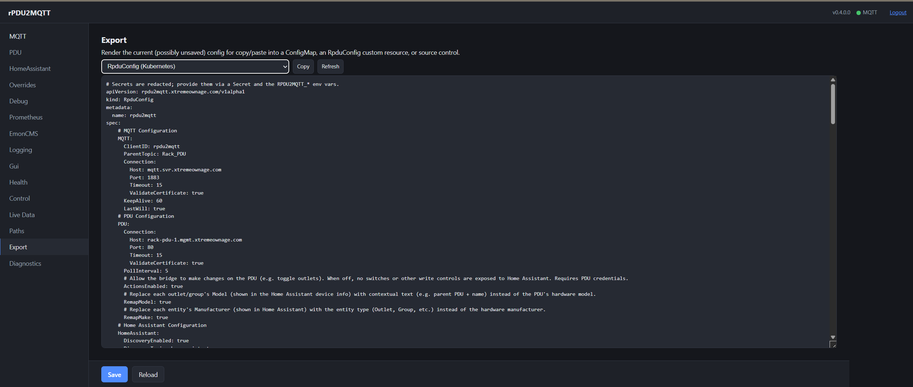
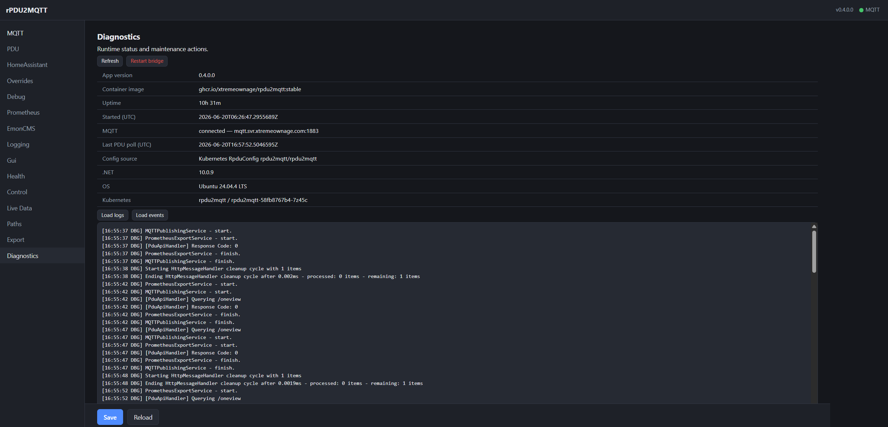

# Kubernetes CRD as a configuration source

**Status:** implemented · **Audience:** Kubernetes users · **Tracking:** follow-up to the
configuration GUI (#69)

rPDU2MQTT can read (and write) its configuration from a Kubernetes **Custom Resource** instead of a
file, as an *optional* source for people running in Kubernetes. This document is both the design and
the reference for the implementation.

**How to use it:** set `kubernetesConfigSource.enabled=true` in the [Helm chart](../charts/rpdu2mqtt),
or apply the raw manifests in [`Examples/Kubernetes/crd/`](../Examples/Kubernetes/crd/). The app reads
config from the `RpduConfig` CR when `RPDU2MQTT_CONFIG_SOURCE=k8s` (+ `RPDU2MQTT_CR_NAME`).

> Built and unit-tested here; the in-cluster runtime paths (auth, CR read, spec/status PATCH, watch)
> should be confirmed in a real cluster — see *Verification constraint* below.

## Motivation

Today configuration is a single `config.yaml` loaded at startup (see
[`YamlConfigLoader`](../rPDU2MQTT/Startup/YamlConfigLoader.cs)), optionally mounted from a ConfigMap.
That works, but in Kubernetes it has two rough edges:

1. **A ConfigMap mount is read-only.** The configuration GUI detects this and disables *Save* (see the
   `configWritable` handling in [`GuiService`](../rPDU2MQTT/Services/Gui/GuiService.cs) and
   [Configuration.md](Configuration.md#gui-with-kubernetes--read-only-config)). So in k8s the GUI is
   view/test only.
2. The config is "just a blob" to Kubernetes — no schema validation, no health/status surfaced to the
   cluster.

A Custom Resource (CR) is a first-class, **writable** API object. Backing config with a CRD would:

- Make the **GUI's Save work in Kubernetes** (it would `PATCH` the CR's `spec` instead of a file).
- Give **server-side schema validation** at `kubectl apply` time (OpenAPI v3 on the CRD).
- Let the app report **status** back to the cluster (`kubectl get rpduconfig` shows connected / device
  count / last poll).
- Stay **GitOps-friendly** — the CR is a normal manifest you can keep in source control.

It is deliberately **optional**: Docker/compose and plain-ConfigMap users are unaffected.

## Non-goals

- Not replacing the file/env config paths; the CRD is an additional, opt-in source.
- Not a multi-tenant operator that provisions Deployments (see *Phasing → Phase 3* for that idea).
- Not required to run in Kubernetes — a ConfigMap continues to work.

## The Custom Resource

```
apiVersion: rpdu2mqtt.xtremeownage.com/v1alpha1
kind: RpduConfig
metadata:
  name: rack-pdu-1
  namespace: rpdu2mqtt
spec:
  # Mirrors the existing Config model (MQTT, Pdus, HomeAssistant, Overrides, Prometheus, EmonCMS, ...)
  MQTT:
    Connection: { Host: mqtt.example.com, Port: 1883 }
    ParentTopic: rPDU2MQTT
  Pdus:
    default:
      Connection: { Host: rack-pdu-1.example.com, Port: 80 }
      PollInterval: 5
  HomeAssistant:
    DiscoveryEnabled: true
status:
  connected: true
  deviceCount: 2
  lastPoll: "2026-06-11T10:02:00Z"
  message: "OK"
```

- **Group/Version/Kind:** `rpdu2mqtt.xtremeownage.com` / `v1alpha1` / `RpduConfig` (namespaced).
- **`spec`** is the existing [`Config`](../rPDU2MQTT/Models/Config/Config.cs) shape, 1:1. Secrets
  (MQTT/PDU passwords, EmonCMS key) should still be sourceable from env/Secret via the existing
  `RPDU2MQTT_*` overrides so they don't have to live in the CR.
- **`status`** is a [status subresource](https://kubernetes.io/docs/tasks/extend-kubernetes/custom-resources/custom-resource-definitions/#status-subresource)
  the app patches.

### Generating the CRD schema from the model (key reuse)

We already reflect over the `Config` model to build the GUI's form schema
([`ConfigSchema.Build()`](../rPDU2MQTT/Services/Gui/ConfigSchema.cs)). The same reflection can emit the
CRD's **OpenAPI v3** `spec` schema, so the CRD validation stays in sync with the model automatically
instead of being hand-maintained. (Phase 1 can ship with `x-kubernetes-preserve-unknown-fields: true`
to avoid blocking on this, then tighten the schema once generation is wired up.)

## Application integration

Introduce a small config-source abstraction and select it at startup:

```
IConfigSource
  ├─ FileConfigSource        (today's YamlConfigLoader behaviour)
  └─ KubernetesConfigSource  (reads/writes the RpduConfig CR)

  Config Load();             // map source -> Config (reusing existing deserialization)
  bool   CanWrite { get; }   // drives the GUI's configWritable
  Task   Save(Config cfg);   // file write today; CR PATCH for k8s
```

- **Selection:** `RPDU2MQTT_CONFIG_SOURCE=k8s` (and/or auto-detect in-cluster via the ServiceAccount
  token at `/var/run/secrets/kubernetes.io/serviceaccount`), with `RPDU2MQTT_CR_NAME` /
  `RPDU2MQTT_NAMESPACE` to locate the CR. Default remains the file source.
- **Load:** `GET .../namespaces/<ns>/rpduconfigs/<name>`, take `.spec`, deserialize into `Config` with
  the existing logic (`InitializeConfig`, env overrides). [`ServiceConfiguration`](../rPDU2MQTT/Startup/ServiceConfiguration.cs)
  consumes the resulting `Config` exactly as it does today — nothing downstream changes.
- **Auth:** in-cluster ServiceAccount token; the official `KubernetesClient` NuGet handles in-cluster
  and kubeconfig contexts.
- **GUI write-back:** the [`POST /api/config`](../rPDU2MQTT/Services/Gui/GuiService.cs) handler calls
  `IConfigSource.Save`, which for k8s issues a `PATCH` to the CR `spec`. `configWritable` becomes true,
  re-enabling Save in-cluster.

### Secrets (decided)

When the Kubernetes config source is used, credentials live in a **companion Kubernetes Secret**, never
inline in the CR `spec`. GUI write-back **never** writes secret values into the CR — instead, on Save the
app writes the secret fields (MQTT/PDU credentials, EmonCMS API key, GUI password, **OIDC client
secret**) into that Secret, and reads them back at startup (the chart also mounts it via `envFrom`, so the
existing `RPDU2MQTT_*` overrides still apply; an explicit env var still wins). This means enabling OIDC
from the GUI just works — no hand-editing the CR.

Mechanics:

- The Secret name comes from **`RPDU2MQTT_SECRET_NAME`** (the chart sets it to the release Secret; it
  defaults to the CR name otherwise).
- The chart **pre-creates** the Secret (create-once, like the CR) so GUI-written values survive `helm
  upgrade`, and grants the pod `get,patch,update` on **just that Secret**. Non-Helm/Argo deploys must
  create the Secret, mount it, and grant the same RBAC (and add an Argo `ignoreDifferences` on its data).
- MQTT **credential/broker changes apply live** — the watcher re-points the running client (#192). GUI
  **OIDC** is the exception: it is wired up at startup, so it still needs a restart (use the Diagnostics
  **Restart bridge** button).

### GitOps & exporting manifests (decided)

The CR can be the GitOps source of truth, so:

- After a GUI **Save** that writes to a CR, the UI shows a **notice to update the GitOps source** so the
  cluster's desired state doesn't silently drift from the repo.
- The GUI's existing **Export** view ([`/api/config/yaml`](../rPDU2MQTT/Services/Gui/GuiService.cs))
  gains a **"RpduConfig manifest"** export that renders the current (edited) config as a ready-to-commit
  CR, **with secrets redacted to placeholders**. This lets users round-trip GUI edits back into source
  control.
- For the *full* set of supporting manifests (Service, ServiceMonitor, Deployment, RBAC), `helm template
  ./charts/rpdu2mqtt` remains the canonical export — the GUI export focuses on the config/CR, which is
  the only thing it actually edits.

The GUI's **Export** view (secrets redacted), used to commit GUI edits back to the GitOps repo:



### Keeping GUI edits across chart upgrades / Argo syncs

Because the GUI writes the CR `spec` and a redeploy also renders the CR `spec` from `values.config`, a
`helm upgrade` or Argo sync can otherwise **revert GUI changes**. To avoid that:

- **Helm chart (`helm upgrade`):** the chart is **create-once** by default
  (`kubernetesConfigSource.preserveExisting: true`) — it reads the live CR with Helm `lookup` and
  re-emits its current `spec`, so `values.config` only seeds the CR on first install. Set
  `preserveExisting: false` to manage the config declaratively (every upgrade applies `values.config`).
- **Argo CD:** `lookup` returns nothing under `helm template`, so the rendered CR always carries
  `values.config` and Argo would sync it. Tell Argo to ignore the CR `spec` so GUI edits stick:

  ```yaml
  # Argo CD Application
  spec:
    ignoreDifferences:
      - group: rpdu2mqtt.xtremeownage.com
        kind: RpduConfig
        jsonPointers:
          - /spec
  ```

  (Or keep config declarative in git and treat the GUI as view/test only — your choice of source of
  truth. The GUI's Save already warns to update the GitOps source.)

### Reacting to changes & status (Phase 2)

- **Watch** the CR; on change, apply it live: the reloaded config is copied into the shared singleton,
  the MQTT client is re-pointed at the new broker/credentials, and the PDU pollers are reconciled
  (#187/#192) — the primary instance included, which is re-pointed in place because DI pins its object
  identity. Restarting the process is a last resort, because a clean exit leaves the pod in `Completed`
  and the kubelet re-starts it under backoff. It remains only for the listening sockets (GUI/API/health/
  metrics ports) and GUI auth, which are bound once when the host is built.
- **Status:** a lightweight hosted service patches `status` (connected from the MQTT client, device
  count + last poll from `PDU.GetRootData_Public`) on the poll interval, using the values already
  surfaced by `/api/status` and `/api/livedata`.

In-cluster, the GUI **Diagnostics** page confirms the config source is the `RpduConfig` CR and can pull
the pod's logs/events on demand (using the RBAC the chart grants):



## Manifests to ship

Under `Examples/Kubernetes/crd/`:

- `crd.yaml` — the `RpduConfig` CustomResourceDefinition (with `status` subresource).
- `rbac.yaml` — `ServiceAccount`, plus a `Role`/`RoleBinding` granting `get,list,watch` on
  `rpduconfigs` and `patch` on `rpduconfigs/status` (and `patch` on `rpduconfigs` if GUI write-back is
  enabled), scoped to the namespace.
- `rpduconfig-sample.yaml` — an example CR.
- `deployment.yaml` — a Deployment using the ServiceAccount and the `RPDU2MQTT_CONFIG_SOURCE=k8s` env.

RBAC is intentionally minimal and namespaced. Installing the CRD itself requires cluster-admin (a
one-time step), documented alongside the manifests.

## Related: Prometheus Operator scraping (ServiceMonitor / PodMonitor)

rPDU2MQTT already exposes a Prometheus `/metrics` endpoint (the
[`PrometheusExportService`](../rPDU2MQTT/Services/PrometheusExportService.cs), gated by
`Prometheus.Enabled`). In a cluster running the **Prometheus Operator**, we can ship a
`ServiceMonitor` (or `PodMonitor`) so Prometheus **auto-discovers and scrapes** the endpoint — no
hand-written scrape config, and it tracks pod restarts/scaling automatically:

```yaml
apiVersion: v1
kind: Service
metadata:
  name: rpdu2mqtt-metrics
  labels: { app: rpdu2mqtt }
spec:
  selector: { app: rpdu2mqtt }
  ports:
    - name: metrics
      port: 9184
      targetPort: 9184
---
apiVersion: monitoring.coreos.com/v1
kind: ServiceMonitor
metadata:
  name: rpdu2mqtt
  labels: { release: kube-prometheus-stack }   # match your Prometheus serviceMonitorSelector
spec:
  selector: { matchLabels: { app: rpdu2mqtt } }
  endpoints:
    - port: metrics
      interval: 30s
```

Notes:
- `ServiceMonitor`/`PodMonitor` are CRDs **owned by the Prometheus Operator** — we don't define them,
  we just ship instances (and the `Service`). They require the operator to be installed.
- This is **orthogonal to the `RpduConfig` CRD** and much lighter — it's manifests only, no app
  changes. It could ship independently (even first), as an `Examples/Kubernetes/monitoring/` bundle,
  regardless of whether the config-CRD work happens.
- Pairs nicely with the proposed `status` subresource: scrape metrics via the ServiceMonitor, and read
  health/last-poll via `kubectl get rpduconfig`.

## Dependencies

- [`KubernetesClient`](https://www.nuget.org/packages/KubernetesClient) (official .NET client). Only
  loaded/active when the k8s source is selected; it does not affect file/compose users.

## Scope (all implemented together)

No phasing — the full feature ships at once:

- Read config from the CR (`KubernetesConfigSource`), in-cluster auth.
- **GUI write-back enabled by default** (`PATCH` the CR `spec`), with a GitOps-drift warning and a
  redacted CR-manifest export for re-importing into source control.
- **`status` subresource** updated with `connected` / `deviceCount` / `lastPoll`.
- **Watch** the CR and apply `spec` changes live (restarting only for listen ports / GUI auth).
- CRD OpenAPI `spec` schema **generated from the `Config` model** (reusing the GUI's `ConfigSchema`
  reflection).
- CRD shipped both in the Helm chart's `crds/` directory **and** as a standalone manifest; the app does
  not self-register it. (Helm does not auto-upgrade `crds/`, so schema bumps need a documented
  `kubectl apply`.)
- RBAC: `get,list,watch` + `patch` on `rpduconfigs` and `patch` on `rpduconfigs/status`.

**Possible future (not now):** a controller reconciling *multiple* `RpduConfig` instances (one per PDU)
with leader election. Multiple CRs are acceptable where there's a benefit; a Deployment-per-CR covers
most needs without a full operator.

## Alternative considered: patch the ConfigMap instead

If the *only* goal is "GUI Save works in k8s," the GUI could `PATCH` the **mounted ConfigMap** via the
K8s API rather than introducing a CRD. That is ~10% of the work and adds no new resource type, but you
lose CRD validation, the `status` subresource, and the first-class object feel. The CRD is the more
idiomatic, more capable answer; the ConfigMap patch is the pragmatic shortcut. Worth revisiting if the
CRD proves too heavy for the audience.

## Testing strategy

There is no cluster in normal dev/CI, so:

- Unit-test the `spec` ⇄ `Config` mapping and the schema/OpenAPI generation (no cluster needed).
- Integration-test against a local [`kind`](https://kind.sigs.k8s.io/) or `k3d` cluster (install CRD,
  apply a sample CR, run the app, assert it loads and patches status). This would be a manual / opt-in
  CI job, not part of the default `dotnet test` run.

## Decisions

1. **Secrets** → stored in a **Kubernetes Secret** and referenced from the CR; never inline in `spec`,
   and never written there by the GUI. (See *Secrets* above.)
2. **Multiple CRs** → acceptable when there is a benefit (e.g. one CR per PDU). Phase 1 ships a single
   named CR; the design does not preclude reconciling several later (Phase 3).
3. **GitOps** → after a GUI save to a CR the UI warns the user to update their GitOps source, and the
   GUI can **export the CR manifest** (secrets redacted) for re-importing into source control. (See
   *GitOps & exporting manifests* above.)

## Decisions (round 2)

4. **CRD installation** → shipped in the chart's `crds/` directory **and** as a standalone manifest;
   the app does not self-register it.
5. **GUI write-back** → **enabled by default**, with the GitOps-drift warning.
6. **`status` subresource** → included now (no phasing).

## Open questions

1. **CRD versioning:** the upgrade/conversion story before graduating `v1alpha1` → `v1` (conversion
   webhooks vs. a documented breaking bump). Deferred until we leave `v1alpha1`.

## Verification constraint

Building this requires no cluster, but **runtime-verifying** it (in-cluster auth, CR read, `spec`/
`status` PATCH, watch) does. With no Docker/cluster available in the dev environment, the cluster-
independent parts (spec⇄Config mapping, OpenAPI generation, manifest/chart rendering, build) are
verified here; the live in-cluster operations must be confirmed against a real cluster.
